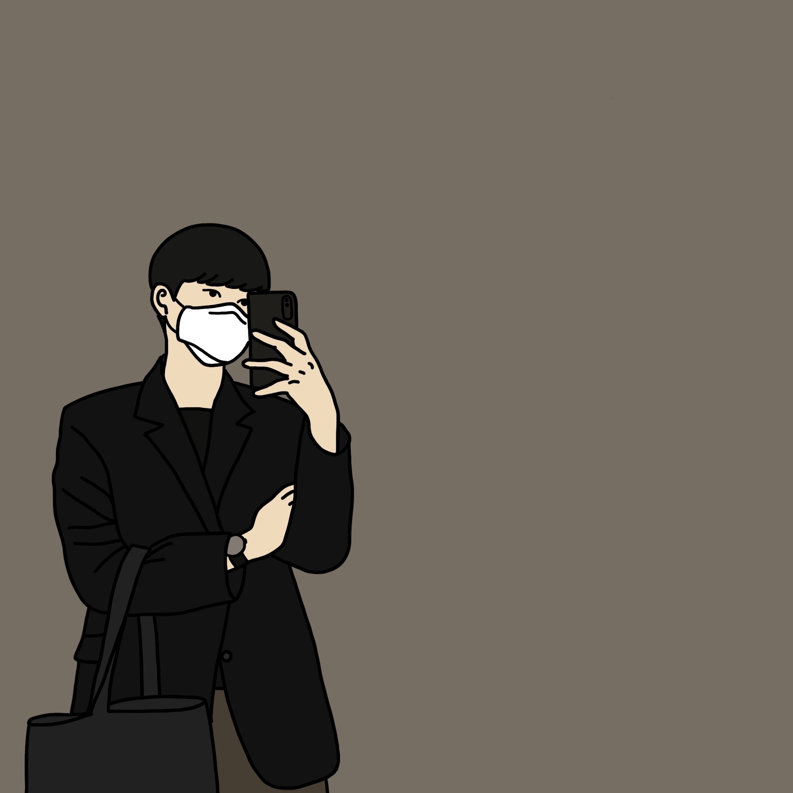

    <h2 class="about-heading" style="color: #374054; margin-bottom: 50px">
        About L2H
    </h2>
    
 
        현재 스타트업에서 Web 개발자로 일 하고 있으며, 경험을 얻기 위해 도전을 두려워하지 않습니다.  
        정리하는 것을 중요한 가치로 여기고 있고 완성도 있는 구현을 위해 생각을 정리한 후 개발을 하는 것을 선호합니다.  
    

    <h2 class="skills-heading" style="color: #374054; margin-bottom: 50px;">
        Skills
    </h2>
    <ul style="display: block; margin: 0 auto; padding: 0; max-width: 800px;">
        <li style="display: inline-block; margin: 7px; padding: 5px 10px; color: #374054; background: #e4e4ea; list-style: none; cursor: default; font-size: 1.2em;">JavaScript</li>
        <li style="display: inline-block; margin: 7px; padding: 5px 10px; color: #374054; background: #e4e4ea; list-style: none; cursor: default; font-size: 1.2em;">TypeScript</li>
        <li style="display: inline-block; margin: 7px; padding: 5px 10px; color: #374054; background: #e4e4ea; list-style: none; cursor: default; font-size: 1.2em;">Python</li>
        <li style="display: inline-block; margin: 7px; padding: 5px 10px; color: #374054; background: #e4e4ea; list-style: none; cursor: default; font-size: 1.2em;">Node.JS</li>
        <li style="display: inline-block; margin: 7px; padding: 5px 10px; color: #374054; background: #e4e4ea; list-style: none; cursor: default; font-size: 1.2em;">React.JS</li>
        <li style="display: inline-block; margin: 7px; padding: 5px 10px; color: #374054; background: #e4e4ea; list-style: none; cursor: default; font-size: 1.2em;">Vue.JS</li>
        <li style="display: inline-block; margin: 7px; padding: 5px 10px; color: #374054; background: #e4e4ea; list-style: none; cursor: default; font-size: 1.2em;">Jquery.JS</li> 
        <li style="display: inline-block; margin: 7px; padding: 5px 10px; color: #374054; background: #e4e4ea; list-style: none; cursor: default; font-size: 1.2em;">JAVA</li>
        <li style="display: inline-block; margin: 7px; padding: 5px 10px; color: #374054; background: #e4e4ea; list-style: none; cursor: default; font-size: 1.2em;">C</li>
        <li style="display: inline-block; margin: 7px; padding: 5px 10px; color: #374054; background: #e4e4ea; list-style: none; cursor: default; font-size: 1.2em;">C++</li>
        <li style="display: inline-block; margin: 7px; padding: 5px 10px; color: #374054; background: #e4e4ea; list-style: none; cursor: default; font-size: 1.2em;">Spring</li>
        <li style="display: inline-block; margin: 7px; padding: 5px 10px; color: #374054; background: #e4e4ea; list-style: none; cursor: default; font-size: 1.2em;">JSP</li>
        <li style="display: inline-block; margin: 7px; padding: 5px 10px; color: #374054; background: #e4e4ea; list-style: none; cursor: default; font-size: 1.2em;">JDBC</li>
        <li style="display: inline-block; margin: 7px; padding: 5px 10px; color: #374054; background: #e4e4ea; list-style: none; cursor: default; font-size: 1.2em;">MySQL</li>
        <li style="display: inline-block; margin: 7px; padding: 5px 10px; color: #374054; background: #e4e4ea; list-style: none; cursor: default; font-size: 1.2em;">MariaDB</li>
        <li style="display: inline-block; margin: 7px; padding: 5px 10px; color: #374054; background: #e4e4ea; list-style: none; cursor: default; font-size: 1.2em;">R</li>
        <li style="display: inline-block; margin: 7px; padding: 5px 10px; color: #374054; background: #e4e4ea; list-style: none; cursor: default; font-size: 1.2em;">Linux</li>
        <li style="display: inline-block; margin: 7px; padding: 5px 10px; color: #374054; background: #e4e4ea; list-style: none; cursor: default; font-size: 1.2em;">Git</li>
    </ul>

    <h2 class="Education-heading" style="color: #374054; margin-bottom: 50px">Education</h2>
    

        

            <h3 style="font-weight: 500; float: left; margin: 0; color: #374054;">Hanshin University</h3>
            
                Marth 2013 - February 2020
            
            <h6 style="color: #74808a; clear: both; font-weight: 500; margin: 0 0 15px;">
                Bachelor of Science in Computer Science
            </h6>
            
컴퓨터공학부 학사로 2020년 2월에 졸업하였으며, Computer Vision Lab과 Software Engineering Lab에서 연구활동을 하였고 특히, Computer Vision 연구실에서는 학생 연구실장을 맡아 학우들을 지도하였습니다. 또, 교수님과 전공 소학회를 진행한 경험이 있고 3,4 학년때 2,3학년들을 대상으로 JAVA, Web Programming tutoring을 진행한 경험이 있습니다. 그리고 교내에서 진행하는 해커톤 대회에서 은상, 졸업 작품 금상을 받은 수상 경력도 있습니다.

        

    

