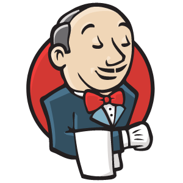
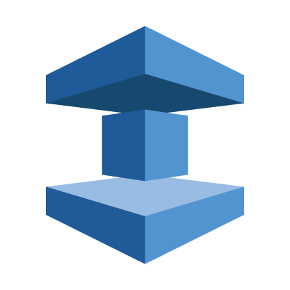

 
 
 

## 🌃 About l2h
---

 
 

  <h1 style=" text-align:center; font-size:50px; text-transform:uppercase; color:#222; letter-spacing:1px; font-weight:400;">
  " JUST DO IT "
  </h1>

 
 

 

***계획과 이론도 중요하지만, 실질적인 실행이 더욱 중요하다는 것을 인지하고 있습니다.***

 

## 🛠 Stack
---

### Devops

<ul style="display: block; margin: 0 auto; padding: 0; max-width: 800px;">
    <li class="skill-icons" style="display: inline-block; margin: 7px; padding: 5px 10px;  list-style: none; cursor: default; font-size: 1.2em;">
        
    </li>
    <li class="skill-icons" style="display: inline-block; margin: 7px; padding: 5px 10px;  list-style: none; cursor: default; font-size: 1.2em;">
        
    </li>
    <li class="skill-icons" style="display: inline-block; margin: 7px; padding: 5px 10px;  list-style: none; cursor: default; font-size: 1.2em;">
        
    </li>
    <li class="skill-icons" style="display: inline-block; margin: 7px; padding: 5px 10px;  list-style: none; cursor: default; font-size: 1.2em;">
        
    </li>
    <li class="skill-icons" style="display: inline-block; margin: 7px; padding: 5px 10px;  list-style: none; cursor: default; font-size: 1.2em;">
        
    </li>
    <li class="skill-icons" style="display: inline-block; margin: 7px; padding: 5px 10px;  list-style: none; cursor: default; font-size: 1.2em;">
        
    </li>
    <li class="skill-icons" style="display: inline-block; margin: 7px; padding: 5px 10px;  list-style: none; cursor: default; font-size: 1.2em;">
        
    </li>
    <li class="skill-icons" style="display: inline-block; margin: 7px; padding: 5px 10px;  list-style: none; cursor: default; font-size: 1.2em;">
        
    </li>
    <li class="skill-icons" style="display: inline-block; margin: 7px; padding: 5px 10px;  list-style: none; cursor: default; font-size: 1.2em;">
        
    </li>
    <li class="skill-icons" style="display: inline-block; margin: 7px; padding: 5px 10px;  list-style: none; cursor: default; font-size: 1.2em;">
        
    </li>
     <li class="skill-icons" style="display: inline-block; margin: 7px; padding: 5px 10px;  list-style: none; cursor: default; font-size: 1.2em;">
        
    </li>
     <li class="skill-icons" style="display: inline-block; margin: 7px; padding: 5px 10px;  list-style: none; cursor: default; font-size: 1.2em;">
        
    </li>
     <li class="skill-icons" style="display: inline-block; margin: 7px; padding: 5px 10px;  list-style: none; cursor: default; font-size: 1.2em;">
        
    </li>
     <li class="skill-icons" style="display: inline-block; margin: 7px; padding: 5px 10px;  list-style: none; cursor: default; font-size: 1.2em;">
        
    </li>
</ul>

### AWS

<ul style="display: block; margin: 0 auto; padding: 0; max-width: 800px;">
    <li class="skill-icons" style="display: inline-block; margin: 7px; padding: 5px 10px;  list-style: none; cursor: default; font-size: 1.2em;">
        
    </li>
    <li class="skill-icons" style="display: inline-block; margin: 7px; padding: 5px 10px;  list-style: none; cursor: default; font-size: 1.2em;">
        
    </li>
    <li class="skill-icons" style="display: inline-block; margin: 7px; padding: 5px 10px;  list-style: none; cursor: default; font-size: 1.2em;">
        
    </li>
    <li class="skill-icons" style="display: inline-block; margin: 7px; padding: 5px 10px;  list-style: none; cursor: default; font-size: 1.2em;">
        
    </li>
    <li class="skill-icons" style="display: inline-block; margin: 7px; padding: 5px 10px;  list-style: none; cursor: default; font-size: 1.2em;">
        
    </li>
    <li class="skill-icons" style="display: inline-block; margin: 7px; padding: 5px 10px;  list-style: none; cursor: default; font-size: 1.2em;">
        
    </li>
    <li class="skill-icons" style="display: inline-block; margin: 7px; padding: 5px 10px;  list-style: none; cursor: default; font-size: 1.2em;">
        
    </li>
    <li class="skill-icons" style="display: inline-block; margin: 7px; padding: 5px 10px;  list-style: none; cursor: default; font-size: 1.2em;">
        
    </li>
    <li class="skill-icons" style="display: inline-block; margin: 7px; padding: 5px 10px;  list-style: none; cursor: default; font-size: 1.2em;">
        
    </li>
    <li class="skill-icons" style="display: inline-block; margin: 7px; padding: 5px 10px;  list-style: none; cursor: default; font-size: 1.2em;">
        
    </li>
    <li class="skill-icons" style="display: inline-block; margin: 7px; padding: 5px 10px;  list-style: none; cursor: default; font-size: 1.2em;">
        
    </li>
    <li class="skill-icons" style="display: inline-block; margin: 7px; padding: 5px 10px;  list-style: none; cursor: default; font-size: 1.2em;">
        
    </li>
    <li class="skill-icons" style="display: inline-block; margin: 7px; padding: 5px 10px;  list-style: none; cursor: default; font-size: 1.2em;">
        
    </li>
    <li class="skill-icons" style="display: inline-block; margin: 7px; padding: 5px 10px;  list-style: none; cursor: default; font-size: 1.2em;">
        
    </li>
    <li class="skill-icons" style="display: inline-block; margin: 7px; padding: 5px 10px;  list-style: none; cursor: default; font-size: 1.2em;">
        
    </li>
</ul>

### Front-end

<ul style="display: block; margin: 0 auto; padding: 0; max-width: 800px;">
    <li class="skill-icons" style="display: inline-block; margin: 7px; padding: 5px 10px;  list-style: none; cursor: default; font-size: 1.2em;">
        
    </li>
    <li class="skill-icons" style="display: inline-block; margin: 7px; padding: 5px 10px;  list-style: none; cursor: default; font-size: 1.2em;">
        
    </li>
    <li class="skill-icons" style="display: inline-block; margin: 7px; padding: 5px 10px;  list-style: none; cursor: default; font-size: 1.2em;">
        
    </li>
    <li class="skill-icons" style="display: inline-block; margin: 7px; padding: 5px 10px;  list-style: none; cursor: default; font-size: 1.2em;">
        
    </li>
    <li class="skill-icons" style="display: inline-block; margin: 7px; padding: 5px 10px;  list-style: none; cursor: default; font-size: 1.2em;">
        
    </li>
    <li class="skill-icons" style="display: inline-block; margin: 7px; padding: 5px 10px;  list-style: none; cursor: default; font-size: 1.2em;">
        
    </li>
    <li class="skill-icons" style="display: inline-block; margin: 7px; padding: 5px 10px;  list-style: none; cursor: default; font-size: 1.2em;">
        
    </li>
    <li class="skill-icons" style="display: inline-block; margin: 7px; padding: 5px 10px;  list-style: none; cursor: default; font-size: 1.2em;">
        
    </li>
    <li class="skill-icons" style="display: inline-block; margin: 7px; padding: 5px 10px;  list-style: none; cursor: default; font-size: 1.2em;">
        
    </li>
</ul>

### Back-end

<ul style="display: block; margin: 0 auto; padding: 0; max-width: 800px;">
    <li class="skill-icons" style="display: inline-block; margin: 7px; padding: 5px 10px;  list-style: none; cursor: default; font-size: 1.2em;">
        
    </li>
    <li class="skill-icons" style="display: inline-block; margin: 7px; padding: 5px 10px;  list-style: none; cursor: default; font-size: 1.2em;">
        
    </li>
    <li class="skill-icons" style="display: inline-block; margin: 7px; padding: 5px 10px;  list-style: none; cursor: default; font-size: 1.2em;">
        
    </li>
</ul>

 
 
 

## 💼 Career
### 주식회사 외식인

📅 2020.04 - 2023.12

`Jquery` 및 `Vue.js`를 이용한 Front-end 개발과 `Spring`을 이용한 Back-end 개발 하였습니다. 그리고 최근에는`AWS`를 이용한 `Cloud` 환경에서의 인프라 구축 및 개발과 Kubernetes를 활용한 컨테이너 운영 환경을 구축 및 운영하였고, 개발 생산성과 운영 효율성을 위한 **Devops Engineer** 로 재직하였습니다.

## 🎓 Education
---

### 한신대학교 컴퓨터공학부

📅 2013.03 -  2020.02

컴퓨터공학부 학사로 2020년 2월에 졸업하였으며, Computer Vision Lab과 Software Engineering Lab에서 연구활동을 하였고 특히, Computer Vision 연구실에서는 학생 연구실장을 맡아 학우들을 지도하였습니다. 

또, 교수님과 전공 소학회를 진행한 경험이 있고 3,4 학년때 2,3학년들을 대상으로 JAVA, Web Programming tutoring을 진행한 경험이 있습니다. 그리고 교내에서 진행하는 해커톤 대회에서 은상, 졸업 작품 금상을 받은 수상 경력도 있습니다.