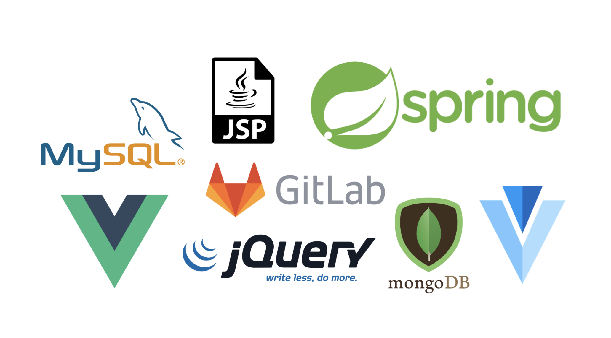
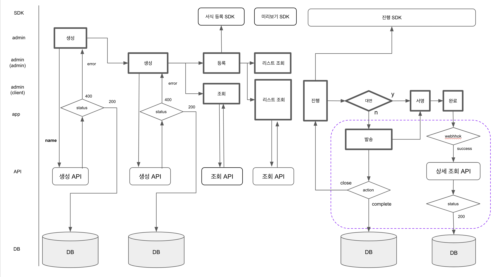

## 들어가며

### 분기별로 요약한 2020년
> 1분기 : 대학 졸업 후 취업 준비

> 2분기 : 취업 준비 후 취업

> 3분기 : 회사 서비스 내용 파악

> 4분기 : 유지보수 및 프로젝트 

 위의 이미지가 보이시나요? 저게 바로 수습이 끝난 후 열심히 달려온 제가 개발하면서 경험했던 프레임워크, 라이브러리, 도구(?) 들입니다 허허...

수습이 끝나자마자 여러 프로젝트를 진행했고 성공적으로 완성되기까지 많은 시간과 노력이 들었는데, 결국 그 결과로 제가 개발한 결과물이 회사의 수입을 내는 서비스로 반영이 되는 쾌거를 이루었습니다 !

학교에서 깊게 공부하지 않았던 `spring` 을 업무의 주된 프레임워크로 사용을 해야 했기 때문에 공부를 시작했고 그 밖에 `SQL`문, `DB relationship`, `jsp`, `jqeury` 등 익숙하지 않은 프레임워크, 도구들로 개발을 해야해서 많은 시간을 들여 공부하며 개발하였습니다. 

`기획` 부터 `DB 설계`, `process 설계`, `실제 개발`까지 `A 부터 Z`까지 멘땅에 헤딩(?) 식으로 진행을 하다보니 느낀점도 많고 이러한 경험으로 정말 많이 성장한 듯 싶어 그 중 하나의 서비스에 관해 이렇게 포스팅을 준비하게 되었습니다. 😎

이번 포스팅은 하나의 서비스가 기획되고 개발 시작되며 테스트를 하는 단계까지의 순서를 바탕으로 작성하겠습니다.

## ✅ 기획

여담이지만.. 평소 학교에서 프로젝트 하듯이 주어진 틀에서 기획을 하는 것이 아니라 처음으로 프로세스 정리부터 테스트 케이스를 작성하는 기획까지 시작했습니다. 하지만 아 프로젝트가 외부업체와 협업을 하는 부분도 있어서 부담도 많이 되었고 내부 시스템을 다 파악하지 못한채 바로 진행했기 때문에 더 힘들었다고 생각이 드네요.. 😅

( 전체적인 `process`를 회사 내부 규정에 맞게 **중요 정보(데이터)** 는 제외하고 올렸습니다. )

어떤 부분에서, 어떤 상태일 때 데이터를 보내고, `DB`에 저장하며, 어떤 값을 반환하는지에 대해 고민했고 특히, 사용자 권한별 데이터에 초점을 맞추어 `process`를 정리했습니다.

정말 신기하게 한번 이렇게 뼈대 설계를 잘해놓으면 개발이 비교적 쉽게 되었습니다. 특히, 예외처리 부분에서 빛을 발휘했습니다. ~~(하지만 실제로 운영서버에 올렸을 때 생각지도 못한 부분에서 오류가 나더라구요 😭)~~

### 기획 의도
제가 오픈한 서비스는 바로 저희 시스템에 `전자계약`이라는 새로운 기능을 연동하는 것이었습니다.
사실 전자 계약 플랫폼 자체를 만드는 것이 아니라 전자계약 플랫폼을 갖고 있는 외부 업체와 협업해서 진행한 프로젝트였는데 저희 쪽의 계약관리에 연동되게 만든 차세대(?) 계약 기능이었습니다.

여기서 제가 특별히 신경썻던 부분은 외부 업체의 `API`, `SDK`를 사용함에 있어 반환값의 형태였습니다. 이 부분에 대해서는 밑에서 더 자세히 설명하겠습니다. 😎

### 기획 특징
외부 업체와 협업을 하다보니 먼저 외부 업체의 플랫폼에 대해 누구보다 잘 알아야 했습니다. 

특히,`request`로 보내는 어떤 `parameter`가 필요한지, `token`은 어떤 값인지, `response`의 형태는 무엇이며 어떤 데이터들을 보내주는지 빨리 파악하는게 핵심이었습니다.

( 이때 사용했던 tool이 바로 `postman` 이었습니다. 사실 `postman`은 웹 개발을 할 때 빼놓을 수 없는 도구인것을 알고 있었지만 이번 만큼 `API 통신`을 할 때 유용했던게 없던 것 같습니다.... )

위의 `process`를 보시면 알 수 있듯이 저희 쪽 `DB`에 저장하는 값을 뽑아야 했고, 저희 `DB`에서 제공할 수 있는 데이터도 파악을 했어야 했습니다.

또, `WebHook`이라는 서버 통신을 해야 했는데 이 부분까지 고려해야 했으며 이 부분이 특히 공부를 해야하는 부분이라 시간이 걸린 것 같습니다.. ( `interceptor` 빌어먹을,,, )

## ✅ Back-end

`Back-end` 쪽은 제가 경험이 거의 없었습니다. 입사 포지션도 `클라이언트 개발` 즉, `Front-end` 로 들어왔기 때문에 제가 `back`단을 해볼거라곤 생각도 못했었죠.. 😂😂 

하지만 다 해봐야 경험이 쌓이고 전체적인 흐름을 파악할 수 있으니 도전하게 되었습니다. 

사실 ❕ `spring`은 대학생때 인턴하던 시기에 조금 다뤄봐서 `controller`, `service`, `dao`에 대한 이해가 조금은 이루어져 있어서 그나마 다행이었숩니다,,,

### Spring

처음 `Spring`으로 업무를 해야한다고 했을 때 구글링을 많이 했던 것 같습니다. 취업을 위해 최근 공부를 `javascript`, `typescript`만 하다보니 `JAVA`에 대해 까먹기도 했고 자신이 없어서 찾아보고 공부하는 시간을 가졌습니다.

### 개발 목적
`back`단에서 데이터의 교환이 이루어지는데 이 때 특히 개인적으로 신경쓰면서 개발했던 부분은 소스의 간소화, 중복코드 방지였습니다. 

### 개발 특징
위에서도 언급했듯이 해당 기능이 종료되면 `Webhook`이라는 특이한 서버 통신으로 데이터 전달이 이루어지는데 이 데이터를 어떻게 받을 지가 `key point` 였습니다. 왜냐하면 단순히 받아와서 저장을 하면 문제가 되지 않지만 응답하는 데이터가 다른 두가지의 케이스가 있어 이 부분이 상당히 까다로웠습니다. (회사 규정상 자세히 언급하지 못해 죄송합니다.)

## ✅ Front-end

제가 입사한 포지션이 `front-end` 쪽이라 화면 쪽은 자신감이 있었습니다. 처음엔 `React.js`로 취업을 했지만 회사의 방향은 `Vue.js`였고 `Vue.js`를 공부하기 시작했습니다. 하지만 회사의 어드민 페이지와 같은 웹 서비스들은 `Jquery`로 개발되어있어서 제가 따로 공부하는 것 외엔 도움 얻을 수 없었습니다. 하지만 다행히 회사의 작은 서비스 중 하나가 `Vue.js`로 구성되어 있어서 그것을 유지보수 하면서 공부도 하고 개발 구조를 습득했습니다.

하지만 처음 `front-end` 포지션으로 입사했을 때에 화면에 그리는 것을 중점에 두는 것이 아니라 자원의 절약, 데이터를 조금 더 효율적으로 다루는 방법등 개발 소스쪽으로 배우고 싶었습니다. 하지만 백단도 만들면서 화면을 그리다보니 결과론적으로 생각을 하게 되었고 처음에 생각했던 방향과는 다르게 완성만 시키자 라는 결과론적 마인드가 생기게 되었습니다.. 이 부분을 굳이 안써도 되지만 쓴 이유는 2021년에는 리소스 관리에도 관심을 갖고 공부하고 싶어 이렇게 적게되었습니다 !!!

### Jquery + Vue
회사에서 프로젝트를 진행하다가 느낀 한가지는 현재 내부에서 개발되어진 `jsp` + `jquery` 파일에 `vue.js`를 얹여야 했습니다. 물론 `jsp`에 `Jquery.js`와 `Vue.js` 모두 `js`이기 때문에 불가능한것은 아니지만 두개의 라이브러리를 하나의 `jsp`에 넣는다는 것 자체가 비효율적이었습니다.

 (저와 같은 상황에 계신 분들을 위헤 이 부분은 추후에 팁(?)으로 따로 포스팅을 할 예정입니다.)

### 개발 목적
일단 화면은 사용자가 가장 사용하기 쉽고 쉽게 접근할 수 있어야한다고 생각합니다. 그래서 취업하고 UI/UX 스터디도 참여했었고, 특히 저희 서비스는 사용자가 젊은 층도 될 수 있지만 중년 사용자분들이 대부분이라 더더욱 접근하기 쉽고 사용하기 쉬워야했습니다.

색 선정부터 엘리먼트들의 위치, 효율적인 버튼등 사용자를 위한 화면이 될 수 있게 목적을 두고 개발하였습니다.

또, 협력업체의 API 통신을 하고 받아오는 부분을 처리해야하기 때문에 이 부분도 특히 신경 썻고 `API` 통신은 `axios`와 `fetch` 함수를 사용하여 많이 작업했습니다. (이부분도 추후에 포스팅하기로 하겠습니다.)

---

간단한 회고 형식이라 보니 개발적인 내용이 아니라 제 경험을 적고 싶었습니다 ㅎㅎ

개발하다가 공부가 필요한 개념은 늘 메모를 해두고 시간이 될 때 공부를 하다보니 작성할 포스팅이 아직 엄청 많네요 !!

읽어주셔서 감사합니다. 태클은 언제든 환영입니다 ~!