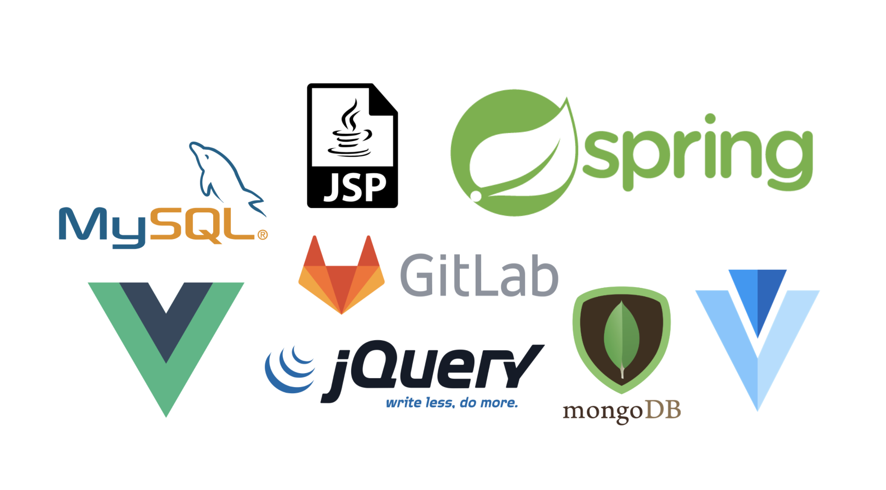

## 들어가며

 위의 이미지가 보이시나요? 저게 바로 수습이 끝난 후 열심히 달려온 제가 개발하면서 경험했던 프레임워크, 라이브러리, 도구(?) 들입니다 허허...

수습이 끝나자마자 프로젝트를 진행했고 성공적으로 서비스에 까지 반영이 되는 쾌거를 이루었습니다 !

그 후 짜잘한 유지보수 및 새로운 서비스 프로젝트를 준비중인 현재네요 ㅎㅎ !

`기획` 부터 `DB 설계`, `process 설계`, `실제 개발`까지 `A 부터 Z`까지 멘땅에 헤딩(?) 식으로 진행을 하다보니 느낀점도 많고 이러한 경험으로 정말 많이 성장한 듯 싶어 이렇게 포스팅을 준비하게 되었습니다. 😎

`spring` 을 능숙히 사용하지 못했었고 `SQL`문, `DB relationship`, `jsp`, `jqeury` 등 익숙하지 않은 프레임워크, 도구들로 개발하다보니 정말 막막했는데 어찌어찌해서 성공하게 되었숩니다 흐흐

## 기획

처음으로 기획부터 개발을 시작했습니다. 첫프로젝트부터 외부업체랑 같이 협업을 하는 업무라 부담도 많이되고 내부 시스템을 다 파악하지 못한채 프로젝트를 진행했기 때문에 더 힘들었다고 생각이 드네요.. 😅

학교에서 나름 프로젝트를 많이 진행했었지만 실제 서비스가 된다고 생각하니 더 부담이 되었고 책임감이 배로 느껴져서 설계 부분에 시간을 가장 많이 쓴 것 같네요.

전체적인 `process`를 회사 내부 규정에 맞게 **중요 정보(데이터)** 는 제외하고 올렸습니다. 😙

어떤 부분에서, 어떤 상태일 때 데이터를 보내고, `DB`에 저장하며, 어떤 값을 반환하는지에 대해 고민했고 특히, 사용자 권한별 데이터에 초점을 맞추어 `process`를 정리했습니다.

정말 신기하게 한번 이렇게 뼈대 설계를 잘해놓으면 개발이 비교적 쉽게 가능하게 되었어요. 특히, 예외처리 부분에서 빛을 발휘했습니다. ~~(하지만 실제로 운영서버에 올렸을 때 생각지도 못한 부분에서 오류가 나긴했어요 😭)~~

여기서 제가 특별히 신경썻던 부분은 외부 업체의 API, SDK를 사용함에 있어 반환값의 형태였습니다. 이 부분에 대해서는 밑에서 더 자세히 설명하겠습니다. 😎

## Back-end

Back-end 쪽은 제가 경험이 거의 없었습니다.. 입사 포지션도 Front-end로 들어왔기 때문에 제가 back단을 해볼거라곤 생각도 못했었죠... 

하지만 다해봐야 경험이 쌓이고 전체적인 흐름을 파악할 수 있으니 도전하게 되었습니다. 

back-end 쪽은 spring으로 개발을 하였고 인턴할 때에 controller, service, dao에 대한 이해가 조금은 이루어져 있어서 그나마 다행이었숩니다,,,

### 트랜잭션이란

#### DB 트랜잭션
데이터 베이스의 상태를 변화시키기 위해 수행하는 작업의 단위를 말합니다.

간단히 말해, SELECT, INSERT, DELETE, UPDATE 와 같은 질의어(SQL)를 이용하여 데이터 베이스에 접근하는 것을 의미합니다.

##### 트랜잭션의 특징
- 원자성 : 트랜잭션이 데이터 베이스에 모두 반영되던가, 아니면 전혀 반영되지 않던가를 의미합니다.
- 일관성 : 트랜잭션의 작업 처리 결과가 항상 일관성이 있어야 합니다.
- 독립성 : 어떤 하나의 트랜잭션이라도, 다른 트랜잭션의 연산에 끼어들 수 없습니다.
- 지속성 : 트랜잭션이 성공적으로 완료되었을 경우, 결과는 영구적으로 반영되어야 합니다.

##### 트랜잭션 연산

- commit : 하나의 트랜잭션이 성공적으로 끝났고 데이터 베이스가 일관성이 있는 상태일 때, 하나의 트랜잭션이 끝났다라는 것을 알려주기 위해 사용하는 연산입니다.
- rollback : 하나의 트랜잭션 처리가 비정상적으로 종료되어 트랜잭션의 원자성이 깨진 경우, 처음부터 다시 시작하던가, 부분적으로 취소 시킵니다.

#### 스프링 트랜잭션
스프링은 코드 기반의 트랜잭션 처리와 선언적 트랜잭셕을 지원합니다. 설정 파일, 어노테이션을 통해 트랜잭션의 범위 및 규칙을 정의할 수 있습니다.

##### 선억적 트랜잭션
- 설정 파일이나 어노테이션을 이용해서 트랜잭션의 범위, 롤백 규칙 등을 정의합니다.

##### 스프링에서 트랜잭션을 사용하는 이유
- DAO에서 처리한 쿼리문이 정상적으로 완료가 되고 service단에서 처리 도중 에러가 났을 경우 DAO에서 처리한 쿼리를 자동으로 rollback 해주기 위해서 사용합니다.

만약 저 어노테이션을 써주지 않는다면, 정상적으로 완료된 쿼리는 저장되기 때문에 위험합니다.

### Database

`DB`는 `mySql`을 사용하여 개발을 하였고, 평소 학교에서 프로젝트를 진행할 때나 취업 준비를 할 때 `front-end` 중심으로 진행해왔었기 때문에 DB는 너무 낯설고 어려웠습니다.

그래도 학교 전공수업때 배운 얄팍한(?) 지식과 구글링을 통해 보다 수월하게 개발을 진행했습니다.

하지만 완전 전문적이고 효율적인 `DB 쿼리`를 짜기엔 아직 너무 부족했고, 입사 후 중점을 맞추고 쿼리를 만들 때는 문법에 오류없이, 내가 계획한 대로 데이터를 핸들링 할 수 있게 하는 것이 중점이었습니다.

#### sub query

회사에서 `DB 테이블`도 직접 구성해보고, `CRUD`를 직접해보면서 가장 중요했던 것 중 한 가지는 바로 서브 쿼리 였습니다.

`JOIN` 되어 있지 않은 테이블에서 데이터를 불러와야할 때에 아주 유용한데, 필요한 데이터가 존재하는데 그 데이터의 수가 조인 할 정도로 많지 않을 때 서브 쿼리를 이용하여 조회를 하였습니다.

처음에 서비쿼리의 규칙 중 하나인 하나의 컬럼만을 불러와야하는 것과, 값의 수가 1개여야한다는 것을 모르고 무턱대고 쿼리를 짯었다가 여러 시간의 삽질 덕분에 단단히 알 수 있었습니다...

#### JOIN

join도 DB 쿼리를 구성할 때에 엄청 중요하게 쓰입니다. 

제가 경험해본 바로는 `LEFT OUTER JOIN`, `RIGHT OUTER JOIN` 도 많이 쓰였지만 여러 개의 테이블을 `FROM` 절에 넣고 `WHERE` 절에서 `COLUME`이 같을 때 조인하는 쿼리도 많이 사용하였습니다.

(사실 `WHERE` 절에서 `colume` 의 값을 비교하는 `JOIN` 이 훨씬 간단하고 유용해서 엄청 씁니다 !!)

## 이 포스터는 계속해서 업데이트를 진행하겠습니다 ㅎㅎㅎㅎ