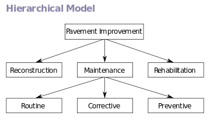
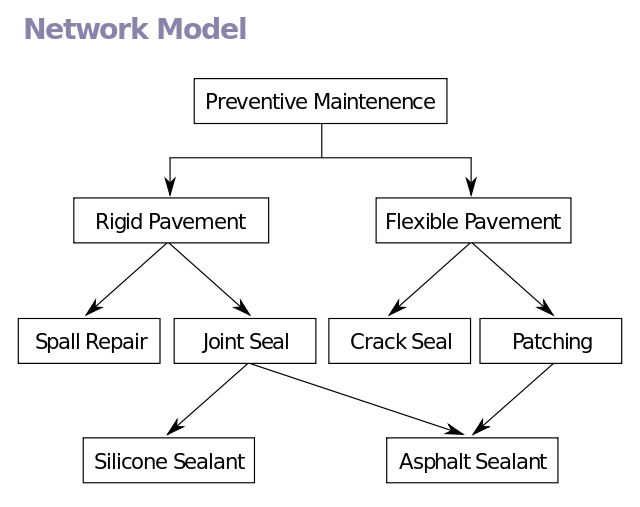
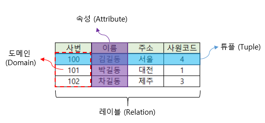

# 들어가며

2021년의 목표 중 하나가 기초를 튼튼히 다지자 이기 때문에 그에 맞춰 DataBase의 기본부터 공부하려고 합니다. 그 첫 번째로 `DB란 무엇인가?`에 대해 포스팅을 시작합니다~! 

( 참고한 책은 쉽게 배우는 MySQl입니다. )

> 데이터 베이스는 특별한 기업의 응용 시스템에서 사용하기 위해서 저장된 데이터의 집합

> DBMS는 사용자에게 데이터베이스를 생성하고 유지할 수 있게 해주는 프로그램의 집합

## 데이터 베이스 개요

### 데이터 베이스의 네 가지 만족 조건
1. 통합된 데이터 (`Integrated data`)
    - 데이터 베이스는 동일한 데이터가 중복되어 있지 않다는 것을 의미
    - 최소한의 중복 또는 통제된 중복을 허용

2. 저장 데이터 (`Stored Data`)
    - 컴퓨터가 접근 가능한 자기테이프나 디스크와 같은 저장 매체에 저장된 데이터

3. 운영 데이터 (`Operational Data`)
    - 어떤 한 조직의 고유 기능을 수행하기 위해 반드시 필요한 데이터
    - 조직의 존재 목적이나 기능을 수행하는 데 없어서는 안 될 데이터의 집합

4. 공용 데이터 (`Shared Data`)
    - 어느 한 조직의 여러 응용 프로그램들이 공동으로 소유하고 유지하며, 이용하는 데이터

### 데이터 베이스의 특성
1. 실시간 접근성 (`Real-time accessibility`)
    -  데이터베이스 내의 데이터들은 데이터 상호간에 연결되어 있지 않으면 이를 참조할 수 없기 때문에 상호 밀접한 관계로 연결.
    - 데이터베이스를 구축하여 놓고 이를 효율적으로 사용하기 위해서는 실시간 처리가 가능하도록 하여 어떠한 질의에 대해서도 몇 초안에 즉각적인 응답이 이루어짐.

2. 계속적인 변화 (`Continuous evolution`)
    - 데이터 베이스는 항상 급변하는 데이터를 반영하기 때문에 계속적으로 변화되어야 한다.

3. 동시 공유 (`Concurrent sharing`)
    - 서로 목적이 다른 사용자들이 같은 시간에 같은 데이터에 접근하여 이용할 수 있도록 `DBMS`는 관리하여 접근

4. 내용에 의한 참조 (`Content reference`)
    - 데이터 참조는 레코드의 주소나 위치에 의해 참조되는 것이 아니라 사용자가 요구하는 데이터의 값에 따라 참조

- 데이터 베이스는 실제 물체를 구분하는 개체 (`Entity`)들고 구성되며, 하나의 개체는 한개 이상의 속성 (`Attribute`)로 구성되고 각 속성은 개체의 특성이나 상태를 나타낸다.
- 개체 인스턴스(`Entity instance`)  : 개체는 그 개체를 구성해서 기술하고 있는 속성들이 어떤 실제 값을 가지며 구체화 된다.

### DBMS

데이터베이스에 저장된 데이터는 직접적으로 접근할 수 없기 때문에 이를 데이터베이스 관리 시스템 (`DBMS : DataBase Management System`)이라고 한다.

- `데이터 독립성` : 데이터가 어떻게 저장되고 어디에 저장되는지 알 필요가 없다.
- `데이터 무결성` : 데이터베이스의 데이터는 실세계에 적용되는 규칙을 항상 만족해야한다.
- `데이터 일관성`: 두 개의 서로 다른 부분에 있는 데이터베이스 데이터가 서로 모순되지 않아야 한다.
 
### Codd의 관계형 데이터베이스 시스템의 특성
1. 데이터의 논리적 독립성 
    - 한 속성(칼럼)에 가해진 변경이 동일한 관계(테이블)에 대한 다른 속성(칼럼)에 심각한 영향을 주지 않는다.

2. 참조 무결성과 데이터 무결성
    - 무결성 제약 조건을 실행해야 하는 부담을 없앨 수 있다.

3. 비정규 질의
    - 사용자는 작업을 실행하는 방법을 명시하지 않고도, 데이터베이스에게 어떤 데이터를 조회할 것인지 명령할 수 있다.

## 모델의 종류

### 계층 데이터 모델 (`Hierarchical Data Model`)

(이미지 출처 : 위키백과) 

- 계층 모델은 개체 집합에 대한 속성 관계를 표현하기 위하여 개체를 노드로 표현하고 개체 집합들 사이의 관계를 링크로 연결한 트리(`tree`) 형태의 자료구조 모델
- 개체와 개체의 관계를 트리구조로 연결하는 데이터 모델

### 망 데이터 모델 (`Network Data Model`)

(이미지 출처 : 위키백과) 

- 개체 집합에 대한 속성 관계를 표현하기 위하여 개체를 노드로 표현하고 개체 집합들 사이의 관계를 링크로 연결한 그래프 (`graph`) 형태의 자료구조 모델

### 관계 데이터 모델 (`Relational Data Model`)

(이미지 출처 : 위키백과) 

- 개체 집합에 대한 속성관 계ㅒ를 표현하기 위하여 개체를 테이블(`table`)로 사용하고 개체 집합들 사이의 관계는 공통 속성으로 연결하는 독립된 형태의 데이터 모델
- 모든 개체들이 다른 개체들과 직접적인 관계없이 독립적으로 존재하는 데이터 모델

### 객체지향 데이터 모델 (`Object-oriented Data Model`)
- 객체 지향 프로그래밍 (`OOP : Object Oriented Programming`)에서 발전된 객체 지향 데이터 모델
- 객체 지향 프로그램의 핵심 개념인 자료 추상형(`ADT`), 객체 신원(`Identity`), 계승(`Inheritance`)등의 개념이 데이터베이스에 통합 된 것.

### 객체관계 데이터 모델 (`Object Relational Data Model`)
- 객체지향 모델의 장점과 관계 모델의 장점을 합쳐 하나의 시스템으로 통합된 모델

## 관계형 모델과 객체 지향형 데이터베이스

### RDBMS의 특징

1. 모델 자체가 간단
2. 여러 연산을 수학적으로 최적화
3. 간단하 질의어로 쉽게 정보 검색

### 관계형 모델의 용어

##### 관계형 데이터베이스 언어 (`Relational database language`)
- 테이블 (`table`) -> 공식적인 명칭은 릴레이션(`Relation`)
- 열 (`Column`)
- 행 (`Row`)
- 무결성 규칙 (`Integrity rule`) 
- 기본 키 (`Primary key`)
- 후보 키 (`Candidate Key`)
- 대체 키 (`Alternate Key`)
- 참조 키 혹은 외래 키 (`Referential Key` or `Foreign Key`)

### 무결성 규칙
무결성 규칙은 관계형 데이터베이스 관리 시스템에서 강화되었다. 매번 테이블이 갱신되면 RDBMS는 새로운 데이터가 적절한 무결성 규칙을 만족하는지 조사해야 한다.

##### 기본 키 (`Primary Key`)
테이블의 기본 키는 유일한 행을 구별할 수 있도록 사용되는 테이블의 열이다.

**테이블에서 두 개의 서로 다른 행은 기본 키 값으로 동일한 값을 가질 수 없고, 테이블에서 모든 행의 기본 키는 항상 하나 이상의 값을 가지고 있어야 하며 NULL 값을 가질 수 없다.**

##### 후보 키 (`Candidate Key`)

기본 키를 대체 할 수 있는 하나 이상의 열 또는 열의 조합

1. 유일성 (`Uniqueness`) : 한 테이블에서 모든 튜플들을 서로 구별할 수 있는 성질

2. 최소성(`minimal`) : 후보 키를 구성하는 칼럼들 중에서 어느 하나를 제거하면 유일성 기능을 상실하는 성질

##### 대체 키  (`Alternate Key`)
테이블의 기본 키가 아닌 훕보 키를 대체 키라 하는데, 특별한 테이블을 위해 0개 이상의 대체키를 정의할 수 있다.

##### 외래 키 (`Foreign Key`)

외래 키는 테이블과 테이블의 관계를 설정해주는 키

한 테이블에 여러 개의 외래 키가 올 수 있는 반면 관계를 설정해 주는 부모 키는 다른 테이블의 기본 키 여야 한다.

### RDBMS 구성 요소
RDBMS 구조의 중요한 두 가지 요소는 소프트웨어인 커널(`Kernel`)과 데이터 베이스를 관리하는 커널에 의해 이용되는 시스템 레벨의 데이터 구조로 구성되는 데이터 사전(`Data Dictionary`)이다.

> 커널 : 자원을 사용자가 사용할 수 있게 관리하는 프로그램

##### RDBMS 커널
MySQL은 데이터 베이스의 동시 사용자를 위해 주어진 자원의 집합게 대한 접근을 관리하고 통제한다.
또한, 메모리 캐시와 페이징을 관리하며, 자원의 동시 사용에 대한 locking을 통제하며 사용자 요청을 할당한다.

##### 데이터 사전
RDBMS과 다른 데이터베이스나 파일 시스템과 근본의 근본적인 차이점은 데이터를 엑세스하는 방법에 있다. 

RDBMS는 더욱 더 추상저깅고 논리적인 형식보다는 물리적 데이터를 참조할 수 있게 하여, 애플리케이션 코드 개발시 용이함과 유연성을 제공한다.

데이터 사전은 데이터 베이스 내에 존재하는 모든 객체에 대한 메타 데이터 (Meta data : 데이터 관리상 필요한 작성자, 목적, 저장장소등 속성에 관한 데이터)를 저장한다. 

또한 데이터베이스를 읽어오거나 갱신하는 요청은 데이터 사전 내의 정보를 사용하는 MySQL 커널에 의해 처리된다. 데이터 사전 내의 정보는 객체의 존재를 타당하게 하고, 객체에 대한 접근을 제공하며, 실제 물리적 저장 위치를 가진다.

## MySQL이란?
`SQL(Structure Query Language)`은 관계형 데이터베이스 언어이다. 

1. 대화형 사용법
하나의 SQL 문장이 입력되면 즉시 처리되어 그 결과를 화면에서 볼 수 있는 형식

2. 내장형 사용법
SQL 문장은 다른 프로그래밍 언어로 작성된 프로그램 내부에 포함되어 있는 형식

---