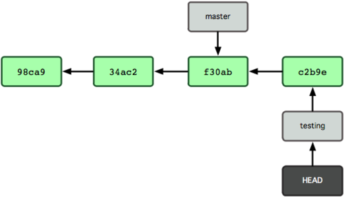
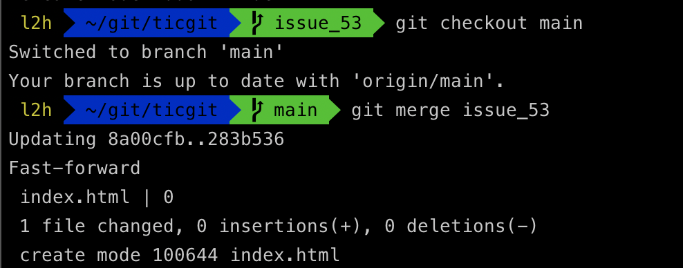

## 들어가며

이번 포스팅에는 `git`의 핵심이라고 볼 수 있는 최대 장점인 `branch`에 대해 정리해보려고 합니다.

여러 사람이 같이 개발을 할 때에 코드를 통째로 복사하고 나서 원래의 코드와 상관없이 독릭적으로 개발을 진행할 수 있는데, 이렇게 독립적으로 개발하는 것이 `branch`이고 모든 버전 관리 시트템은 `branch`를 지원합니다.

`git`의 `branch`는 매우 가벼워서 다른 버전 관리 시스템과는 다르게 `git`은 `branch`를 쉽게 만들어 작업하고 나중에 `merge`하는 방법을 권장합니다.

## branch는 무엇인가?

`Git`이 `branch`를 다루는 과정을 이해하려면 우선 `git`이 데이터를 어떻게 저장하는지 알아야합니다.

`git`은 데이터를 변경사항(`diff`)로 기록하지 않고 일련의 스냅샷으로 기록합니다.

`commit`하면 `git`은 현 `staging area`에 있는 데이터의 스탭샷에 대한 `pointer`, `author`, `message`와 같은 메타 데이터, 이전 커밋에 대한 포인터등을 포함하는 커밋 개체(`commit object`)를 저장합니다.

`git commmit`으로 커밋하면 먼저 `root directory`와 각 하위 `directory`의 `tree` 개체를 체크섬과 함께 저장소에 저장합니다.

그 다음에 커밋 개체를 만들고 메타데이터와 루트 디렉토리 트리 개체를 가리키는 포인터 정보를 커밋 개체에 넣어 저장합니다.


이 작업을 마치고 나면 `git` 저장소에는 각 파일에 대한 `Blob` 파일, 파일과 디렉터리 구조가 들어있는 트리 개체 하나, 메타 데이터와 루트 트리를 가리키는 포인터가 담긴 커밋 개체 하나가 생성됩니다.


위의 이미지를 보면 각 스냅샷은 이전의 `commit`의 스냅샷을 가리키는 포인터가 저장되어 있는 것을 확인할 수 있습니다.

### 새 브랜치 생성하기

```bash
$ git branch testing
```

브랜치를 새로 만들면 지금 작업하고 있던 마지막 커밋을 가리킵니다.


그렇다면 현재 작업중인 브랜치가 무엇인지 `git`은 어떻게 파악할까요 ? 

다른 버전관리 시스템과는 달리 `git`은 `HEAD`라는 특수한 포인터가 있습니다. 이 포인터는 지금 작업하는 로컬 브랜치를 가리킵니다.


즉, `git branch` 명령어는 브랜치를 생성만 할 뿐이지 작업하는 브랜치를 바꾸진 않습니다.

```bash
$ git checkout testing
```

위의 명령어를 실행하면 `HEAD`는 `testing` 브랜치를 가리킵니다.


커밋을 새로 해보겠습니다!

```bash
$ vim test.rb
$ git add test.rb
$ git commit -m 'made a change'
```



새로 커밋해서 `testing` 브랜치는 앞으로 이동했습니다. 하지만 `master` 브랜치는 여전히 이전 커밋을 가리킵니다.

```bash
$ git checkout master
```


위의 명령어는 master 브랜치가 가리키는 `commit`을 `HEAD`가 가리키게 하고 `working directory`의 파일도 그 시점으로 되돌려 놓았습니다.

앞으로 `commit`을 하게되면 다른 브랜치의 작업들과 별개로 진행되기 때문에 `testing` 브랜치에서 작업하고 있었다면 `add`로 `stage`에 올려놓고 `commit`을 하고 다른 브랜치로 이동하여 다른 일을 진행 할 수도 있습니다.

## branch와 merge의 기초

보통 브랜치와 `merge`는 아래와 같이 진행합니다.

1. 새로운 이슈를 처리할 새 `branch`를 만든다.
2. 새로 만든 `branch`에서 작업을 진행한다.

하지만 이와는 별개로 중요한 문제가 생겨서 그것을 해결하는 `hotfit`를 먼저 만들어야합니다.
1. 새로운 이슈를 처리하기 이전의 운영 브랜치로 이동한다.
2. `hotfix` 브랜치를 하나 생성한다.
3. 수정한 `hotfix` 를 운영 브랜치로 `merge` 한다.
4. 다시 작업하던 브랜치로 이동하여 일을 진행한다.


### branch의 기초


이렇게 진행되고 있는 프로젝트에서 issue-53번을 처리한다고 가정해봅시다.

그럼 이 이슈를 처리할 브랜치를 하나 만듭니다. 브랜치를 만들면서 `checkout`까지 함께하기 위해선 `-b` 옵션을 사용합니다!

```bash
$ git checkout -b issue_53
```


이렇게 `HEAD`까지 생성된 브랜치인 `issue-53`으로 이동했으면 이슈를 처리해보겠습니다.

```bash
$ vim index.html
$ git add index.html
$ git commit -m '[add] issue 53'
```

`index.html` 파일을 추가하고 `commit`을 하면해당 브랜치가 앞으로 나아갑니다.


하지만 이렇게 쉽게 브랜치를 이동하고 사용하려면 주의해야할 점이 있습니다.

아직 커밋하지 않은 파일이 `checkout` 할 브랜치와 충돌나면 브랜치를 변경할 수 없습니다. 즉, 브랜치를 변경할 떄는 `working directory`를 정리하는 것이 좋습니다.

`master` 브랜치로 이동해서 `issue_53` 브랜치를 Merge 해보겠습니다.

```bash
$ git checkout master
$ git merge issue_53
```



`Merge` 메시지에서 `fast-forward`가 보일 것입니다. 

이 단어의 의미는 `A브랜치`에서 `B브랜치`로 `merge`할 때 `b브랜치`가 `a브랜치` 이후의 `commit`을 가리키고 있으면 그저 `A브랜치`가 `B브랜치`와 동일한 커밋을 가리키도록 이동시킨다라는 뜻입니다.

이렇게 하면 각 브랜치간의 영향을 끼치지 않는다는 것을 이해하셔야합니다.

예를 들어 `issue_53` 브랜치에서 작업을 하던 중 `master` 브랜치에 오류가 생겨 `hotfix` 브랜치를 `master`에서 만들어서 작업 후 `master`에 `merge` 하게 되어도 `issue_53` 브랜치에는 영향이 없다는 것입니다.

그 대신 `git merge master` 명령으로 `master` 브랜치를 `issue_53` 브랜치에 `merge`하면 `issue_53` 브랜치에 `hotfix`가 적용됩니다.


