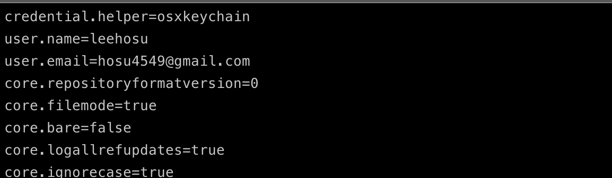

# 들어가며

올해에 개인적으로 목표를 세웠던 것들 중 `Git` 공부가 있었습니다. 하지만 회사내에서 프로젝트를 진행하면서 주말에도 일을 하는 바람에 따로 공부하는 시간을 갖지 못했죠.... 

프로젝트가 성공적으로 마무리 되면서 이제 개인 공부를 할 시간이 확보가 되면서 계획했었던 `Git` 공부를 시작하려고 합니다!

이 포스팅은 시리즈로써 작성될 것이며 책 [ProGit] 을 공부하면서 요약/정리 하는 포스팅입니다!

이 게시글을 보며 도움이 되었으면 좋겠습니다.

## 버전 관리란?

버전 관리는 무엇이고, 이것을 왜 해야할까 ? 

버전 관리 시스템은 파일 변화를 시간에 따라 기록했다가 나중에 특정 시점의 버전을 다시 꺼내올 수 있는 시스템입니다.

버전 관리 시스템을 사용하게 되면 각 파일을 이전 상태로 되돌릴 수 있고, 프로젝트를 통째로 이전 상태로 되돌릴 수 있고, 시간에 따라 수정 내용을 비교해보며, 누가 문제를 일으켰는지도 추적이 가능합니다. 또, 파일을 잃어버리거나 잘못 고쳤을 때도 쉽게 복구 할 수 있습니다.

## Git의 기초

##### 스냅샷
`Git`의 핵심은 데이터를 다루는 방법입니다. `Git`은 데이터를 파일 시스템 스냅샷으로 취급하고 아주 작습니다. `Git`은 커밋하거나 프로젝트의 상태를 저장할 때마다 파일이 존재하는 그 순간을 취급합니다. 파일이 달라지지 않았으면 `Git`은 성능을 위해서 파일을 새로 저장하지 않습니다.

`Git`은 데이터를 스탭샷의 스트림처럼 취급합니다.


##### 거의 모든 명령을 로컬에서 실행
`Git`은 거의 모든 명령이 로컬 퐈일과 데이터만 사용하기 때문에 네트워크에 있는 다른 컴퓨터는 필요가 없습니다.

예를 들어, `Git`은 프로젝트의 히스토리를 조회할 때 서버없이 조회합니다. 어떤 파일의 현재 버전과 한달 전의 상태를 비교해 보고 싶을 때도 Git은 그냥 한달 전의 파일과 지금의 파일을 로컬에서 찾습니다.

즉, 오프라인 상태이거나 `VPN`으로 연결 할 수 없어도 막힘없이 일할 수 있습니다.

##### Git의 무결성
`Git`은 데이터를 저장하기 전에 항상 체크섬을 구하여 그 체크섬으로 데이터를 관리합니다. 그래서 체크섬없이는 어떠한 파일이나 디렉토리로 변경 할 수 없습니다.

`Git`은 `SHA-1` 해시를 사용하여 체크섬을 만들고 모든 것을 해시로 식별합니다. 

##### Git은 데이터를 추가
`Git`으로 무엇을 하든 `Git` 데이터베이스에 데이터가 추가됩니다. 되돌리거나 데이터를 삭제할 방법이 없습니다. `Git`도 커밋하지 않으면 변경사항을 잃어버릴 수 있습니다. 하지만 일단 스냅샷을 커밋하고 나면 데이터를 잃어버리기 어렵습니다.

또, `Git`을 사용하면 프로젝트가 심각하게 망가질 걱정없이 매우 즐겁게 여러 가지 실험을 해볼 수 있습니다!

### 세 가지 상태
- 이 부분은 매우 중요하기 때문에 집중해서 읽으셔야 합니다 !

`Git`은 파일을 `Committed`, `Modified`, `Staged`이렇게 3가지로 상태를 관리합니다. 


- `Committed` : 데이터가 로컬 데이터 베이스에 안전하게 저장된 상태
- `Modified` :  수정한 파일을 아직 로컬 데이터 베이스에 커밋하지 않은 상태
- `Staged` : 현재 수정한 파일을 곧 커밋할 것 이라는 상태


`Git Directory(Repository)` 프로젝트의 메타데이터와 객체 데이터베이스를 저장하는 곳을 말합니다. 이 `Git Directory`가 `Git`의 핵심입니다. 다른 컴퓨터에 있는 저장소를 `Clone` 할 때 `Git` 디렉토리가 만들어집니다.

`Working Directory`는 프로젝트의 특정 버전을 `checkout`한 것입니다.

`Staging Area`는 `Git directory`에 있습니다. 단순한 파일이고 곧 커밋할 파일에 대한 내용을 저장합니다.

`Git`으로 하는 일은 기본적으로 아래와 같습니다.

1. `Working Directory`에서 파일을 수정 한다.
2. `Staging Area`에 있는 파일을 `Stage`해서 커밋할 스냅샷을 만든다.
3. `Staging Area`에 있는 파일들을 커밋해서 `Git` 디렉터리에 영구적인 스냅샷으로 저장합니다.

`Git Directory`에 있는 파일들은 `Committed` 상태입니다. 파일을 수정하고 `Staging Area`에 추가했다면 `Staged`입니다. 그리고 `Checkout`하고 수정했지만, 아직 `Staging Area`에 추가하지 않았다면 `Modified`입니다.

## Git 최초 설정
`Git`을 처음 설치하고 나면 Git의 사용 환경을 적절하게 설정해주셔야 합니다. 한 번만 설치하면 되며 설정한 내용은 `Git`이 업그레이드해도 유지가 됩니다.

##### git config
1. `/etc/gitconfig` : 시스템의 모든 사용자와 모든 저장소에 적용되는 설정입니다. `git config --system` 옵션으로 이 파일을 읽고 쓸 수 있습니다.

2. `~/.gitconfig`, `~/.config/git/config` : 특정 사용자에게만 적용되는 설정입니다. `git config --global` 옵션으로 이 파일을 읽고 쓸 수 있습니다.

3. `.git/cnofig` : `Git Directory(Repository)`에 있고 특정 저장소(혹은 현재 작업중인 프로젝트)에만 적용됩니다.

위의 설정은 3->2->1 순으로 우선시 됩니다.

##### 사용자 정보
`Git`을 설치하고 나서 가장 먼저 해야하는 것은 사용자 이름과 이메일 주소를 설정하는 것입니다.

```bash
$ git config --global user.name "l2h"
$ git config --global user_email hosu4549@gmail.com
```

`--global` 옵션으로 설정하는 것은 딱 한번만 해주시면 됩니다! 즉, 해당 시스템에서 해당 사용자가 사용할 때에는 이 정보를 사용합니다. 만약 프로젝트마다 다른 이름과 다른 이메일 주소를 사용하고 싶으면 `--global` 옵션을 빼고 명령을 실행하면 됩니다.

##### 설정 확인
`git config --list` 명령을 실행하면 설정한 모든 내용을 보여줍니다.

```bash
$ git config --list
```

