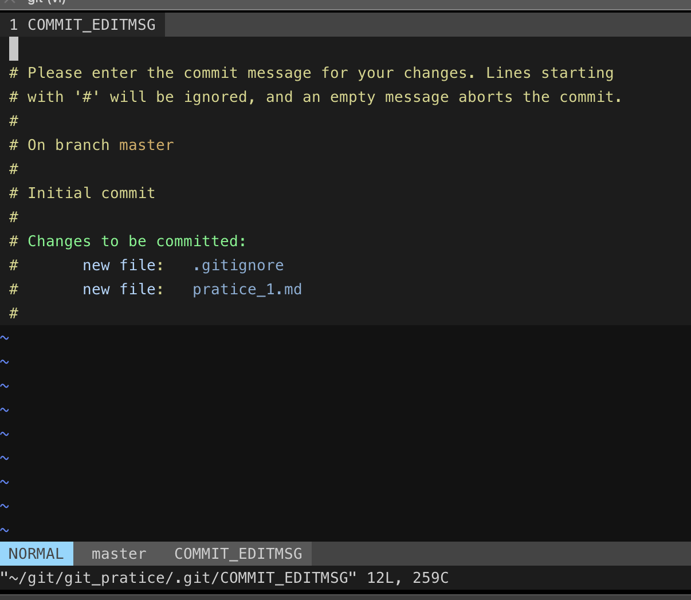
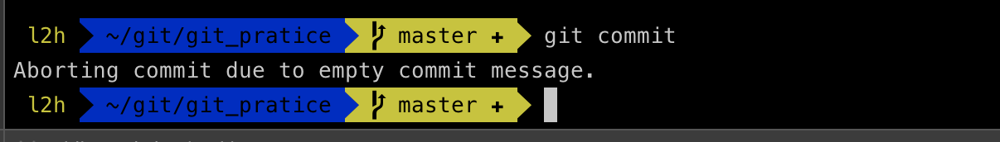
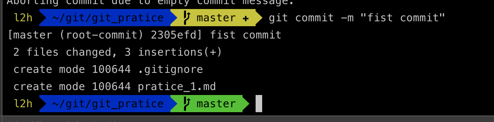
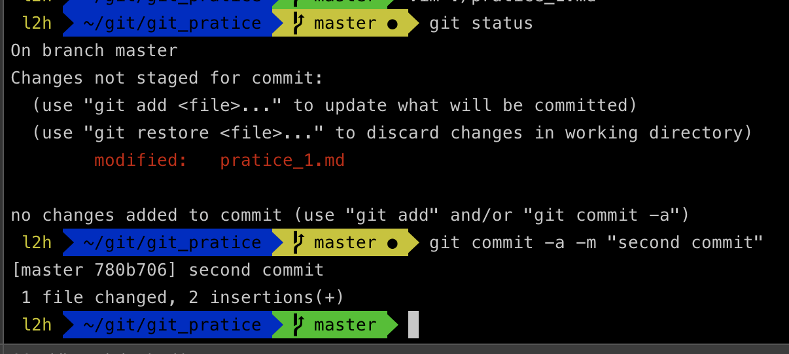
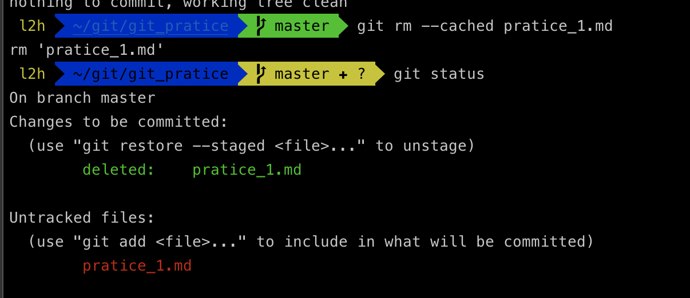
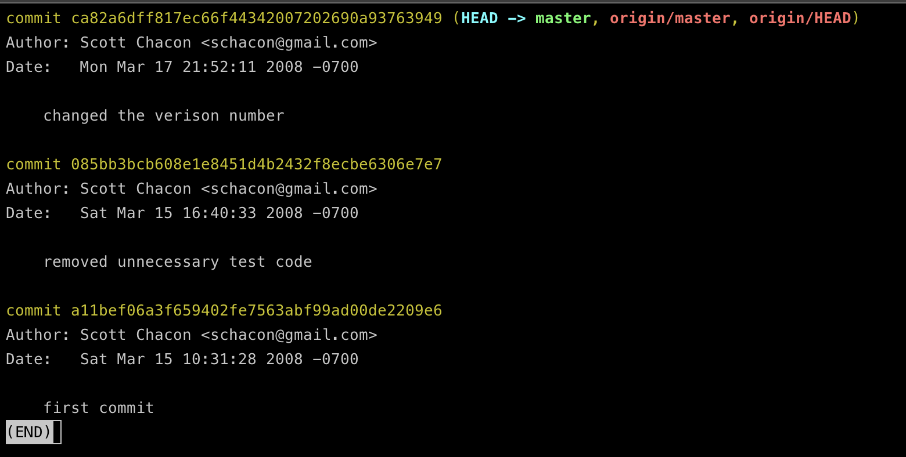
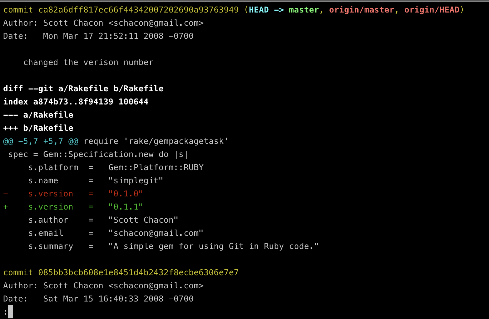
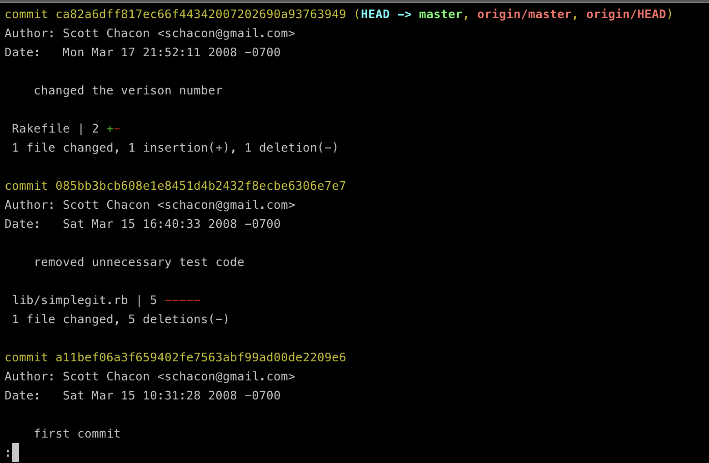

## 들어가며

이번 포스팅에는 `Staged` 상태인 파일들을 저장소에 `commit` 하고 관리해보는 내용을 포스팅하려고합니다 !

## Git Commit

##### 변경사항 커밋하기
수정한 것을 커밋하기 위해 `Staging Area`에 파일을 정리했습니다. `Unstaged` 상태의 파일은 커밋되지 않는다는 것을 기억해야합니다. `Git`은 생성하거나 수정하고 나서 `git add` 명령으로 추가하지 않은 파일은 커밋하지 않습니다. 그 파일은 여전히 `Unstaged` 상태로 남아 있습니다. 커밋하기전에 `git status`명령으로 모든 것이`Staged` 상태인지 확인할 수 있습니다. 그 후 `git commit` 명령을 통해 커밋합니다.

```bash
$ git commit
```



자동으로 생성되는 커밋 메시지의 첫 라인은 비어 있고 둘째 라인부터 `git status` 명령의 결과가 채워집니다. 커밋한 내용을 쉽게 기억할 수 있도록 이 메시지를 포함할 수도 있고 메시지를 전부 지우고 새로 작성할 수 있습니다. 내용을 저장하고 편집기를 종료하면 Git은 입력된 내용으로 새 커밋을 하나 완성합니다.



메시지를 직접 인라인으로 첨부하고 싶다면 `-m` 옵션을 사용하면 됩니다.

```bash
$ git commit -m "message"
```




위와 같이 첫번째 커밋을 작성해보았습니다. `commit` 명령은 몇 가지 정보를 출력하는데 1) `master branch`에 커밋을 했고, 2) 체크섬은 `2305efd` 라는 것을 알려줍니다. 그리고 수정한 파일이 몇개이고 삭제됐거나 추가된 라인이 몇 라인인지 알려줍니다.

`Git`은 `Staging Area`에 속한 스냅샷만을 커밋해야한다는 것을 명심해야 합니다. 즉, 수정은 했지만 아직 `Staging Area`에 넣지 않은 것은 다음에 커밋을 할 수 있습니다.

*추가로 커밋할 때마다 프로젝트의 스탭샷을 기록하기 때문에 나중에 스냅샷끼리 비교하거나 예전 스냅샷으로 되돌릴 수 있습니다.*


##### Staging Area 생략하기
`Staging Area`는 커밋할 파일을 정리한다는 점에서 매우 유용하지만 복잡하고 필요하지 않을때도 있습니다. 그럴 때 아주 쉽게 생략할 수 있는데 `git commit -a` 명령을 실행하면 됩니다. 그래서 git add를 하는 수고를 덜 수 있습니다.





##### 파일 삭제하기
`Git` 에서 파일을 제거하려면 `git rm` 명령으로 `Tracked` 상태의 파일을 삭제한 후 커밋해야 합니다. 이 명령은 `working directory`에 있는 파일도 삭제하기 때문에 실제로 파일도 지워집니다.

커밋하면 파일은 삭제되고 `Git`은 이 파일을 더이상 추적하지 않습니다. 이미 파일을 수정했거나, 수정한 파일을 추적하고 있다면 `-f` 옵션을 주어 강제로 삭제할 수도 있습니다.

또, `Staging Area`에서만 제거하고 `working Directory`에 있는 파일은 지우지 않고 남겨둘 수도 있습니다. 다시말해서 하드디스크에 있는 파일은 그대로 두고 `Git`만 추적하지 않게 합니다. 

=> `.gitignore` 파일에 추가하는 것을 빼먹었다거나, 대용량 로그 파일이나 컴파일된 파일인 .a 파일 같은 것을 실수로 추가했을 때 아주 유용합니다.


```bash
$ git rm --cached 파일명
```




##### 파일 이름 변경하기
`Git`은 파일 이름의 변경이나 파일의 이동을 명시적으로 관리하지 않습니다. 다시 말해서 파일 이름이 변경되었다는 별도의 정보를 저장하지 않습니다.

```bash
$ git mv file_from file_to
```

위의 명령어는 아래의 명령어를 수행한 것과 완전 똑같습니다.

```bash
$ mv file_from file_to
$ git rm file_from
$ git add file_to
```

### 커밋 히스토리 조회하기

새로 저장소를 만들어서 몇 번 커밋했을 수도 있고, 커밋 히스토리가 있는 저장소를 `clone`했을 수도 있습니다. 그럴때 조회를 할 수 있는 `git log` 명령어가 있습니다.


##### 예제
```bash
$ git clone https://github.com/schacon/simplegit-progit
```

위의 프로젝트를 `clone`해서 받아온 후 `git log` 명령어를 실행하면 아래와 같이 출력됩니다.




특별한 옵션없이 git log 명령을 실행하면 저장소의 커밋 히스토리를 시간 순으로 보여줍니다. 그리고 각 커밋의 SHA-1 체크섬, 저자 이름, 저자 이메일, 커밋한 날짜, 커밋 메시지를 보여줍니다.

원하는 히스토리를 검색할 수 있도록 git log 명령은 매우 다양한 옵션을 지원합니다. 

```bash
$ git log -p
$ git log -p -2
```




-p 옵션은 각 커밋의 diff 결과만을 보여주고 -2 옵션은 최근 2개의 결과만 보여주는 옵션입니다. 직접 diff를 실행한 것과 같은 결과를 출력하기 때문에 동료가 무엇을 커밋했는지 리뷰하고 조회하는데 유용합니다. 또, git log 명령에는 히스토리의 통계를 보여주는 옵션이 있습니다.

```bash
$ git log --stat
```



##### 조회 제한 조건

1. `-n` : 최근 n개의 커밋만 조회한다.

2. `--since` , `--after` : 명시한 날짜 이후의 커밋만 검색한다.

3. `--until`, `--before` : 명시한 날짜 이전의 커밋만 검색한다.

4. `--author` : 입력한 저자의 커밋만 보여준다.

5. `--committer` : 입력한 커미터의 커밋만 보여준다.

6. `--grep` : 커밋 메시지 안의 텍스트를 검색한다.

7. `-S `: 커밋 변경(추가/삭제)내용 안의 텍스트를 검색한다.