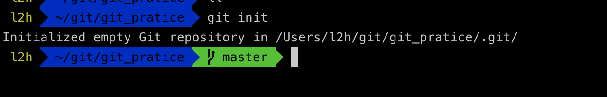
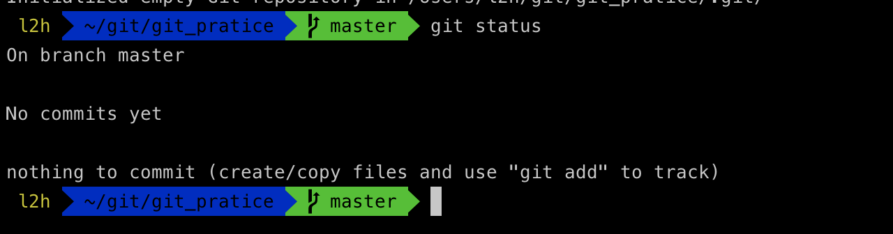
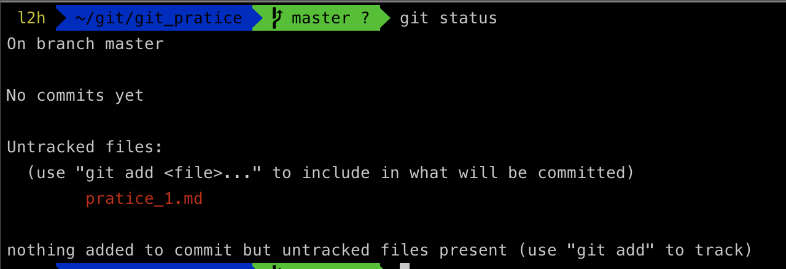
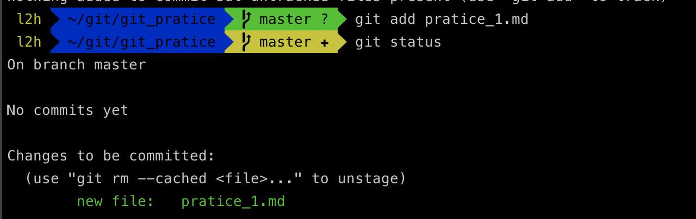
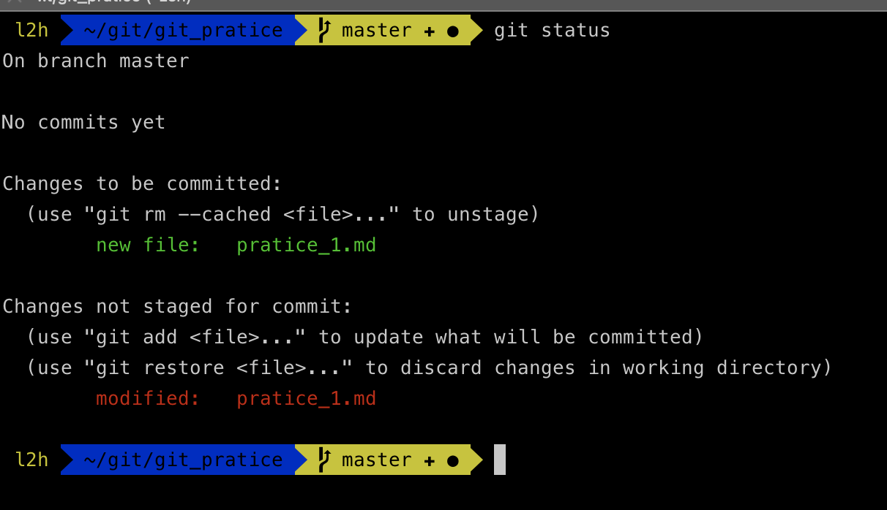
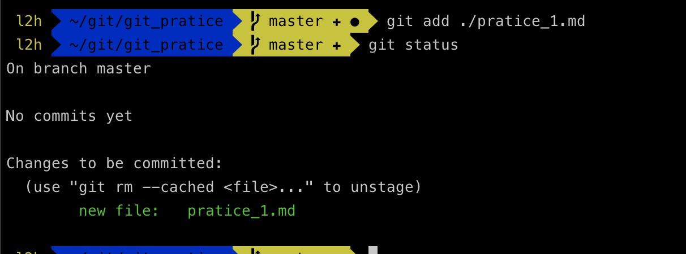
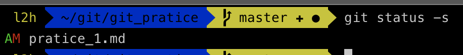
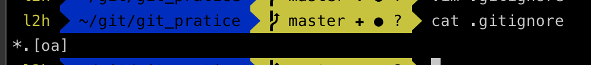
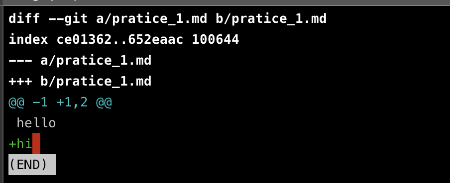

## 들어가며

이번 포스팅에서는 저장소를 만들고 설정하는 방법, 파일을 추적(`Track`)하거나 추적을 그만 두는 방법에 대해 알아 보겠습니다 !

## Git의 기초

### Git 저장소 만들기

`Git`의 저장소를 만드는 방법은 두 가지 입니다. 

1. 기존 프로젝트나 디렉토리를 `Git` 저장소로 만드는 방법
2. 다른 서버에 있는 저장소를 `Clone`하는 방법

##### 기존 디렉토리를 Git 저장소로 만드는 방법
기존의 프로젝트를 `Git`으로 관리하고 싶다면, 프로젝트의 디렉토리로 이동해서 아래의 명령어를 실행하면 됩니다.

```bash
$ git init
```

위의 명령어는 `.git` 이라는 하위 디렉토리를 만들게 됩니다. (하지만 이 명령만드로는 아직 프로젝트의 어떠한 관리도 하지 않습니다 !)

##### 기존 저장소를 Clone 하기

다른 프로젝트에 참여하려하거나(`contribute`) `Git` 저장소를 복사하고 싶을 때 `git clone` 명령어를 사용합니다. 

`git`은 서버에 있는 거의 모든 데이터를 복사하게 됩니다. (프로젝트의 히스토리까지 !)


```bash
$ git clone url myName
```

위와 같이 명령어를 입력하면 해당 프로젝트를 다른 이름으로 `clone` 할 수 있습니다.


### 수정하고 저장소에 저장하기

먼저 앞서 `git directory`에 파일이 쓰여지는 과정을 먼저 알아보겠습니다.


`Working Directory`의 모든 파일은 크게 `Tracked(관리대상)`와 `Untracked(관리대상이 아님)`으로 나눠집니다.

`Tracked` 파일은 이미 스냅샷에 포함되어있는 파일이며 `Unmodified(수정하지 않음)`와 `Modified(수정함)`, `Staged(커밋으로 저장소에 기록)`하는 상태로 나눠집니다. 그리고 나머지는 모두 `Untracked` 파일입니다. 

즉, `Untracked` 파일은 `Working Directory`에 있는 파일 중 스냅샷에도, `Staging Are`a`에도 포함되지 않은 파일입니다.

처음 저장소를 `Clone`하면 모든 파일은 `Tracked`이면서 `Unmodified` 상태입니다. 

나아가 마지막 커밋 이후 아무것도 수정하지 않은 상태에서 어떤 파일을 수정하게되면 그 파일은 `Modified` 상태가 됩니다.

실제로 커밋을 하기 위해서는 이 수정한 파일을 Staged 상태로 만들고, `Staged` 상태인 파일을 커밋합니다.

#### 예제를 통해 공부하기

이제는 파일을 수정하고 파일의 스냅샷을 커밋해보겠습니다~! (실습 !!)

먼저! 빈 디렉토리를 만들어보겠습니다.

```bash
$ mkdir git_pratice
```

이 디렉토리를 `git director`y로 사용하기 위해 초기화를 해줍니다.

```bash
$ git init
```



##### 파일의 상태 확인하기

`Git` 초기화를 시켜주고 먼저 상태를 확인해줍니다.

```bash
$ git status
```



위의 내용은 파일을 하나도 수정하지 않았다는 것을 말해줍니다. `Tracked`나 `Modified` 상태인 파일이 없다는 의미입니다.

그렇기 때문에 새롭게 파일을 만들고 상태를 확인해보겠습니다.

```bash
$ touch pratice_1.md
$ git status
```



`pratice_1.md` 파일이 `UnTracked files` 부분에 속해 있습니다. 즉, `Git`은 `Untracked` 파일을 아직 커밋에 넣어지지 않은 파일이라고 보는 것입니다.


##### 파일을 추적하기

`Git`이 파일을 추적하게 만들기 위해 `add` 명령어를 실행하고 상태를 확인해보겠습니다.

```bash
$ git add pratice_1.md
$ git status
```



`Tracked` 상태이면서 커밋에 추가될 `Staged` 상태라는 것을 확인할 수 있습니다.

`Changes to be committed` 에 들어 있는 파일은 `Staged` 상태라는 것을 의미합니다. 커밋하게되면 `git add`를 실행한 시점의 파일이 커밋되어 저장소 히스토리에 남게됩니다.

이 명령을 통해 디렉토리에 있는 파일을 추적하고 관리할 수 있습니다.


##### Modifed 상태의 파일 Staged 하기

이미 `Tracked` 상태인 파일을 수정하는 법을 알아보겠습니다. 

먼저 `pratice_1.md` 파일을 수정 후 상태를 확인해보겠습니다!

```bash
$ vim ./pratice_1.md
$ git status
```



`Changed not staged for commit` 이라는 상태는 수정한 파일이 `Tracked` 상태이지만 아직 `Staged` 상태는 아니라는 뜻입니다. `Staged`상태로 만들고 싶다면 `git add` 명령을 실행해야 합니다.


**add의 의미는 프로젝트에 파일을 추가한다기 보다 다음 커밋에 추가한다고 생각하는게 좋습니다.**

`add` 명령어를 실행하여 `Staged` 상태로 만들고 상태를 확인해보겠습니다.

```bash
$ git add ./pratice_1.md
$ git status
```




지금 이 시점에서 커밋을 하면 `git commit` 명령을 실행하는 시점의 버전이 커밋되는 것이 아니라 마지막으로 `git add` 명령을 실행했을 때의 버전이 커밋됩니다. 즉, `git add` 명령을 한 후 또 파일을 수정하면 `git add` 명령을 다시 실행해서 최신 버전을 `Staged` 상태로 만들어야 합니다!

#### 파일 상태를 짤막하게 확인하기
`git status` 명령으로 확인할 수 있는 내용이 많기 때문에 조금 더 간단하게 보여주는 옵션이 있습니다.

```bash
$ git status -s
```



아직 추적하지 않은 새 파일 앞에는 `??`표시가 붙습니다. `Staged` 상태로 푸가한 파일 중 새로 생성한 파일 앞에는 `A` 표시가, 수정한 파일에는 `M` 표시가 붙습니다.

##### 파일 무시하기

보통 로그파일이나 빌드 시스템이 자동으로 생성한 파일들은 `Git`이 관리할 필요가 없습니다. 

꼭 위와 같은 파일 뿐만아니라 `Git`으로 관리할 필요가 없다고 생각되는 파일들은 `.gitignore` 파일을 만들고 그안에 무시할 파일의 패턴을 적습니다.

```bash
$ touch .gitignore
$ cat .gitingnore
```



`.gitignore` 파일은 아래의 규칙을 따릅니다.
- 아무것도 없는 라인이나, `#`으로 시작하는 라인은 무시합니다.
- 표준 `Glob` 패턴을 사용합니다.
- 슬래시 (`/`)로 시작하면 하위 디렉토리에 적용되지 않습니다.
- 디렉토리는 슬래시를 끝에 사용하는 것으로 표현합니다.
- 느낌표로 시작하는 패턴의 파일은 무시하지 않습니다.

```bash
# 확장자가 .a인 파일 무시
*.a

# 윗 라인에서 확장자가 .a인 파일은 무시하게 했지만 lib.a는 무시하지 않음
!lib.a

# 현재 디렉토리에 있는 TODO 파일은 무시하고 subdir/TODO처럼 하위 디렉토리에 있는 파일은 무시하지 않음
/TODO

# build/ 디렉토리에 있는 모든 파일은 무시 
build/

# doc/notes.txt 파일은 무시하고 doc/server/arch.txt 파일은 무시하지 않음
doc/*.txt

# doc 디렉토리 아래의 모든 .pdf 파일을 무시
doc/**/*.pdf

```

##### Staged 와 Unstaged 상태의 변경 내용을 보기
단순히 파일이 변경됐다는 사실이 아니라 어떤 내용이 변경됐는지 살펴보려면 git status 명령이 아니라 git diff 명령을 사용하면 됩니다. 보통 Staged 파일인 것과 아닌것만 파악해도 되기 때문에 git status으로 충분합니다. 더 자세하게 볼 때는 git diff 명령을 사용하는데 Patch처럼 어떤 라인을 추가했고 삭제했는지가 궁금할 때 사용합니다.

```bash
$ git diff
```



***git diff 는 Unstaged 상태인 것들만 보여줍니다. 그렇기 때문에 수정한 파일을 모두 Staging Area에 넣는다면 git diff 명령은 아무것도 보여주지 않습니다.***

