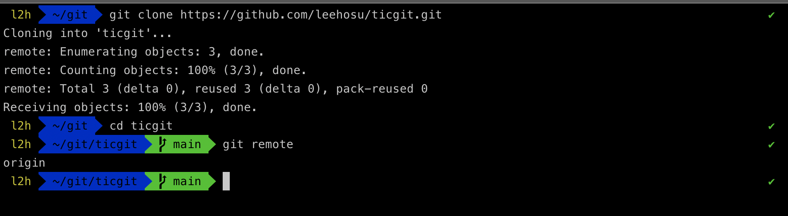
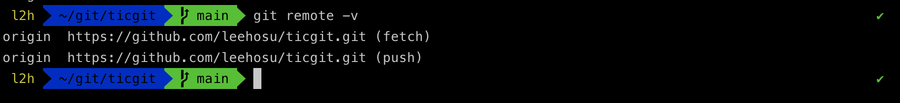
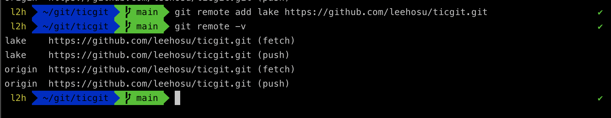
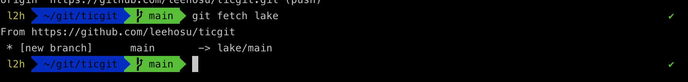

# 들어가며
다른 사람들과 `git`을 사용해서 성공적인 협업을 하려면 `remote` 저장소를 관리할 줄 알아야 합니다.

여기서 말하는 `remote` 저장소란 인터넷이나 네트워크 어딘가에 있는 저장소를 말합니다.
어떤 저장소는 읽기만 가능 할 수 있고, 어떤 저장소는 읽기와 쓰기가 모두 가능 할 수 있습니다.

이번 포스팅에는 이러한 `remote` 저장소를 관리하는 방법에 대해 공부해보겠습니다! 

## 리모트 저장소 

### 리모트 저장소 확인하기
`git remote` 명령으로 현재 프로젝트에 등록된 `remote` 저장소를 확인할 수 있습니다.

저장소를 처음 `clone` 하면 `origin` 이라는 `remote` 저장소가 자동으로 등록되기 때문에 `origin`이라는 이름을 볼 수 있습니다.




`-v` 옵션을 주어 이름과 `URL`을 함께 볼 수 있습니다.




### 리모트 저장소 추가하기

새 `remote` 저장소는 쉽게 추가 하실 수 있는데, 아래의 명령어로 가능합니다.

```bash
$ git remote add [이름] [url]
```



이제 `URL` 대신 `lake`라는 이름으로 사용할 수 있습니다. 

예를 들어 로컬 저장소에는 없는 `lake branch`를 가져오려면 아래의 명령어를 사용하면 됩니다.

```bash
$ git fetch lake
```



### remote 저장소 Pull, Fetch

`remote` 저장소에서 새로운 `branch`를 가져오려면 `fetch` 명령어를 사용하면 됩니다.

이 명령은 `local`에는 없지만 `remote` 저장소에 있는 모든 데이터를 가져옵니다.

저장소를 `Clone` 하면 명령은 자동으로 `remote` 저장소를 `origin` 이라는 이름으로 추가됩니다. 

그래서 나중에 `git fetch origin`을 실행하면 `Clone`한 이후에 수정한 모든 것을 가져옵니다.

`git fetch` 명령은 리모트 저장소의 데이터를 모두 로컬로 가져오지만, 자동으로 `Merge`하지는 않습니다. 그래서 로컬에서 작업하던 것은 직접 `Merge`해야 합니다.

그래서 `git pull` 명령으로 `remote` 저장소 `branch`에서 데이터를 가져올 뿐 아니라 자동으로 `local branch`와 `Merge` 시킬 수 있습니다.

정리 하자면,,

- `git clone` 명령은 자동으로 `local`의 `master branch`가 `remote` 저장소의 `master branch`를 추적하게 합니다.

- `git pull` 명령은 `clone`한 서버의 데이터를 가져오고 그 데이터를 자동으로 현재 작업하는 코드와 `Merge` 시킵니다.


### remote 저장소에 Push 하기

프로젝트를 공유하고 싶을 때 `Upstream` 저장소에 `Push` 할 수 있습니다. 

```bash
$ git push [remote 이름] [branch 이름]
```

`mater` 브랜치를 `origin` 서버에 `push` 하려면 아래와 같이 명령어를 사용합니다.
```bash
$ git push origin master
```

위 명령은 `clone`한 remote 저장소에 쓰기 권한이 있고, `clone`하고 난 이후 아무도 `Upstream` 저장소에 `Push` 하지 않았을 때만 사용할 수 있습니다.

다시 말해, `clone` 한 사람이 여러 명이고 다른 사람이 `push` 했을 경우, 충돌이 발생합니다.

그래서 먼저 다른 사람이 작업한 것을 `local`로 가져와 `Merge`한 이후에 `push` 해야합니다.


