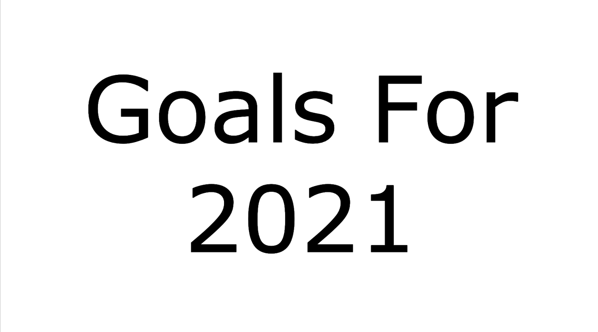

## 들어가며

다사다난 했던 2020년이 지나고 드디어 2021년을 맞이했습니다. 

20년 2월에 대학을 졸업하고 취업을 준비하면서 코로나를 겪어 심히 불안했었고 운 좋게 스타트업에서 저를 필요로하여 비교적 짧은 취준 시간을 갖고 취업을 하였습니다.

나름 자신이 있었지만 막상 실무를 하다보니 상당한 어려움이 있었네요 ㅎ..

2020년에는 회사에 적응하고 업무에 익숙해지기 위해 시간을 주로 보냈다면, 2021년에는 새로운 공부를 통해 업무 능력을 올리고 스스로 레벨업이 되는 한해로 보내려고 합니다.

1년 전체 계획을 계획하는 것보다 반기 혹은 분기로 나누어서 계획을 세웠습니다. (길게 보고 계획을 세우면 쉽게 지칠것을 예상...)

> 2021년은 레이크에게 개발 능력 업그레이드를 위한 한 해

## 2021년 목표

### DataBase
처음에 업무를 하면서 가장 많이 부딪혔던 장벽이 `SQL` 이었습니다.

기본 질의어는 쉽게 구현해서 원하는 data를 뽑아 낼 수 있었지만 `명령문의 최적화`라든지, `UNION`등 단계가 있는 `SQL`은 어려움이 있었습니다. 

올해에는 `SQL`문을 상반기에 공부하여 습득하는 것이 첫번째 목표입니다.

##### 쉽게 배우는 MySQL 완독

|Chapter|기간|기타|
|---|---|---|
|1장 개요| 1월 |
|2장 설치와 사용법| 1월|
|3장 학사관리 예제| 1월 |
|4장 학사관리 예제| 1월|
|5장 테이블 생성| 1월 |
|6장 SELECT - 기본 | 1월 |
|7장 SELECT - Caluse| 2월 |
|8장 SELECT - FROM | 2월 |
|9장 SELECT - WHERE | 2월 |
|10장 SELECT - 통계 함수| 2월  |
|11장 GROUP BY와 HAVING | 2월 |
|12장 SELECT - ORDER BY| 2월 |
|13장 SELECT - 명령문 조합| 2월  |
|14장 부속 질의어| 2월 |
|15장 SELECT - JOIN| 2월 |
|16장 테이블 변경| 3월|
|17장 인덱스 사용| 3월|
|18장 view| 3월|
|19장 Transaction 과 Lock| 3월|
|20장 SQL 명령문의 최적화|3월|
|21장 데이터베이스 설계 지침 |3월|
|22장 MYSQL 유틸리티 |3월|
|23장 Trigger |3월|

### Pro Git

`git`에 대해서는 대학생때부터 욕심이 있어서 공부를 꾸준히 해왔었습니다. 회사에서도 `git`을 쓰기 때문에 앞으로 점차 능숙하게 사용하고 싶어 `Pro Git` 책을 구매하였고 완독이 목표입니다.

( 사실 최종 `git` 목표는 회사의 `git process`에 제가 권한을 받는 것 입니다!!)

하지만 `git`은 꾸준히 공부할 예정이기 때문에 날짜를 정해두고 공부하진 않을 예정입니다. (시간남을때마다 틈틈히 공부!)

|Chapter|기타|
|---|---|
|1장 시작하기|  |
|2장 Git의 기초| |
|3장 Git 브랜치|  |
|4장 Git 서버| |
|5장 분산환경에서의 Git|  |
|6장 GitHub | |
|7장 Git 도구| |
|8장 Git 맞춤 | |
|9장 Git과 여타 버전 관리 시스템 ||
|10장 Git의 내부 | |

### 블로그

원래 블로그는 꾸준히 써오려고 했으나.. 회사 업무와 여러 상황들 때문에 글을 잘 쓰지 못했었습니다..

추가로.. 원래 만들어져있던 git repo가 저의 실수 때문에 날라가버리는 바람에 기존에 작성되어 있던 글 들도 살리지 못했습니다.. 😂 😂 😂

하지만 이를 계기로 2021년에는 `주 1회 개발 블로그 포스팅`을 하려고 합니다 !! 

---

2021년에는 더 나아질 수 있도록 계획을 세워봤습니다.

이 포스트에 공부가 완료되면 ✅  check를 하는 식으로 계속 업데이트를 하려고 합니다~!

