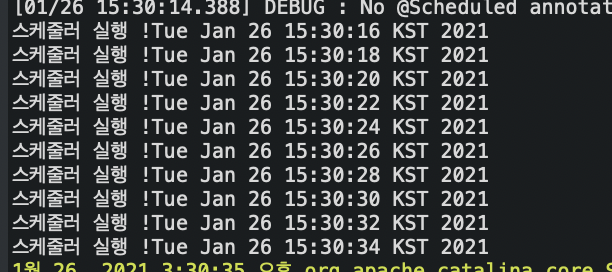
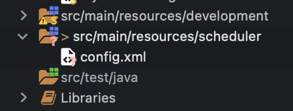
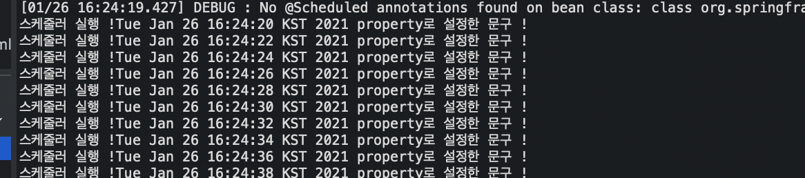

# 들어가며

회사에서 주기적으로 AWS 비밀번호 변경 프로그램을 만들라는,, 업무 아닌 업무가 떨어져서 한번 찾아보면서 개발 해본 내용입니다 !
많이 부족한 내용일 수도 있으니 피드백 언제든지 환영합니다!

## java scheduler
특정 시간에 일괄적으로 처리를 해야하는 부분을 코드로 만들어 처리하는 Job입니다.

예를 들어, 기본적으로 서비스 내에서 생성되는 필요없는 log데이터를 정해진 시간에 일괄로 삭제한다던가 매일 오전 10시에 사용들에게 알림 문자나 메일을 보내야할때 사용하는 것이 이러한 스케줄러입니다.

오늘은 scheduler 구현했던 경험에 대해 포스팅을 하겠습니다.

### @Scheduler

`scheduler`를 구현하려면 `@scheduler`라는 어노테이션을 이용해야합니다. ~~( 이 어노테이션 설정은 여기서 따로 설명하지 않겠습니다! )~~

``` java

@Component
public class PasswordScheduler {
    @Scheduled(cron = "*/2 * * * * ? ") // 2분 마다 실행
    public void SchedulerMain(){    
        Date today = new Date();
        System.out.println("스캐쥴링 !" + today);
    }
}
```

##### 결과



위의 결과를 확인해보면 2초마다 `scheduler` 가 반복되어 실행되는 것을 확인 하실 수 있습니다.


### cron

이제 `schduler`라는게 무엇인지 알게 되었는데 어노테이션의 `cron="*/2 * * * * *" ` 이건 뭐지? 라는 생각을 하실 겁니다. 

##### cron 이란?

`cron`이란 원래 윈도우에서 예약된 작업과 같이 리눅스 시스템에서 예약 작업을 실행하기 위한 프로그램입니다.

##### cron 표현식

cron 표현식은 공백 (" ")으로 구분되는 문자열입니다.

| 항목값 | 필수값 여부 | 허용 범위 | 허용 특수 문자 | 비고 |
|--|--|--|--|--| 
| 초 | Y | 0~59 | * , - | 일부 표현식에서 사용되는 필드 |
| 분 | Y | 0~59 | * , - | |
| 시 | Y | 0~23 | * , -  | |
| 일 | Y | 1~31 | * , - ? L W | ? L W 는 일부 표현식에서만 사용됨 |
| 월 | Y | 1~12 / JAN ~ DEC| * , - |
| 요일 | Y | 0~6 / MON~SUN | * , - ? L # | ? L # 는 일부 표현식에서만 사용됨 |
| 년 | N | 1970~2099 | * , - | standard / default 표현식에는 사용되지 않음 |


- `*` : 와일드 카드로 모든 값을 의미
- `?` : 설정값 없음을 의미
- `-` : 범위 지정


##### cron 표현식 예제

| cron식 | 설명 |
|--|--|
| */1 * * * * ? | 1초마다 |
| 30 0/10 * * * ? | 30초 뒤부터 10분마다 |
| 0 0 10 * * ? | 매일 10시마다 |
| 0 30 10 * * ? | 매일 10시 30분마다 |
| 0 * 10 * * ? | 매일 10:00부터 10:59까지 매분마다 |
| 0 0-30 10 * * ? | 매일 10:00부터 10:30까지 매분마다 |


## Property

### Property란?

기본적으로 `property`는 어떤 값을 나타냅니다. 소스내에서 사용가능한 `parameter` 들을 저장하기 위한 파일이며 `key, value` 형태로 저장되어 있습니다.

`property` 를 왜 사용하냐면 `JAVA`는 파일을 실행하기 위해선 `class`를 생성 후 `java Bean`을 생성한 후 해당 값을 찾아오게 됩니다. 하지만 코딩을 하다보면 매번 코드를 돌렸다 멈췄다 하기에 번거롭습니다. 특히 서버에 관련된 `setting` 이라면 더더욱 그렇지요. 

그럴때 `config` 설정을 `property`에 정의해놓고 해당 `class`에서 `property`에서 값을 가져오게 한다면 설정이 바뀌어 수정을 한다해도 `property`에서 해당 값만 수정하면 되어 서버를 멈출 필요도 없습니다. 

### Property 설정

먼저 `config` 파일을 만들 폴더를 생성해줍니다.





폴더를 생성하고 `config.xml` 파일을 생성했다면 `property`를 작성해줍니다! 


```xml
<properties>
    <comment></comment>
	<entry key="message"> property로 설정한 문구 ! </entry>
</properties>
```

그 후 `root-context.xml` 파일에서 해당 `config` 파일을 읽을 수 있게 경로를 명시해줍니다.

```xml
<util:properties id="config" location="classpath:#{systemProperties['spring.profiles.active']}/../scheduler/config.xml"/>
```


### Property 적용

``` java

@Component
public class PasswordScheduler {

	@Value("#{config['message']}")
	private static String config_message;

    @Scheduled(cron = "*/2 * * * * ? ") // 2분 마다 실행
    public void SchedulerMain(){    
        Date today = new Date();
        System.out.println("스캐쥴링 !" + today + config_message);
    }
}
```

##### 결과




이제 `cron 표현식`으로 특별한 날짜 및 시간을 정해서 해당 `class`에 `scheduler` 어노테이션으로 명시를 해주시면 설정해 놓은 날짜에 자동으로 실행되는 `scheduler`를 구현하실 수 있습니다.


---

## Reference

- https://m.blog.naver.com/PostView.nhn?blogId=agapeuni&logNo=60102461641&proxyReferer=https:%2F%2Fwww.google.com%2F

- https://mingmi-programming.tistory.com/132