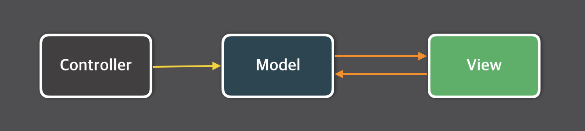
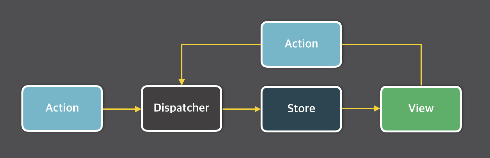

## Flux?

`Redux`를 좀 더 쉽게 이해하기 위해 `Flux` 패턴을 이해해야 합니다.

먼저 `React.js`는 `MVC` 패턴에서 `View` 에 집중해있습니다.




하나의 `controller`에서 데이터를 `model`에 전달하고 `view`단으로 화면을 구성하는것이 일반적인 `MVC `패턴입니다.

<br>

하지만 만약 이러한 방식에서 `View`가 많아진다면 어떡할까요?


`Model`과 `View`가 추가될 때 마다 복잡도가 증가하고, 프로젝트 규모가 기하급수적으로 늘어나게 되며 논리적인 관계 또한 파악하기 힘들어집니다.

<br>

이러한 단점을 보완해줄 수 있는 패턴이 `Flux` 입니다.



`Flux` 패턴에서 `store`는 개념이 등장하는데 이 `store`는 해당 어플리케이션의 모든 데이터 변화를 담고 있는 개념이라고 생각하시면 됩니다.

<br>

`action`이 발생 했을 때, `dispatcher`는 `store`에서 갖고 있는 데이터 들을 어떻게 수정할 것인지 결정합니다.

<br>

이 후 `store`가 변경되면 `store` 내부의 데이터도 바뀌므로 `view`가 갱신되게 됩니다.


<br>

위의 내용을 간단히 정리하자면, `dispatcher`가 `action`으로 인한 데이터 변경 로직을 결정하면 `store`에 변경된 데이터가 쌓여 `view`가 바뀌게 됩니다.

### React와 React + Redux의 차이

- `React.js`는 `React component` 자신이 개별적으로 상태관리를 합니다.
- `React.js` + `Redux`는 데이터들을 한 곳(`store`)에서 상태 관리를 하고, `React component`(`view`)는 그걸 보여주기만 하는 용도로 쓰입니다.

### Redux에서 중요한 개념

1. Action
2. Reducer
3. Store

### Action

`Action`에서는 `state` 변화과 있을법한 상황들을 미리 정의합니다.

### Reducer

`Reducer`에서는 `Action`이 일어났을 때 어떻게 `state`를 바꿔줄지에 대한 로직을 담습니다.

`Action`의 결과가 `Reducer`로 전달되고 `Redux`가 `state`를 해당 결과로 값을 수정합니다.

### Store

변경된 `state`들은 `store`에 담기게 됩니다. 이 때, `store` 내부의 상태 변화에 따라 `view`도 함께 변화해야하기 때문에 `store`와 `view`를 연결해줄 필요가 있습니다.

##### 간단 예제 - class형 component

1. 최상위 `React Component`에 `store`를 만듭니다.

```jsx
import { createStore } from 'redux';

...

store = createStore(reducer);
```

2. `Provider`로 전체 앱을 한 번 감싸줍니다.

```jsx
import { Provider } from 'react-redux';

...

<Provider store = {store}>
	<App />
</Provider>,
document.getElementById('root');
```

3. `Component`와 `store`를 연결합니다. 

```jsx
const Profile = (props) => {
  const { profile, updateProfile, thunkGetProfile } = props;

  // 첫번째 아이디 수정 
  const updateId = () => {
    updateProfile({
      id: 'test',
    });
  };

  // 두번째 아이디 수정
  const updateId2 = () => {
    updateProfile({
      id: 'test2',
    });
  };
  
  return (
    <div>
      <h1>useState, useEffect Example</h1>
      Profile! <br />
      ID: {profile.id} <br/>
      ButtonClick Count is: {counter} <br />
      <button onClick={updateId}>Update profile</button>
      <button onClick={updateId2}>Update profile</button>
    </div>
  );
};

const mapStateToProps = (state: AppState) => ({
  profile: state.profile,
});

export default connect(
  mapStateToProps,
  { getProfile, updateProfile, thunkGetProfile }
)(Profile);
```

`class` 형 `component`에서는 위와 같이 `mapStateToProps`를 이용해서 `props`내 `state`를 정의하고 `connect`를 이용해서 `props`를 바인딩하는 방식으로 구현합니다.

## Redux + Hooks

```jsx
const Profile = (props) => {
	const dispatch = useDispatch();
	const profile = useSelector((store) =>  store.example.profile);

  // 첫번째 아이디 수정 
	const updateId = () => {
			dispatch(updateExampleProfile({ id : "test"}));
	};

  // 두번째 아이디 수정
	const updateId2 = () => {
		dispatch(updateEampleProdile({ id : "test2"}));
	};

	return (
		<div>
      <h1>useState, useEffect Example</h1>
      Profile! <br />
      ID: {profile.id} <br/>
      ButtonClick Count is: {counter} <br />
      <button onClick={updateId}>Update profile</button>
      <button onClick={updateId2}>Update profile</button>
    </div>
	);
};

export default Profile;
```

실제로 `props`내에 `function`들을 이용해서 `component`를 `wrapping`하여 `props`에 연결해주는 방식이 아닌, `hooks`를 통해 더 직관적으로 접근이 가능해졌습니다.

`useSelector`의 경우 `mapStateToProps`와 유사한 기능을 하며, `store`의 `state`의 데이터를 할당할 수 있도록 하는 함수입니다. 

해당 `selector`의 경우는 연결된 `action`이 `dispatch` 될 때마다 `selector`에 접근하여 값을 수정하게 됩니다.

여기서 `profile` 객체는 연결된 `store`의 `example`이라는 `state`의 `profile`을 할당하도록 되어 있고, 실제 하단의 `updateId`와 `updateId2` 에서 `dispatch`되는 `action`에 따라 해당 `profile`에 관련된 `state`가 변경되도록 설정되어 있습니다.

이를 통해 `profile`이라는 객체는 `store`에서 반환되는 값을 통해 `update`가 가능합니다.

`useDispatch` 는 `redux store`에 설정된 `action`에 대한 `dispatch`를 연결하는 `hook`으로써, 실제 `updateExampleProfile`이라는 `action`을 연결할 수 있도록 선언해줍니다.


