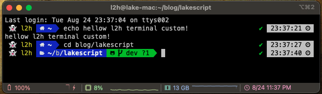
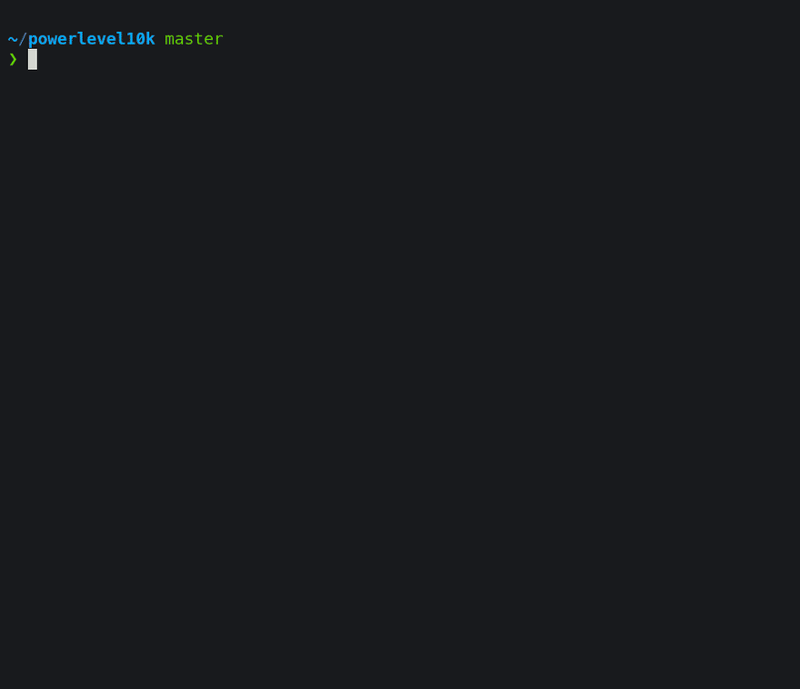
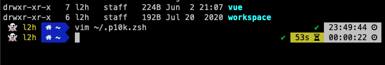
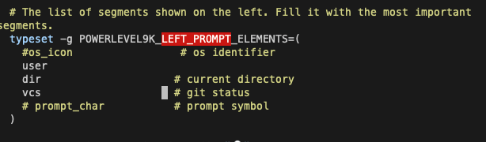
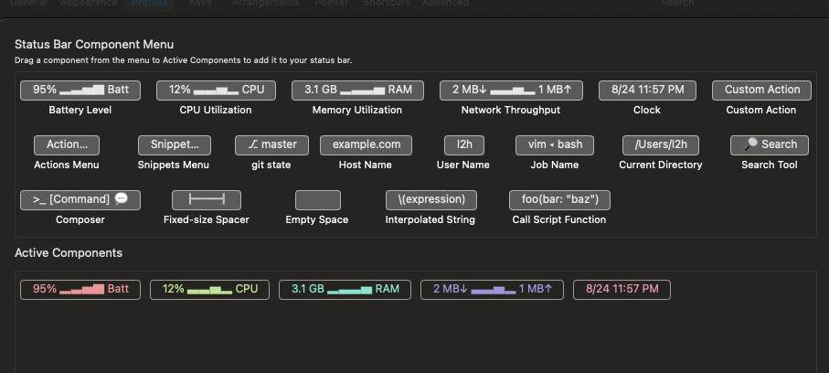

## 들어가며

개발을 하다보면 `terminal`에서 많은 시간을 보내게 됩니다.

그렇기 때문에 보여지는 것도 이쁘게 ! 나만의 스타일로 커스텀 할 수 있게 되면 좋겠죠? 🤡


## Overview



## Pre-setting
✅ &nbsp; [zsh 설치](https://github.com/ohmyzsh/ohmyzsh/wiki/Installing-ZSH)

✅ &nbsp; [Oh my ZSH 설치](https://github.com/ohmyzsh/ohmyzsh)

✅ &nbsp; [iterm2 설치](https://iterm2.com/)

## POWERLEVEL10K 설치

저희가 사용할 `terminal theme`는 `POWERLEVEL10K` 입니다.

해당 테마의 자세한 설명은 [POWERLEVEL10K](https://github.com/romkatv/powerlevel10k)를 참고해주세요 !


### install

```bash
$ git clone --depth=1 https://github.com/romkatv/powerlevel10k.git ~/powerlevel10k
```

먼저 위의 repo를 로컬로 받아옵니다.

그 후 `root` 경로의 `~/.zshrc'를 열어 편집을 해줍니다.

```bash
...
ZSH_THEME="powerlevel10k/powerlevel10k"
...
```

### config

```bash
$ p10k configure
```




위의 명령어로 기본 `config`를 설정해주시면 완료입니다 😎

### custom

기본 설정 외에 사용자 각자의 성향 / 기호에 맞게 `custom` 설정을 하고 싶다면, `~/.p10k.sh`를 수정해주시면 됩니다.




위의 사진 처럼 왼쪽 `prompt`의 `user` 왼쪽에 emoji를 보여주고 싶다라고 하면 위의 `shell`을 수정해주시면 됩니다.

```bash
$ vim ~/.p10k.sh
```

그 후 `POWERLEVEL9K_LEFT_PROMPT_ELEMENTS`를 찾아 갑니다.



> prompt란? 컴퓨터가 입력을 받아드릴 준비가 되었다는 상태를 알려주는 창입니다. POWERLEVEL10K에서는 LEFT, RIGHT를 나눌 수 있는데 이 부분을 직접 custom 할 수 있습니다.


저 부분 밑에 아래의 코드를 적어주세요.

```vim
$ typeset -g POWERLEVEL9K_USER_ICON="👻"
```

`emoji`는 원하시는 `emoji`를 넣어주시면 됩니다.

그 후 해당 `shell`을 적용시키면 정상적으로 적용된 것을 확인하실 수 있습니다.


이와 같이 직접 원하는 custom을 적용시킬 수 있는데, 해당 내용은 [POWERLEVEL10K](https://github.com/romkatv/powerlevel10k) 과 [POWERLEVEL9K](https://github.com/Powerlevel9k/powerlevel9k) 를 참고해주시면 됩니다 !


### Status bar Setting

제 터미널 환경을 보시면 여러 상태들을 보여주는 상태창이 터미널 하단에 설정되어있습니다.

```bash
iterm2 > Profiles > Session > Status bar enabled  
```




원하시는 `status`를 확인할 수 있게 `Active Components` 부분으로 드래그 해주신 후 재실행해주시면 정상적으로 `status bar`가 적용된 것을 확인하실 수 있습니다 !