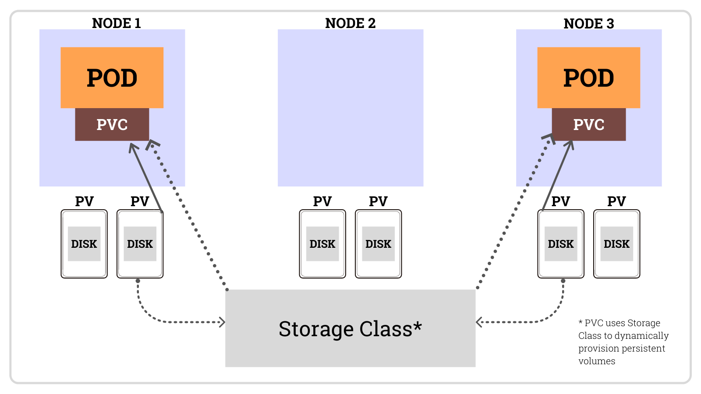
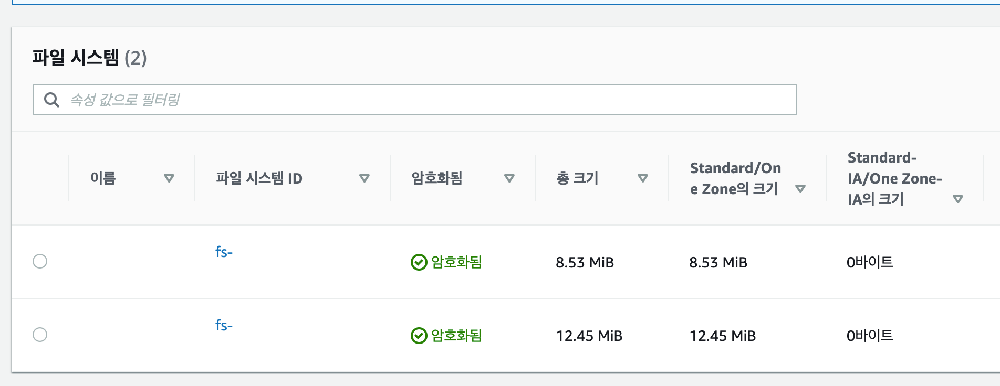
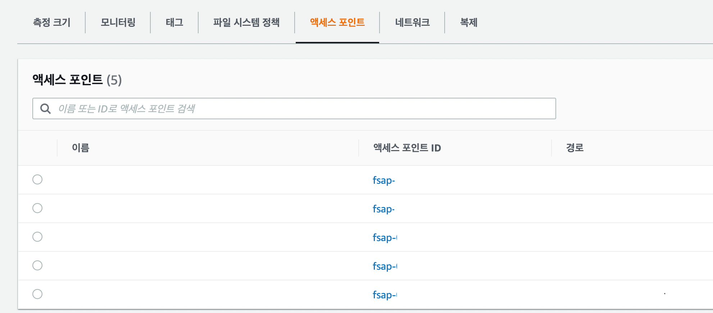
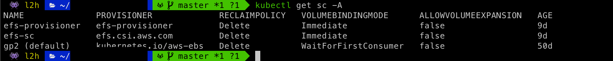
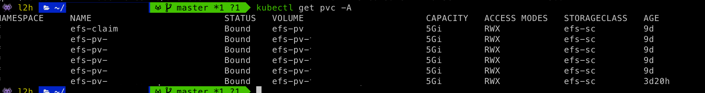
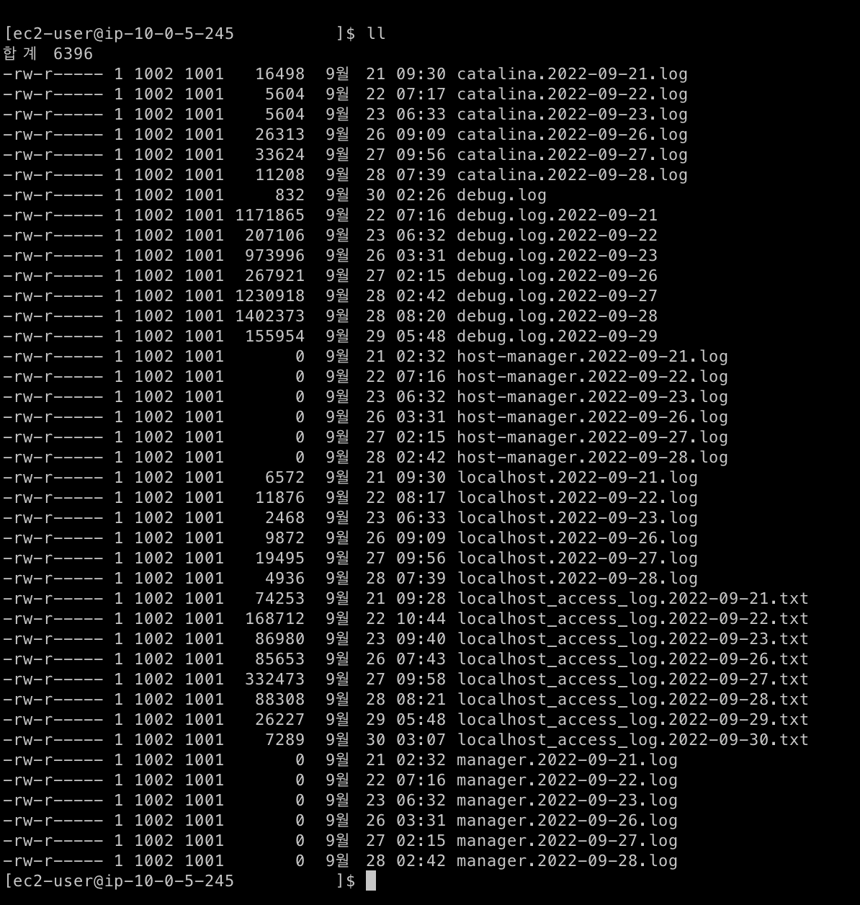

## 들어가며

사내에서 `POD`를 생성할 때에 `EFK Stack`으로 구성하기전, `POD`별로 `log`를 저장해야할 이슈가 있었습니다. (물론 파드는 `stateless`하게 관리되어야하지만 어떤 이유 때문에 `Stateful`하게 관리가 되었었습니다 ㅎㅎ,,,)

그래서 `Deployment`나 `Replicaset`으로 `POD`를 띄우는 것이 아닌 `Statefule`로 `POD`를 띄우게 되었었는데, 그때 공유 스토리지 볼륨이 필요하였었습니다. 여러 자료를 찾던 중 `AWS`에서 제공되는 서비스인 `EBS(Elastic Block Store)`와 `EFS(Elastic File System)` 사이에 고민을 하였었고, 결국 여러 가용영역을 지원하는 `EFS`를 선택하게 되었습니다.

## Volum



`kubernetes`에는 데이터를 저장하는 `Storage` 즉, `Volume`을 제공합니다. `Container` 단위가 아니라 `Pod` 단위이기 때문에 `Pod`에 속해 있는 여러개의 컨테이너가 공유해서 사용할 수 있습니다.

여러 볼륨의 종류가 있지만 해당 포스트에서는 `PersistentVolume`에 대해서 다룰려고 합니다.


## PersistentVolume

### PV
`PV(PersistenetVolume)`이란 `Kubernetes`에서 관리되는 저장소로 `Pod`와는 다른 수명 주기로 관리됩니다. `Pod`가 재실행 되더라도, `PV`의 데이터는 정책에 따라 유지/삭제가 됩니다.

### PVC
`PVC(Persistent Volume Claim)`는 `PV`를 추상화하여 개발자가 손쉽게 PV를 사용 가능하게 만들어주는 기능입니다. 개발자는 사용에 필요한 `Volume`의 크기, `Volume`의 정책을 선택하고 요청만 하면 됩니다. 운영자는 개발자의 요청에 맞게 `PV` 를 생성하게 되고, `PVC`는 해당 `PV`를 가져가게 됩니다.
또한, `PVC`는 `Namespace Object`이기 때문에 `Namespace`에 `depedency`가 걸리게 됩니다.


## AWS EFS
`AWS EFS(Amazon Elastic File System)`은 `AWSAmazon Web Service`에서 제공하는 매니지드 `NFS` 서버입니다. `NFS`는 여러 서버에서 동시에 같은 파일을 공유할 때 편리하게 사용할 수 있지만, 관리가 어렵다는 단점이 있습니다. 아마존 `EFS`를 사용하면 좀 더 쉽게 `NFS`로 서버들 간에 파일을 공유할 수 있습니다. `Kubernetes`와 같은 분산 환경에서도 같은 용도의 서버들 간에 공유 스토리지로 `EFS`를 사용할 수 있습니다. 


## 설정하기

### Create a AWS EFS 
`AWS console`에 접속하여 `AWS EFS` 서비스에서 파일 시스템을 하나 생성합니다.



### Create a AWS EFS AccessPoint
`POD`별로 쌓는 데이터를 다 다르게 설정해야하니 `Access Point`를 설정합니다.




저는 총 5가지의 `Application`이 있으며 각각 데이터를 따로 수집해야하기 때문에 `AccessPoint`를 5개 생성해두었습니다.


### AccessPoint Mount

그 후 헤딩 파일 시스템과 연동할 서버에 접속하여 폴더를 생성 한 후 `Access Poin`t 를 `mount` 합니다.

```
sudo mount -t efs -o tls,accesspoint=${ACCESSPOINT_ID} ${EFS_ID}:/ /${PATH}
```

### Install  AWS-CSI-Driver 

먼저 `AWS-CSI-Driver`를 설치합니다.

```
helm repo add aws-efs-csi-driver https://kubernetes-sigs.github.io/aws-efs-csi-driver/
helm repo update
helm upgrade -i aws-efs-csi-driver aws-efs-csi-driver/aws-efs-csi-driver \
    --namespace kube-system \
    --set image.repository=602401143452.dkr.ecr.ap-northeast-2.amazonaws.com/eks/aws-efs-csi-driver \
    --set controller.serviceAccount.create=false \
    --set controller.serviceAccount.name=efs-csi-controller-sa

```


### POD 생성하기

> ${} 부분은 직접 작성 해야하는 부분입니다.

#### storageClass
```
kind: StorageClass
apiVersion: storage.k8s.io/v1
metadata:
  name: ${STORAGECLASS_NAME}
provisioner: efs.csi.aws.com
```
위의 형식으로 `yaml`파일을 작성 한 후 적용합니다.

#### result




#### PersistentVolume
```
---
apiVersion: v1
kind: PersistentVolume
metadata:
  name: efs-pv-app
spec:
  capacity:
    storage: 5Gi
  volumeMode: Filesystem
  accessModes:
    - ReadWriteMany
  persistentVolumeReclaimPolicy: Retain
  storageClassName: ${STORAGECLASS_NAME}
  csi:
    driver: efs.csi.aws.com
    volumeHandle: ${ACCESSPOINT_ID}
---
...
```

`metadat`e에 해당 `PV`의 이름을 작성해주시고, `spec.storageClassName`에 `StorageClass`의 이름을 작성합니다.
그 후 `spec.csi`에 설정해두었던 `AWS EFS Access Point`에 대한 내용을 작성합니다.

#### result


#### PersistentVolumeClaim
```
apiVersion: v1
kind: PersistentVolumeClaim
metadata:
  name: efs-pv-app
  namespaces: ${APP_NAMESPACE}
spec:
  accessModes:
    - ReadWriteMany
  storageClassName: ${STORAGECLASS_NAME}
  resources:
    requests:
      storage: 5Gi
---
...
```

`PV`C는 생성해둔 `PV`와 매핑이 되어야합니다. 그렇기 때문에 이름을 같게 설정해두어야 자동으로 매핑되어 생성됩니다.

#### result



#### POD

```
...
    spec:
      affinity:
        nodeAffinity:
 ...
        kubernetes.io/os: linux
      volumes:
      - name: data-path
        persistentVolumeClaim:
          claimName: efs-pv-app
---
...
```

`spec.containers.volumeMounts.claimName`에 위에서 생성해두었던 `pvc` 명을 적어줍니다.


## 결과

그 후 `mount` 했던 디렉토리로 이동하여 데이터들이 잘 쌓여있나 확인합니다.





## Reference
- https://bcho.tistory.com/1259
- https://do-hansung.tistory.com/57
- https://kubernetes.io/ko/docs/concepts/storage/storage-classes/
- https://www.44bits.io/ko/post/amazon-efs-on-kubernetes-by-using-efs-provisioner