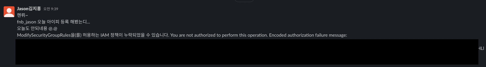
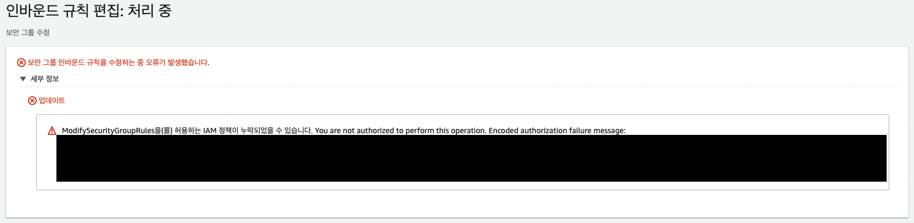
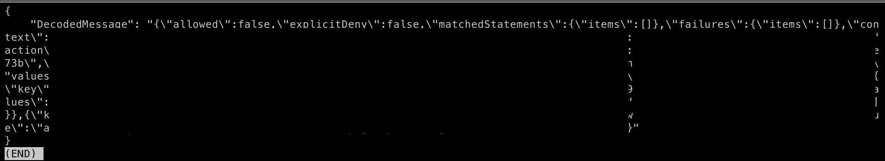

## 들어가며

보통 `AWS`를 사용하다보면 `AWS Management Console`에서 `GUI`식으로 제공되는 화면에서 `Control`하는 경우가 많습니다.

특히, 권한과 같은 부분은 이해하기 쉽게 목록화되어있으니 `Management Console`을 주로 사용하는 편입니다.

`AWS Management Console`에서 작업을 하던 중에 `Error`가 발생하게 되면 암호화되어 `Message`가 노출이 되는데, `AWS cli`에서 `Decode`하는 방법에 대해 포스팅 해보겠습니다.


### 무엇이 문제인가..

현재 사내에서 계정별로 권한을 부여하고 있습니다. 특정 계정에게 특정 `Security Group`의 `AuthorizeSecurityGroupIngress`, `RevokeSecurityGroupIngress`, `RevokeSecurityGroupEgress`, `AuthorizeSecurityGroupEgress`, `ModifySecurityGroupRules`, `UpdateSecurityGroupRuleDescriptionsIngress`, `UpdateSecurityGroupRuleDescriptionsEgress` 권한을 부여하고 특히 `ModifySecurityGroupRules` 권한에는 자유롭게 수정가능하도록 `security-group-rule`을 전부 열어주는 작업이었습니다.


### Encoding Message

위의 권한을 정상적으로 세팅한 후 계정을 전달하였는데, 아래의 메새지가 왔습니다.





내용은 특정 보안그룹에서 보안그룹규칙의 수정하였는데 `Error Message`가 보여진다는 것이었습니다. 하지만 암호화되어 보여졌기 때문에 어떤 문제인지 알 수 없었습니다,,(후우)





### 무엇이 문제냐 알려달라..

암호화된 메시지만 보고는 아무것도 알 수 없었습니다. 어떤 권한을 부여할때 문제가 생겼는지는 제목에 적혀있어 알았지만, 어디서 부여할때 문제가 생긴건지는 알 수 없었습니다.

### Decoding Message

```bash
$ aws sts decode-authorization-message --encoded-message [message]
```




위의 명령어를 입력하시면 암호화된 `Error Message`가 정상적으로 `Decoding`되어 보여집니다.

위의 저 이슈 문제는 `ModifySecurityGroupRules`의 권한을 모든 `security-group-rule`에서 적용되지 못하게 해서 보안그룹의 보안 그룹 규칙을 수정할때 발생했던 문제였습니다 ㅎㅎ,,


