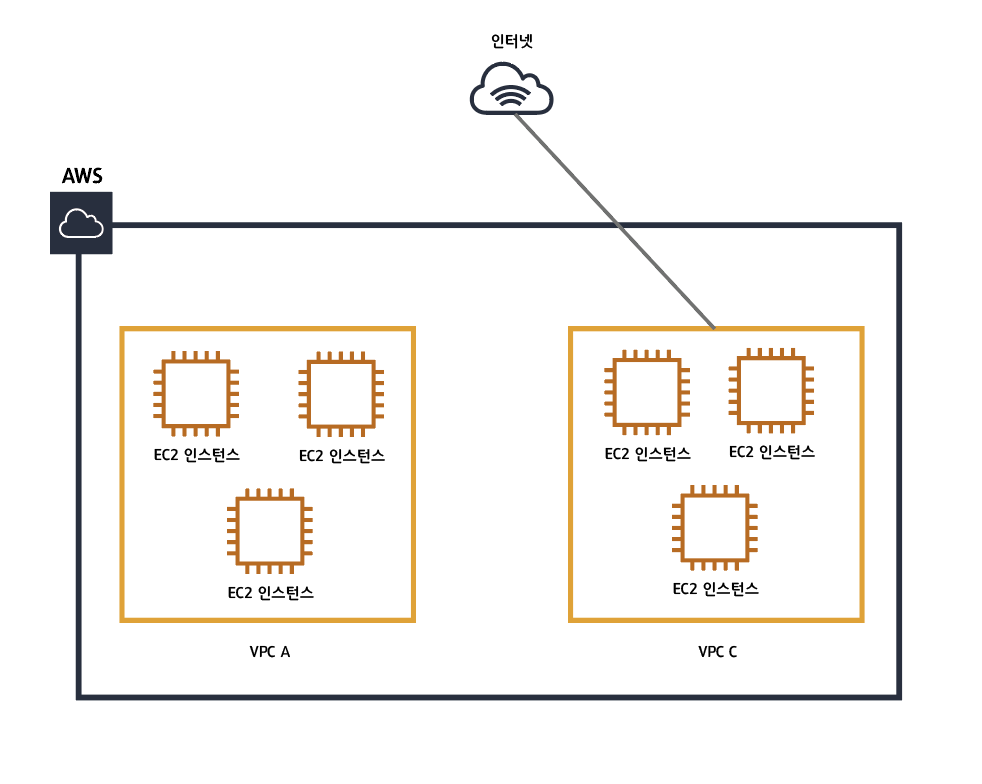

## 들어가며

사내에서 `staging server`를 구축하기 위해 `AWS EKS`를 활용하여 `cluster`를 생성하는 도중 노드 그룹 생성에서 `VPC` 이슈에 부딪히고 말았습니다...    😢

한번 개념정리를 확실히 해놓기 위해 여러 블로그 및 게시글을 보게 되었는데, 이번 기회에 한번 정리를 해보려고 합니다 !

## VPN (Virtual Private Network)

`VPN`은 한국어로 가설사설망 이라고 합니다. 보안상의 이유로 네트워크를 분리하고 싶다면 기존 인터넷 선 공사도 다시해야하고, 건물의 내부선을 다시 뜯어내면서 공사를 해야하기에 가상의 망인 `VPN`을 사용하게 됩니다.

인터넷 프라이버시를 지키기 위한 도구로 널리 사용되기 전에는 멀리 떨어진 네트워크 환경을 하나의 안전한 네트워크로 만드는 역할을 하였습니다.

우리가 현재 사용하고 있는 인터넷은 서버의 `ip`주소에 네트워크 패킷을 주고 받으며 통신을 하고 있습니다. 만약, `google.com`에 접속한다면 먼저 `DNS` 서버를 통해 `ip`주소를 받아오며 패킷을 보내게 됩니다.

주소창에 입력된 주소가 `http`일 경우 평문(`plain text`)로 그 내용을 그대로 주고 받고, `https` 일 경우 암호화된 데이터로 주고 받기 때문에 중간에서 누군가 그 내용을 알 수 없습니다. 

`VPN`은 인터넷에 사용되는 모든 네트워크 패킷을 암호화해서 믿을 수 있는 VPN 서버에 보내고, 그 서버가 나를 대신하여 인터넷에 접속하고 그 결과를 돌려주게 됩니다. 내 컴퓨터와 `VPN`서버 사이에는 안전하게 암호화 되어 그 내용을 준간에서 볼 수 없기 때문에 인터넷이 안전하다고 볼 수 있습니다. 모든 트래픽을 암호화해서 보내기 때문에 설령 내가 접속하려는 웹사이트가 `https`를 지원하지 않아도 안전하게 접속이 가능합니다.

## Amazon VPC (Virtual Private Cloud)

> 사용자가 정의하는 IP 주소 범위 선택, 서브넷 생성, 라우팅 테이블 및 네트워크 게이트웨이 구성 등 가상 네트워킹 환경

`Amazon VPC`는 인터넷에 엑세스 할 수 있는 웹 서버를 위해 `public subnet`, 인터넷 엑세스가 없는 `private subnet`에 데이터 베이스나 애플리케이션 서버 같은 시스템을 배치하고 보안 그룹 및 네트워크 엑세스 제어 목록을 포함한 다중 보안 계층을 사용하여 각 `subnet`에서 `Amazon EC2` 인스턴스의 엑세스를 제어할 수 잇습니다.

`VPC`를 적용하면 위의 그림과 같이 VPC별로 네트워크를 구성할 수 있고 각각의 `VPC`에 따라 다르게 네트워크 설정을 할 수 있습니다. 또한 각각의 `VPC`는 완전히 독립된 네트워크처럼 동작하게 됩니다.

### Region
`AWS`의 물리적 서버가 위치하고 있는 국가 단위의 위치

### Availiability Zone
`Region`내의 물리적 서버의 지역 단위의 위치

### Subnet

##### Pulic Subnet

외부가 개방되어 있어 인터넷 연결이 가능한 서브넷으로써 인터넷 게이트 웨이로 향하는 라우팅이 잇는 라우팅 테이블과 연결되어 있는 서브넷

##### Private Subnet

외부에서 직접적으로 접근이 불가능한 네트워크 영역으로 서브넷이 인터넷 게이트웨이에 등록되어있지 않으므로 해당 서브넷에 위치한 리소스들은 외부와의 연결이 불가능

보안에 엄격하게 다뤄야하는 리소스들을 안전하게 관리하기 위해 사용

### CIDR
1993년에 도입되기 시작한 최신의 `IP` 주소 할당 방법으로 `IP Adress` 그웁을 관리하며 기존의 `IP Adress Class`보다 유연하게 동작

###  Routing Table
서브넷 또는 게이트 웨이의 네트워크 트래픽이 전송되는 위치를 결정하는데 사용되는 라우팅이라는 규칙의 집합으로 구성

`VPC`는 생산량이 제한된 라우팅 테이블을 사용하여 네트워크 트래픽이 전달되는 위치를 제어합니다. `VPC`의 각 서브넷을 라우팅 테이블에 연결하여 서브넷에 대한 라우팅을 제어합니다. 

서브넷을 특정 라우팅 테이블과 연결할 수 있으며 여러 서브넷을 동일한 라우팅 테이블에 연결 할 수 있습니다. (하지만 서브넷은 한 번에 하나의 라우팅 테이블에만 연결 할 수 있습니다.)

또한 라우팅 테이블을 인터넷 게이트웨이 / 가상 프라이빗 게이트웨이 와 연결하여 VPC로 들어오는 인바운스 트래픽에 대한 라우팅 규칙을 정할 수 있습니다.

### VPC Peering
물리적으로 의존하지 않는 두 `VPC`간의 트래픽을 라우팅 할 수 있도록 하기 위한 두 `VPC` 사이의 네트워킹 연결입니다.

동일한 계정, 동일한 네트워크, 다른 `Region`의 `VPC`간의 연결을 할 수 있습니다.

### NAT GateWay

외부 접속이 안되는 `private subnet`의 인스턴스가 외부의 서비스에 연결 할 수 있도록 도와주는 서비스입니다.

`private subnet` 의 인스턴스를 인터넷 또는 다양한 AWS 서비스에 연결하여 통신 할 수 있습니다. 예를들어 프라이빗 서브넷의 인스턴스가 외부 결제 시스템을 사용해야하는 경우 혹은 다른 `AWS` 서비스에 데이터를 전달해야하는 경우 `NAT GateWay`를 `public subnet`에 두어 통신을 할 수 있습니다.

### AWS PrivateLink
데이터를 인터넷에 노출하지 않고 `VPC`와 `AWS` 또는 `on-premise`에서 호스팅되는 서비스 간에 `private` 연결을 설정

`VPC` 엔드포인트를 사용하면 인터넷 게이트웨이, `NAT Device`, `VPN` 연결, `AWS Direct Connect` 하지 않고 `VPC`를 비공개적으로 연결 할 수 있습니다.

## 마무리
이번 게시글에는 `AWS VPC`에 대한 개념을 정리해봤습니다. 다음 포스팅에는 `VPC` 구축을 직접 해보고 정리해본 결과를 공유해드리고자 합니다. 😎

---

## Reference

https://docs.veilduck.app/knowledge/vpn

https://medium.com/harrythegreat/aws-%EA%B0%80%EC%9E%A5%EC%89%BD%EA%B2%8C-vpc-%EA%B0%9C%EB%85%90%EC%9E%A1%EA%B8%B0-71eef95a7098

https://dontbesatisfied.tistory.com/13
