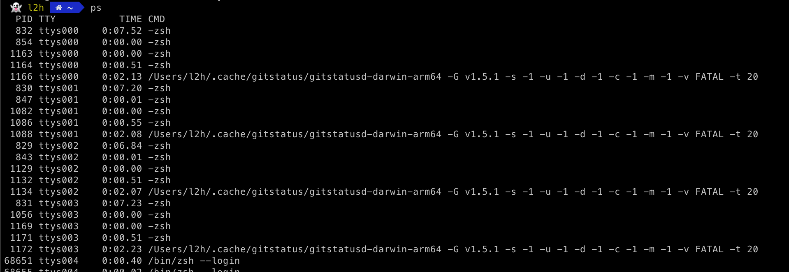
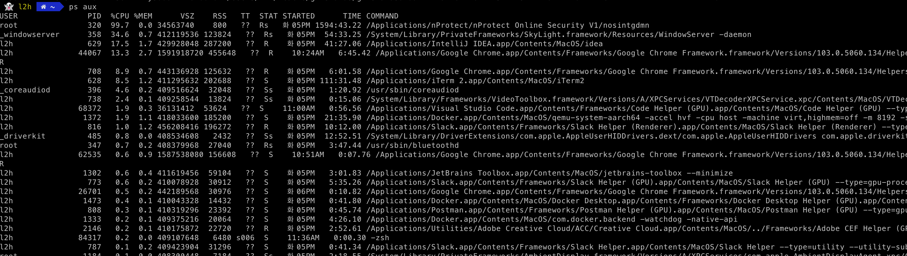
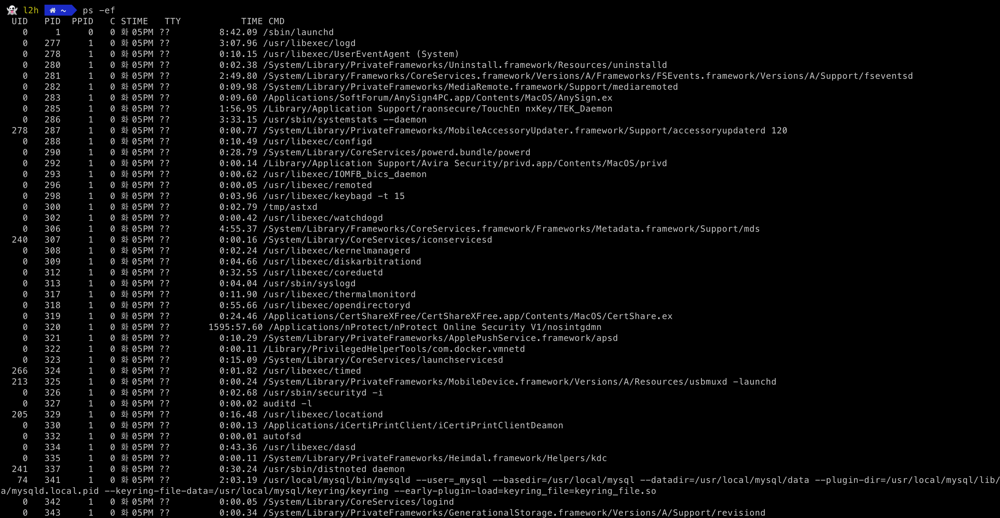

## 들어가며

서버를 운영/관리를 하다보면 `Process`에 대해 긴밀히 알아야합니다. 서버의 어플리케이션에 문제가 생겼을 경우 빠르게 `Process`의 상태를 확인하고 프로세스에 대해 `Kill`을 하든 어떤 행동을 취해야 원활한 서버 운영이 가능합니다. 

오늘은 이러한 프로세스들의 상태를 확인하는 명령어 중 대표적인 명령어인 `PS`에 대해 포스팅 해보겠습니다.

## PS?

`PS`는 `Process Status`의 약자입니다. 즉, 프로세스의 상태를 확인할 수 있는 명령어입니다.

`PS`를 이용하면 현재 실행중인 프로세스 목록과 상태를 알 수 있습니다.


### 사용 방법

``` bash
$ ps [Option]
```



옵션 없이 사용할 경우 `ps`는 현재 셸에서 실행 중인 최소 두 개의 프로세스, 셸 자체 및 명령이 호출되었을 때 셸에서 실행되는 프로세스에 대해 네 개의 정보 열을 출력합니다.

즉, 현재 실행되고 있는 `process`의 목록과 상태를 출력합니다.


### Options

#### 시스템에 동작중인 모든 프로세스를 소유자 정보와 함께 출력

``` bash
$ ps aux
```



#### 시스템에 동작하는 모든 프로세스 출력

``` bash
$ ps -ef
```




##### more

```bash
$ ps -ef | more
```

- 한 페이지씩 화면에 출력되도록 하는 옵션


##### grep 
```bash
$ ps -ef | grep tomcat
```

- 동작중인 전체 프로세스 중에 [특정] 이름의 프로세스 출력


#### PID가 []인 프로세스의 이름 출력

```bash
$ ps -p [] -o comm=
```


## 프로세스의 상태 (STAT)

##### R : Running or Runnable
- `Process`가 정상적으로 동작하고 있는 상태

##### S : Interruptible sleep
- `event`를 완료하기 위해 기다리는 상태
- `Process`가 사용자 혹은 다른 `Proces`s로 부터 `Input`을 받기 위해 대기하고 있는 상태

##### W : Waiting
- `sleep state`에서 `input`을 입력받아 `Running` 가능한 상태이지만 아직 `CPU`에게 선택받지 못해 기다리고 있는 상태

##### S : Stopped
- 일반적으로 알고 있는 `Process`가 멈춘 상태
- `CPU`에게 할당을 받아도 실행되지 않으며, 실행하기 위해서는 `state`를 변경하는 signal을 입력

##### Z : Zombie Process
- 좀비 프로세스 상태 (실질적으로 `shutdown`인데 목록에 노출되는 `process`) 


---

## Reference

- https://hoho325.tistory.com/429
- https://jjeongil.tistory.com/1659
- https://minholee93.tistory.com/entry/Linux-Process-States