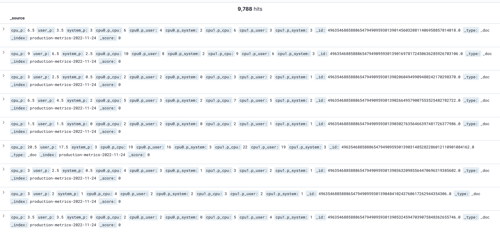

## 들어가며

`kubernetes`를 상용으로 운영하기 전 `CPU`나 `system`에 대한 `Metrics Data`를 수집하고 시각화하여 원활한 운영을 해야할 필요가 있었습니다.

현재 `EFK Stack`으로 `logging system`을 구축해놓았었는데, 그 중 `fluent-bit`를 활용하여 `metrics data`를 수집하는 방법에 대해 다뤄보려고 합니다.


## CPU Metric

`fluent-bit`의 `input plugin`중 `cpu`는 기본적으로 프로세스 혹은 전체 시스템의 `CPU` 사용량을 측정합니다.

설정된 시간에 대해 백분율 단위로 수집되며 현재 이 `plugin`은 `linux`에서만 사용하실 수 있습니다.

### key
##### cpu_p

이 값은 사용자 및 커널 공간에 소요된 사간 대비 전체 시스템의 `CPU` 사용량을 요약해서 보여줍니다. ( `CPU` 코어 수를 고려합니다. )

##### user_p
이 값은 사용자 모드에서 `CPU` 사용량을 의미합니다.( `CPU` 코어 수를 고려합니다. )

##### system_p
커널 모드에서 `CPU` 사용량, 간단히 말해서 커널에 의한 `CPU` 사용량을 의미합니다.( `CPU` 코어 수를 고려합니다. )

### CPU.core
위에 설명한 `key`외에도 `CPU core`별로 데이터가 수집됩니다. `core`는 0에서 N까지 나열됩니다.
##### cpuN.p_cpu
`core` N개의 `CPU` 사용량을 나타냅니다.

##### cpuN.p_user
`core` N개의 사용자 모드에서 사용된 총 `CPU` 사용량을 나타냅니다.

##### cpuN.p_system

N번째 `core`와 관련된 시스템 또는 커널 모드에서 사용된 총 `CPU`입니다.


## Proceeding

### INPUT

```bash
[INPUT]
    Name              cpu
    Tag               my_cpu
```

먼저 `cpu plugin`을 작성해줍니다. `Tag`에는 다른 데이터들도 수집될 수 있으니, 특수한 이름을 작성합니다. (여기선 `my_cpu`)
 

### OUTPUT

```bash
[OUTPUT]
    Name              kinesis_firehose
    Match             my_cpu
    region            [az]
    delivery_stream   [kinesis_firehose_name]
```

먼저 `AWS Kinesis`에서 `firehose`를 생성해두었습니다. 그 후 해당 전송스트림을 `delivery_stream`에 작성해줍니다.


그러면 설정은 모두 완료되었습니다.

`config map`을 삭제해주신 후 해당 `fluent-bit config map file`을 적용해주시면 모든 작업이 완료가 됩니다.


## Result




그 후 `elastic search`에 접속하여 `index` 설정 한 후 `kibana`의 `discover`에서 위와 같이 수집된 `metrics data`를 확인해볼 수 있습니다.


---

## Reference

- https://docs.fluentbit.io/manual/v/1.5/pipeline/inputs/cpu-metrics