# 들어가며

여러 배포 프로세스 중 `Jenkins`로 `Build` 된 결과물을 `SSH` 연결을 통해 직접 서버에 접근하여 배포하는 프로세스에 대해 작성해보았습니다.

보안상 이슈로 인해 권장하는 배포 프로세스는 아니지만, 여러 배포 방식 중 이런 방식도 있다 라는 점을 알아주시면 될 것 같습니다.


## Process


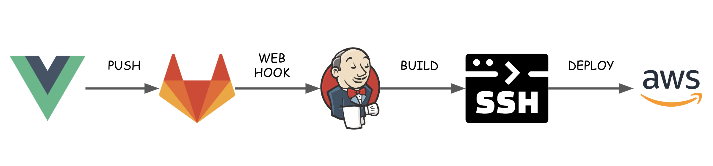


먼저 `Process`는 위와 같습니다.

1. 개발 완료된 코드를 `git`을 통해 저장소에 `push` 합니다.
2. `gitlab`은 `push event`를 `trigger` 하며, `push` 명령이 감지되면 `jenkins`에 `webhook`을 전송합니다.
3. `jenkins`는 `gitlab`으로 부터 `webhook`을 수신하게되면 `build`를 하게됩니다. 이때 설정해놓은 `build process`에 따라 `build`가 진행됩니다.
4. `build`가 완료되면 `SSH` 통신을 하여 `AWS EC2`로 생성된 `server`에 결과물을 전송합니다.


## Jenkins build Pipeline Setting


### build setting

#### Gitlab Webhook Setting

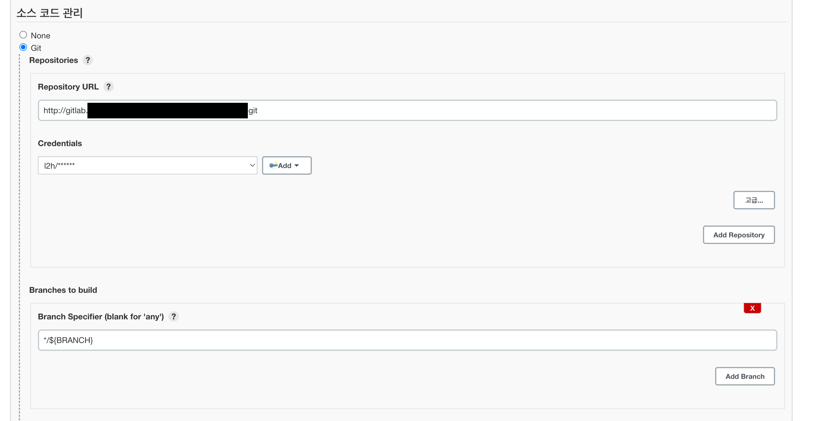


먼저 `webhook`으로 연동될 `gitlab repository` 설정을 합니다.

> Credentials가 Jenkins에 설정되어 있어야 gitlab에서 Webhook 전송을 할때에 인증이 되니 꼭 먼저 설정해주세요 !


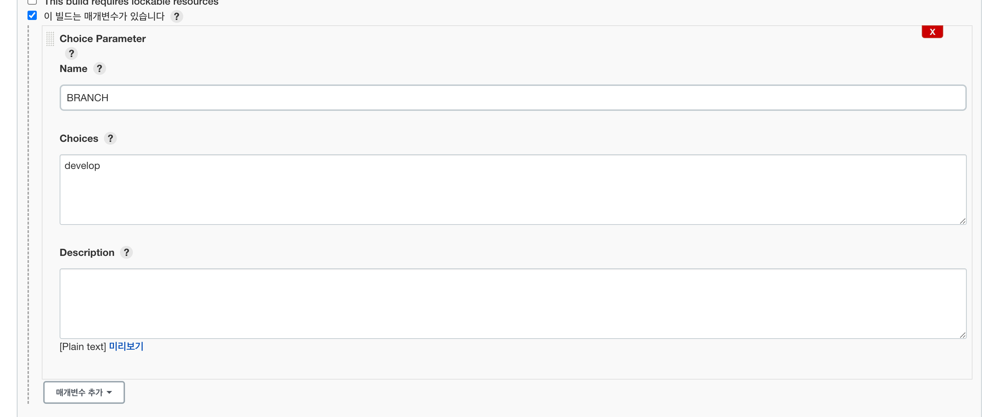

`Gitlab Repository`를 설정하였다면 그 다음 매개변수를 설정합니다.

`Jenkins`의 `build` 매개변수는 특정 `Parameter`가 전달되었을때 실행되는 조건을 의미 합니다.

`gitlab repository`에서 `develop`으로 `push`된 `commit`을 `webhook`으로 발송할때에 `Jenkins`에서 감지하기 위해 `branch : develop` 으로 설정합니다. 즉, `Jenkins`에서는 `develop branch`에 관한 `webhook`만 감지한다는 의미입니다.


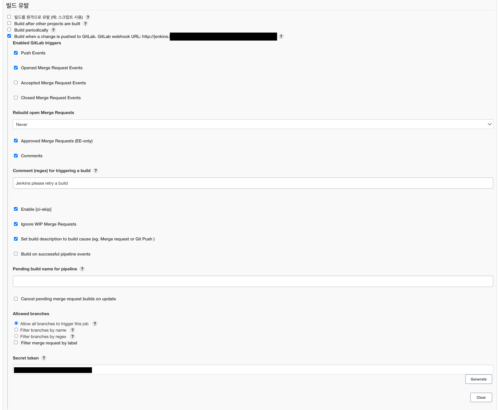

빌드 유발 이벤트를 설정합니다.

해당 설정은 `Gitlab`에서 `Webhook`으로 이벤트를 전송할때에 어떻게 허용할건지에 대한 설정입니다.

맨 하단에 보시면 `Secret token` 생성 칸이 있는데, 해당 값을 `gitlab webhook` 설정화면에서 `secret token` 입력칸에 넣어주시면 됩니다.

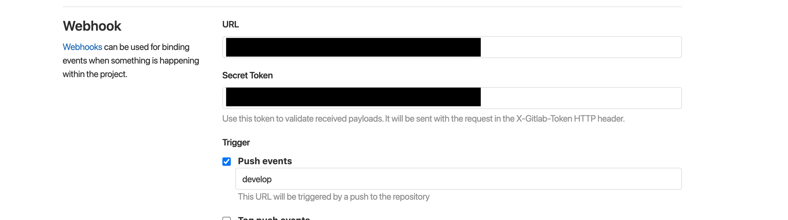

그 후 `Gitlab Repository`의 `Webhook` 메뉴로 이동하여 `URL`에는 `Jenkins Project URL`을 입력하고, `Scret Token`에는 위에서 생성된 `Secret Token`값을 넣어줍니다.


자! 이러면 `Jenkins`와 `Gitlab`의 `Wehook` 연동이 완료되었습니다.

이제 `Gitlab reposiory`에서 특정 `branch`(여기선 `develop`)에 `git push` 이벤트가 발생하면 `Jenkins`에 `Webhook`을 발송하여 빌드가 시작됩니다.


### jenkins build

이 부분은 `build` 설정 단계입니다. 

해당 프로젝트는 `node.js`기반의 `Vue.js` 프로젝트이기 때문에 `Jenkins` 에서 `node.js`를 설치한 후 스크립트로 `build`를 진행해야합니다.

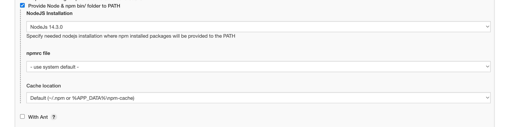

`Jenkins Market Place에`서 `Node.js`를 설치해주신 후 해당 `Jenkins` 프로젝트에서 `Provide` 설정을 합니다.


그 후 `Build` 탭에서 `Script`를 작성합니다.

``` bash
npm install yarn -g
yarn cache clean
yarn install
yarn build:test
```

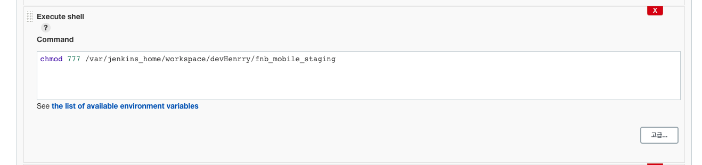

그 후 `chmod` 명령어를 통해 해당 direcoty의 권한을 수정합니다. `directory`의 권한을 수정해주셔야 `SSH` 통신을 통해 `AWS EC2` 서버로 `build`된 결과물을 옮길 수 있습니다.


`node.js` 기반의 `Vue.js` 프로젝트를 `build` 한 후 결과물인 `dist` 디렉토리를 생성하는 것까지 완료되었습니다.


### SSH setting

이제는 `SSH Plugin`을 이용하여 `AWS EC2`에 접속한 후 해당 디렉토리를 옮겨보도록 하겠습니다.

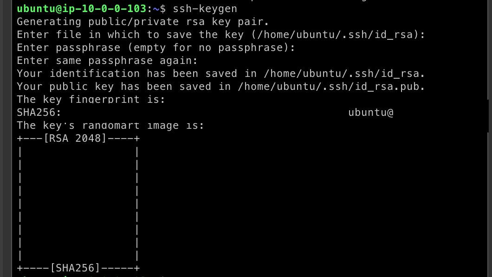


먼저 해당 `AWS EC2`의 서버에 접속을 한 후 `ssh-keygen` 명령어를 통해 `rsa key`를 생성해줍니다.


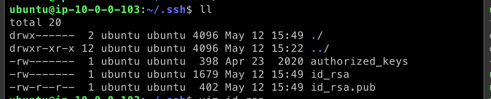

생성된 `rsa-key`는 위의 화면에서 보여지는 것 처럼 `~/.ssh` 경로에서 확인 하실 수 있습니다.

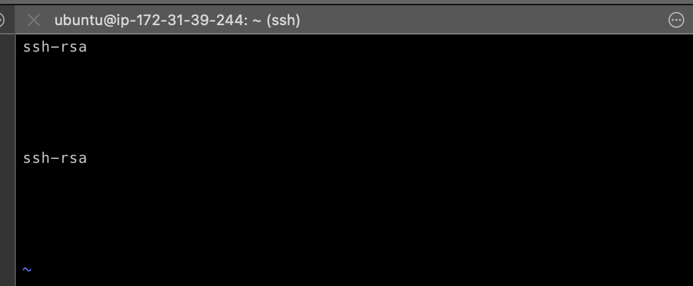


``` bash
$ vim id_rsa.pub
```

`id_rsa.pub` 파일을 편집하여 생성된 ssh-key값을 확인합니다.

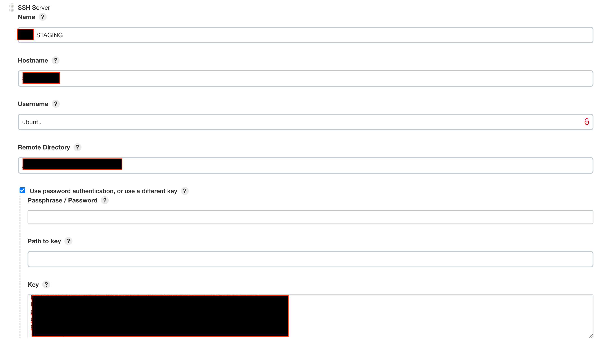

그 후 `Jenkins`로 돌아와 `SSH Server` 설정을 합니다. 

- `Hostname` : `AWS EC2`의 `IP`주소를 입력합니다.
- `Username` : `AWS EC2`의 `User`를 입력합니다. (여기선 `Ubuntu`)
- `Remote Directory` : 접속하였을때의 첫 경로를 입력합니다.
`use Password Authenticaton, or use a different Key` 체크 박스를 선택 한 후 `Key` 입력칸에 위에서 생성해놓은 `ssh-rsa` 값을 입력합니다.

이렇게 해주시면 `Jenkins SSH Publish` 설정이 완료되었습니다!! 🎉🎉


이제 `Jenkins`에서 `build`가 완료되면 `SSH` 통신으로 `AWS EC2` 서버에 접속 한 후 설정해놓은 경로에 `build` 결과물을 전송하게됩니다 !


### Deploy

모든 설정을 마친 후 한번 `develop branch`에 `PUSH`를 해보았습니다.

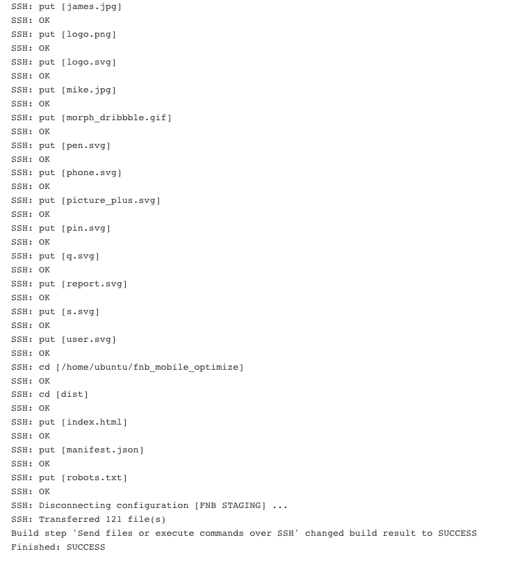

정상적으로 `build`가 완료가 된 후 `SSH` 통신을 통해 `file`을 전송한 `log`를 통해 확인해보실 수 있습니다! 😎😎


## 마치며

사실 보안상의 이슈로 인해 `Jenkins`에서 `SSH Publish` 사용을 권장하지 않습니다,,ㅎㅎ 

하지만 이렇게 구성해보고 자료를 정리해보는 이유는 "이러한 배포 방식도 있었다."라는 것을 경험해보고 싶었습니다. 😺😺


