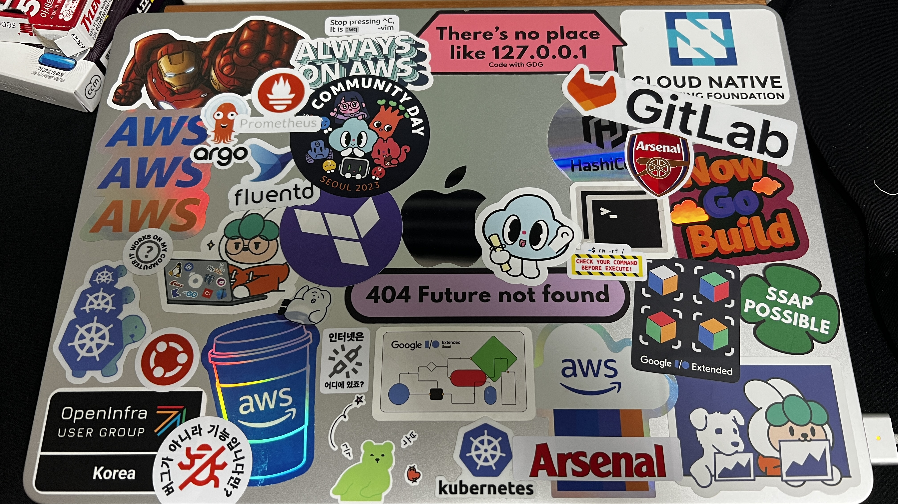
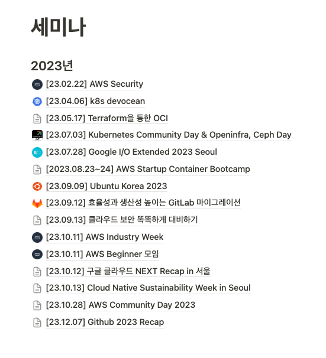
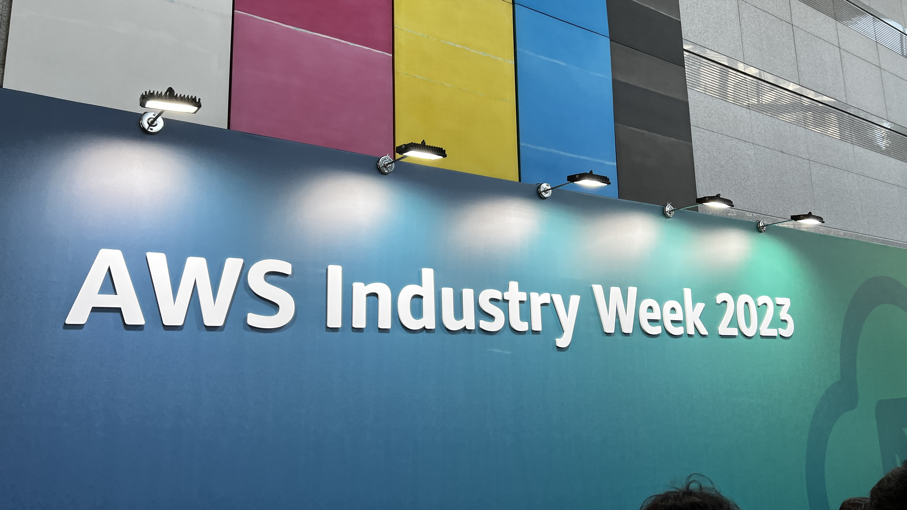
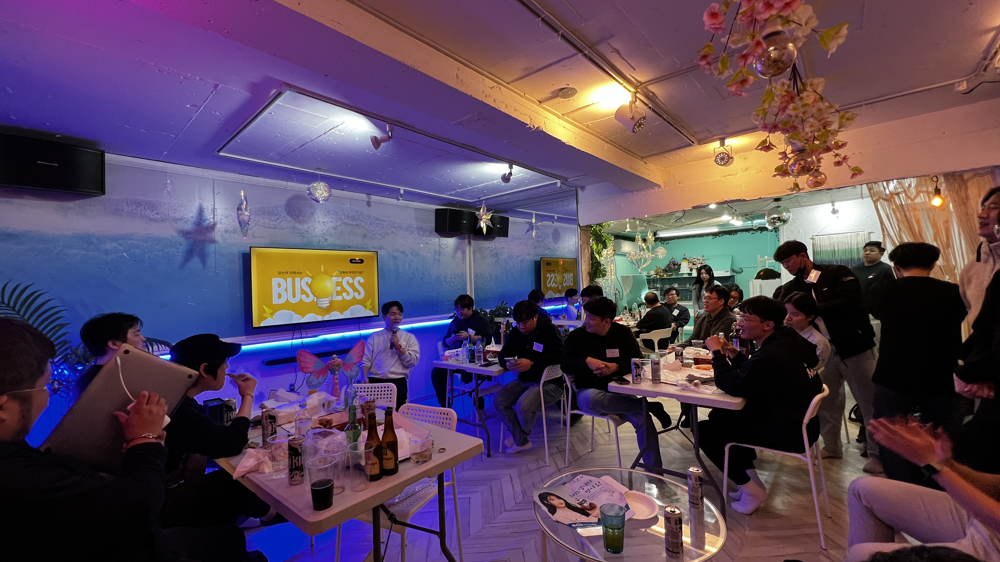
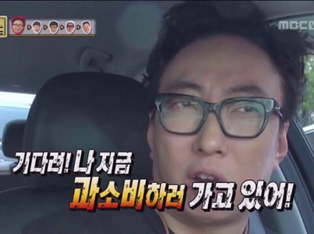
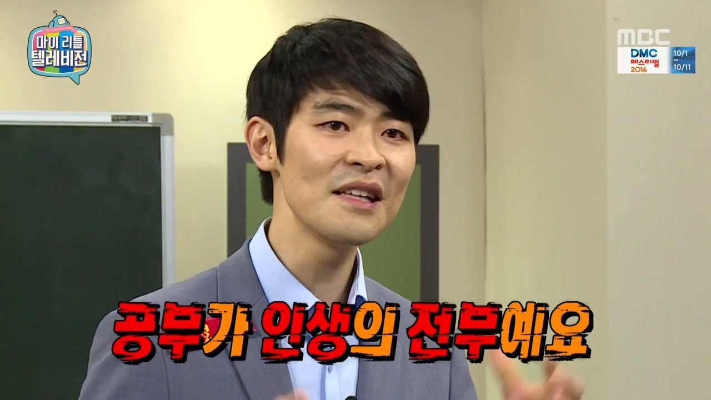

# 들어가며

안녕하세요! 2023년에는 무슨 일을 했었고, 개인적으로 어떤 변화가 있었는지, 목표했던 것을 이루었는지 회고를 한번 해보려고 합니다. 

평소 개인적으로 회고를 하는 타입이어서 개인 회고는 따로 진행했는데요. 좀 다른 성격인 업무적, 커리어적 회고는 블로그를 통해 진행해보려고 합니다. (업무보단 커리어에 대한 고민이 주를 이루네요)

# 내가 무엇을 했지?

## 업무적으로 무엇을 했지?

### Kubernetes를 활용한 컨테이너 운영 환경의 서버 환경을 운영 서버에 적용

2022년에 개발서버와 스테이징 서버에는 k8s의 컨테이너 운영 환경을 적용해놓고 피드백을 받으며 운영 중이었습니다! 안정성이 충분히 증명되었고, 운영서버에 배포했을 때에 또 다른 이슈가 수집 될 것이고 하루 빨리 배포하여 그것을 수집하여 해결하는 것이 더 낫겠다 라는 판단하에 2023년 1분기에 운영 서버에도 배포하였습니다.

결과는 아주!! 성공적!!! 쿠버네티스의 여러 장점 중 재해 복구 가 너무 좋았습니다ㅜㅜㅜㅜ 기존엔 새벽에 문제 생기면 즉시 서버에 들어가서 다시 excute 시켰는데,, 쿠버네티스를 도입하고 나서는 새벽에 문제가 생겨도 다음날 업무시간에 파악 및 해결 할 수 있으니,,, 후후 (+ 다양한 오픈소스도 너무 좋았습니다!!!)

### PLG Stack 구축

기존에 모니터링 시스템으로 AWS OpenSearch를 활용하여 EFK Stack을 구축해놓았었는데, 비용이 상당했습니다.. 그렇기에 하루 빨리 교체가 필요했는데, 개인적으로 Prometheus와 Loki, Grafana를 경험해보고 싶어 해당 Stack으로 구축했습니다. 자세한 내용은 [포스팅](https://leehosu.github.io/kube-prometheus-stack)을 참고해주세요! 

### VPN 구축

개발팀이 워케이션을 떠나기도 하고, 호주에 계신 개발자분이 계셔서 여러 보안적인 이슈에 의해 VPN을 구축했습니다. 이것도 충분한 시간을 갖고 VPN의 원리부터 하나하나 파고들어야 하지만,, 급하게 구축을 했어야 해서 AWS에서 제공해주는 [Workshop](https://workshops.aws/categories/AWS%20Client%20VPN) 을 기초로 작업을 진행했습니다. 

### Jenkins에서 Github Action으로 전환

사내에서 다양한 Devops 시스템을 구축해서 사용하다보니 간소화해야 할 이슈가 생겼습니다. (서버 비용 줄이자는 이슈도 있었습니다.)  그래서 여러 CI 파이프라인 솔루션을 찾던 도중 어차피 사내에서 Github을 통해 코드를 관리하고 있으니 같은 페이지에서 바로 확인할 수 있게 github action을 한번 도입해보자라는 마음으로 구축했습니다. 전환하면서 기존에 불필요했던 ci Stage도 수정하고, base imgae도 경량화 하고, 최대한 cache를 활용하여 build 시간을 줄일 수 있게 되었어요. 개발팀이 코드 병함과 리뷰는 github에서, 빌드는 jenkins에서, 배포는 argo에서 각각 다른 브라우저를 사용해야 했는데, 이번 전환으로 github에서 코드에 관해서는 이동없이 한 곳에서 진행하게 되어 매우 편리하다고 해주었습니다 흐흐 ( slack bot도 한 몫!)

---

## 개인적으로는 무엇을 했지?

### 독서 24권!

|  | 읽은 책 목록 | 성격 |
| --- | --- | --- |
| 1 | 김미경의 마흔수업 | 자기계발 |
| 2 | 데미안 | 인문학 |
| 3 | 이어령의 마지막 수업 | 자기계발 |
| 4 | 태도의 말들 | 자기계발 |
| 5 | 말의 품격 | 자기계발 |
| 6 | 관계에도 연습이 필요합니다 | 자기계발 |
| 7 | 참 괜찮은 태도 | 자기계발 |
| 8 | 어떤 생각들은 나의 세계가 된다. | 자기계발 |
| 9 | 모두를 움직이는 힘 | 자기계발 |
| 10 | 챗GPT 거부할 수 없는 미래 | IT |
| 11 | 내 안의 어린 아이에게 | 에세이 |
| 12 | 테크커리어 | IT |
| 13 | 매니징 쿠버네티스 | IT |
| 14 | 모두의 네트워크 | IT |
| 15 | IT개발자의 영어필살기 | 자기계발 |
| 16 | K 배터리 레볼루션 | 경제 |
| 17 | 말랑말랑 생각법 | 자기계발 |
| 18 | 한자줍기 | 에세이 |
| 19 | 한 권으로 끝내는 네트워크 기초 | IT |
| 20 | 하나님의 열심 | 종교 |
| 21 | 소프트 스킬 | IT |
| 22 | 자기만의 트랙 | 자기계발 |
| 23 | 당신을 더 좋은 회사를 다닐 자격이 있다 | 자기계발 |
| 24 | 그림으로 배우는 AWS 구조 | IT |

2023년에 계획했던 목표였던 25권을 못채웠네요,, 🥲 그래도 독서를 꾸준히 하자라고 목표를 세운 첫해에 만족스러운 결과라고 생각합니다!!! (무한 긍정,,)

저는 주로 주변에 좋은 사람들에게 제가 읽었던 책중 인상깊고, 선물 받을 사람에게 필요할 만한 책을 선물해주는데요. 올해에 선물을 많이 했었고, 2023년에 읽었던 책 중 올해의 책 Top3를 선정하자면 아래와 같습니다!

1. 이어령의 마지막 수업 (https://product.kyobobook.co.kr/detail/S000001860182)
2. 말랑말랑 생각법 (https://product.kyobobook.co.kr/detail/S000201350451)
3. 자기만의 트랙 (https://product.kyobobook.co.kr/detail/S000200688253)

각각 링크를 걸어두었으니,, 꼭 한번은 읽어보시길,,,!

### 맥북 Air 구매

드디어!!  M2 8코어, GPU 10코어, 512GB, 16GB의 스펙을 가진 개인 노트북을 구매하게 되었습니다 !! 🎉🎉

여러 컨퍼런스와 세미나를 다니면서 수집한 스티커를 붙이면서 재미를 더했어요!! 

하지만,, 어느 순간 노트북을 딱 보는데 머리가 너무 아파서 다 떼고 핵심만 붙여놨습니다 하하… (지금은 다 뗏어요!!!!)

### 세미나, 밋업 15곳 참석

자칭 세미나 쟁이인 저는 올해에도 많은 세미나 및 컨퍼런스, meetup에 참석했는데요. 정말 많은 인사이트와 경험을 얻을 수 있었습니다!!

특히, 7월에 진행했던 Kubernetes Community Day는 실제로 업무적으로 도움이 되는 세션들이 많아서 유익했고, 10월에 진행했던 AWS Industry Day에서는 많은 회사에서 AWS를 사용해서 어떻게 그들만의 고민을 해결했는지에 소중한 경험을 들을 수 있었던 시간이었어요!

그리고 저기에는 기록되어 있지 않지만 [2023 느린밤](https://www.linkedin.com/feed/update/urn:li:activity:7137592549975748608/)도 너무 좋았습니다! 매년 참석할 예정이에요 흐흐

2024년에는 더 많은 세미나를 참석하면서 트랜드를 쫒고, 제가 얻을 수 없는 귀한 경험을 간접적으로 느껴볼 수 있도록 더더욱 열정을 갖고 동향을 살피도록 하겠습니다!!

### 링크드인 가입

처음으로 LinkedIn에 가입해서 커리어 적으로 SNS 생활을 했습니다. 정말 다양한 영역에서 영향을 미치는 사람들이 있어 그들의 소식을 접할 수 있었고, 개인적으로 요 근래에 가장 많이 사용하는 APP이 되었습니다. 특히 Devops 그룹에 가입하여 올라오는 꿀팁들을 짧게나마 보는 것도 상당히 도움이 많이 되더라고요! 저의 블로그 포스팅도 업데이트로 올려놓으면 반응도 꾸준히 수집되어 너무 유익했습니다! 특히 이직, 구직활동할 때에 관심 있는 서비스를 하는 회사의 채용공고가 올라오면 링크드인으로 먼저 해당 기업을 살펴보기도 하고, 해당 회사의 속해있는 엔지니어와 개발자들을 보면서 정보를 얻기도 하니 매우 유용합니다! 

### 닌텐도 스위치 구매

평소 게임을 그렇게 좋아하지 않지만,, 과감히 블랙프라이데이 때 구매했습니다!! 어렸을 때 정말 재밌게 했던 포켓몬스터 게임이 떠올라 포켓몬스터 스칼렛도 같이 구매했고 구매한지 2주만에 다 깻네요 ㅎㅎㅎ

가끔 취미로 한두시간씩 할 생각으로 구매했는데, 매우 만족하고 있습니다!! (게임 추천해주세요…..)

## 주저리주저리

### 권고사직

2023년에는 2022년의 성과를 토대로 성공적인 연봉협상을 이루어내어 만족스러운 보상에 이어 Devops Engineer로서 전문성을 키우기로 목표했던 해 인데요. 하지만 회사의 재정적인 문제로 인해 더이상 함께 하지 못하게 되었습니다. (이직 준비를 Start,,,)

### 이직 준비,, 하지만 연이은 불합격

회사에서 이야기를 해주기 전에 이력서를 최신화하면서 시험(?) 삼아 몇 군데를 지원해 보기 시작했었는데요. 운 좋게 서류 통과하고, 과제 전형도 통과하고 면접을 보게 된 곳도 꽤 많았습니다. 하지만 1차 면접에서 대부분 탈락하게 되었는데, 제 능력이 너무나도 부족하다는 것을 새삼 깨닫게 되었습니다. 그래도 꾸준히 2023년에 이직을 하기 위해 면접을 보고 있었는데, 결과는 ALL Failed!

### 원인은 전문성

회사의 규모상 하나를 구축하기 위해 개념 정리를 탄탄하게 하고 구축하는 것보다 빠른 실행에 의해 피드백을 받고 보다 빨리 구축해야 했습니다. (그래도 어느 정도 개념은 잡고 했습니다!) 그래서 제가 생각했던 계획은 빨리 구축하고, 안정화를 거쳐 고도화를 진행하면서 DEEP 하게 파고들어 가 보자! 였습니다. 이런 생각에 의해 하나의 시스템을 구축할 때 생각보다 얕게, 기능에만 문제없을 정도로만 개념 정리를 하고 구축하게 되었습니다. 그러다 보니 면접에서 제가 구축한 시스템에 대해 꼬리 물기식으로 질문을 이어가게 되면 머릿속으로는 그려지는데 말로 설명하지 못하는 상태가 되었습니다. (제가 생각하는 제 것으로 만든 지식은 남들에게 해당 내용에 대해, 개념에 대해 처음 접하는 사람들도 쉽게 이해할 수 있게 설명하는 것이라고 생각하는데… 이것을 못 하니 제 것이 아니었습니다.) 

### 그래서?

2023년 12월부로 저는 다시 백수로 돌아갑니다. 하지만 이직에 급하게 달려들진 않으려고 합니다. 저에 대해 먼저 탐구를 해보고, 제가 지원해 보고 싶은 회사가 무엇인지 목록화해 보려고 합니다. (이미 완료!) 그다음 전문성을 기르기 위해 제가 구축했던 시스템들에 대해 공부를 하고, 자격증을 공부하면서 1~2월을 보내려고 합니다. 하지만 공백기를 길게 갖진 않고, 꾸준히 지원해 보려고 합니다! (좋은 기회가 있을 수 있으니…ㅎㅎ)

### 하지만,, 시작이 좋지 않다,,,

자격증 취득을 목표로 하고 12월에 공부를 제대로 시작하고 12월 28일에 CKA 시험을 보게 되었습니다! 사실 14일에도 시험을 응시했었는데, 예약한 스터디룸의 문제로 인해 시험을 못 보게 되었습니다.. 억울하지만 다시 멘탈을 붙잡고 28일에 응시를 하고 보게 되었는데 결과는 탈락이었습니다. ㅜㅜ (제 점수 : 57 / 통과 점수 :66)

(,,, 내 $395,,,, 또 사야한다니,,,) )

### 2023년 정리

한 마디로 “최악의 해” 였습니다. 

회사의 권고사직, 자격증 불합격, 2023년에는 이직 실패.. 최고의 스타트로 시작했던 해를 최악의 결과로 마무리 짓게 되었습니다 😢

하지만, 늘 그렇듯 시련은 저를 더 단단하게 만들어 준다는 것을 믿어 의심치 않기에!!! 저는 잘 될것임을 믿기에!!

2024년는 기똥찬 한 해가 될 것을 기대해 봅니다!

# 그래서 2024년엔 뭐 할건데?

## 자격증 따보자!

2024년엔 개인적으로 전문성을 더하기 위해 자격증을 공부하려고 해요! 

- CKA
- AWS Cloud Practitioner
- AWS Solutions Architect
- Terraform Associate (003)
- Linux System Administration(LFCS) : 큰 도전!

취득을 해보면서 계속 추가할 예정입니다!! 

### 독서

2023년보다 더 많이!! 최소 24권 이상 독서를 해보려고 합니다! 기록의 중요성을 알기 때문에 읽은 책은 제때 제때 느낌점과 인상깊었던 부분을 따로 기록하려고 합니다! (좋은 책이 있다면 언제든 추천해주세요!!)

### 영어 공부

진짜 영어의 중요성을 절실하게 느낀 2023년이었습니다... 

### 운동

2024년엔 운동을 좀 꾸준히 해보려고 합니다… 제발….

## 일단 이직이 최우선!

내년 계획을 세우기 위해서는 아무래도 이직을 진행한 후에 주어진 업무에 맞게 계획을 해야하니, 이직한 후에 계획하려고 합니다.
11월, 12월의 시간을 투자하여 ***나는 어떤 사람인가?***, ***어떤 커리어를 쌓고 싶은가?***, ***그래서 내가 어떤 회사를 원하는가?*** 에 대해 정리를 해보았습니다. 그러니 조급하게 이직을 하려고 하지 않고 최선을 다해서 원하는 회사에 이직을 하려고 합니다! 조만간 좋은 소식으로 돌아오겠습니다!