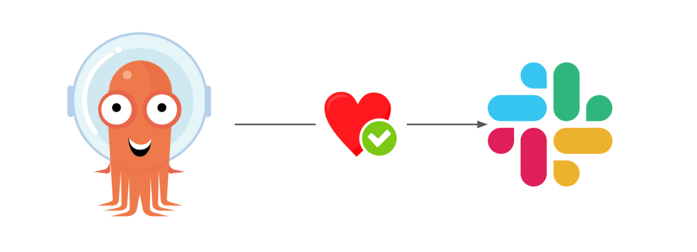
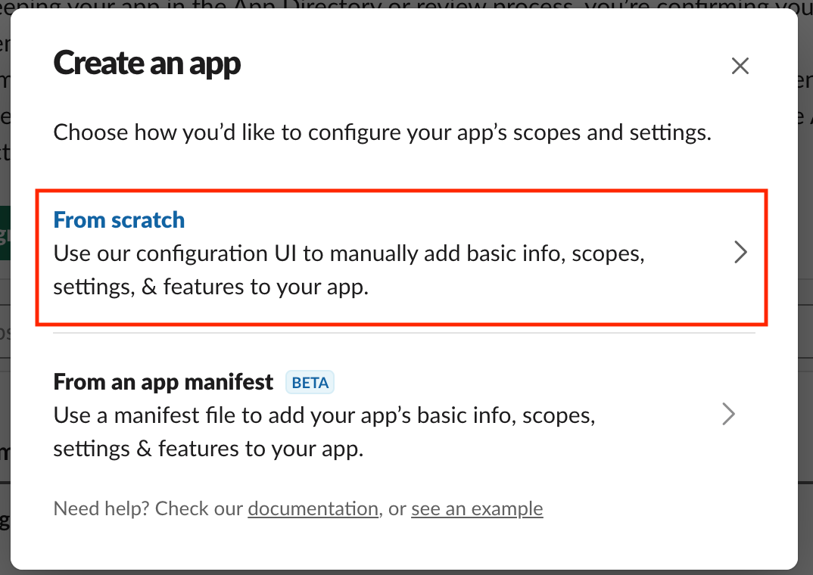
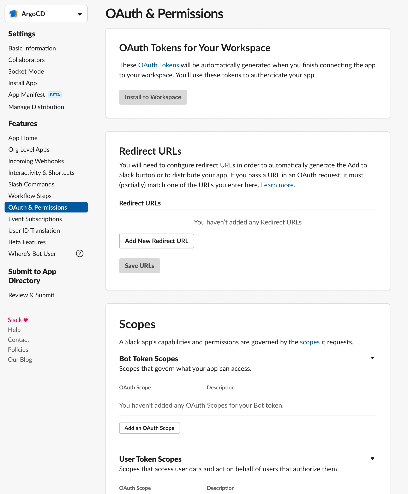
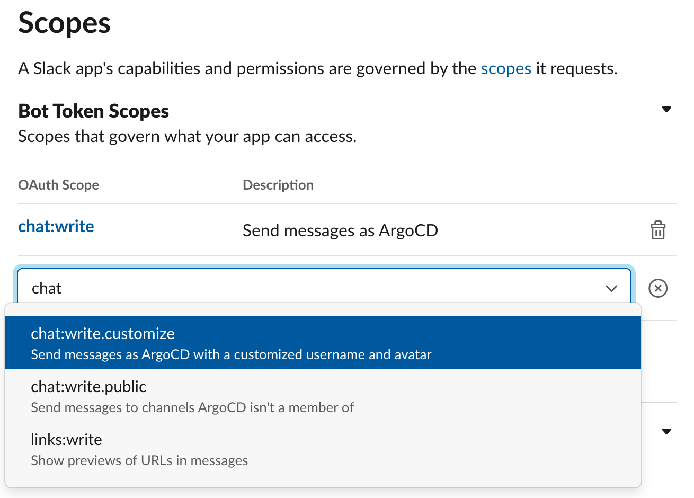
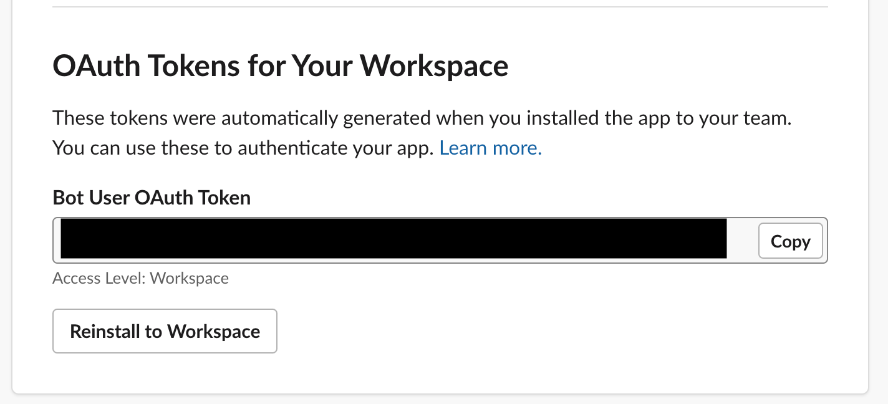
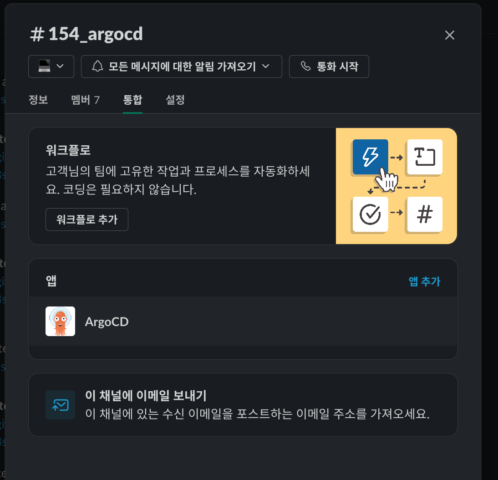
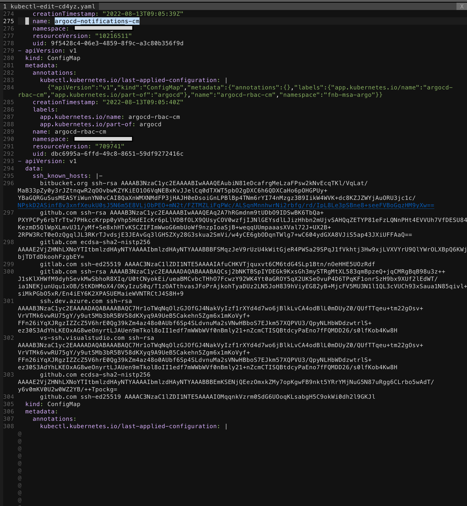

## 들어가며

사내에서 배포 자동화로 ArgoCD를 사용하고 있는데, 여러 개발자가 Sync를 맞추는 작업을 할때에 동시에 작업을 수행할 수도 있는 우려가 있었습니다.

그래서 누군가 Sync를 맞추는 작업을 할때나 완료되었을때, 실패하였을때, 파드가 죽었을 때 슬랙을 통해 알림을 보내는 설정을 하였습니다.


## How To Setting

### Slack



먼저 Slack에서 새로운 앱을 만듭니다.

Create an App > From scratch 버튼을 눌러 애플리케이션을 만들 수 있습니다.





생성한 후 왼쪽 메뉴의 OAuth & Permissions 메뉴에 접근합니다.





Scopes > Bot Token Scopes에서 chat:writ 기능을 활성화합니다.

그 후 상단으로 이동하여 Install To Workspace 을 진행합니다.





그러면 위와 같이 Bot User OAuth Token 이 발급되게 됩니다.





그 후 슬랙에서 해당 앱을 추가해줍니다.


### ArgoCD

`[ ]` 으로 되어있는 칸은 직접 입력해야하는 값입니다.


```bash
$ kubectl apply -f https://raw.githubusercontent.com/argoproj-labs/argocd-notifications/release-1.0/manifests/install.yaml -n [argoCD namespace]
$ kubectl apply -f https://raw.githubusercontent.com/argoproj-labs/argocd-notifications/release-1.0/catalog/install.yaml -n [argoCD namespace]
```

위의 명령어를 실행 시켜 ArgoCD Notification의 manifests 파일과 catalog 파일을 적용합니다.


#### argocd-notifications-secret
```bash
apiVersion: v1 
kind: Secret 
metadata: 
  name: argocd-notifications-secret 
stringData:
  slack-token: [Bot User OAuth Token]
```

#### argocd-nofitications-cm
```bash
apiVersion: v1
kind: ConfigMap
metadata:
  name: argocd-notifications-cm
  namespace: argocd
data:
  service.slack: |
    token: $slack-token
```


```bash
$ kubectl edit cm argocd-notifications-cm -n ${argocd_namespace}
```
위의 명령어 실행 후 

```bash
apiVersion: v1
  kind: ConfigMap
  metadata:
    name: argocd-notifications-cm
    namespace: argocd
  data:
    service.slack: |
      token: [Bot User OAuth Token]<- 이 부분 작성
```


#### argocd-notification check

ArgoCD Configmap에서 notificatoin이 설정되어있는지 체크하기 위해 ArgoCD가 배포되어있는 namespace로 이동하여 아래의 명령어를 입력합니다.

```bash
$ kubectl edit cm
```




위의 이미지처럼 argocd-notifications-cm 가 등록되어있다면 잘 설정되어 있는 것입니다!


그 후 ArgoCD가 특정한 액션을 할 시에 알림을 받기 위해 아래의 명령어를 입력해줍니다.

```bash
$ kubectl patch app [app name] -n [argoCD Namespace] -p '{"metadata": {"annotations": {"notifications.argoproj.io/subscribe.on-sync-succeeded.slack":"[slack chanel name"}}}' --type merge
```


#### ArgoCD Notification List

##### Sync가 성공했을 때 알림
```bash
notifications.argoproj.io/subscribe.on-sync-succeeded.slack
```

##### Sync가 실패했을 때 알림
```bash
notifications.argoproj.io/subscribe.on-sync-failed.slack
```

##### Sync가 진행중일 때 알림
```bash
notifications.argoproj.io/subscribe.on-sync-running.slack
```

##### Sync 상태가 Unknown일 때 알림
```bash
notifications.argoproj.io/subscribe.on-sync-status-unknown.slack
```

##### Health가 Degrade 되었을 때 알림
```bash
notifications.argoproj.io/subscribe.on-health-degraded.slack
```

##### Deploy 되었을 때 알림
```bash
notifications.argoproj.io/subscribe.on-deployed.slack
```


## Finish


위의 설정을 모두 완료하면 정상적으로 Slack 채널을 통해 noti가 오는 것을 확인하실 수 있습니다!