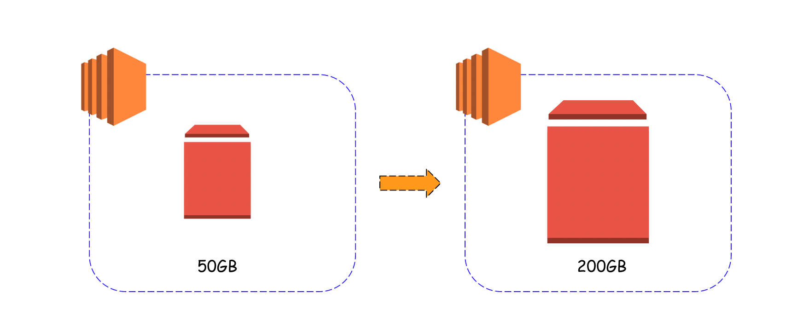
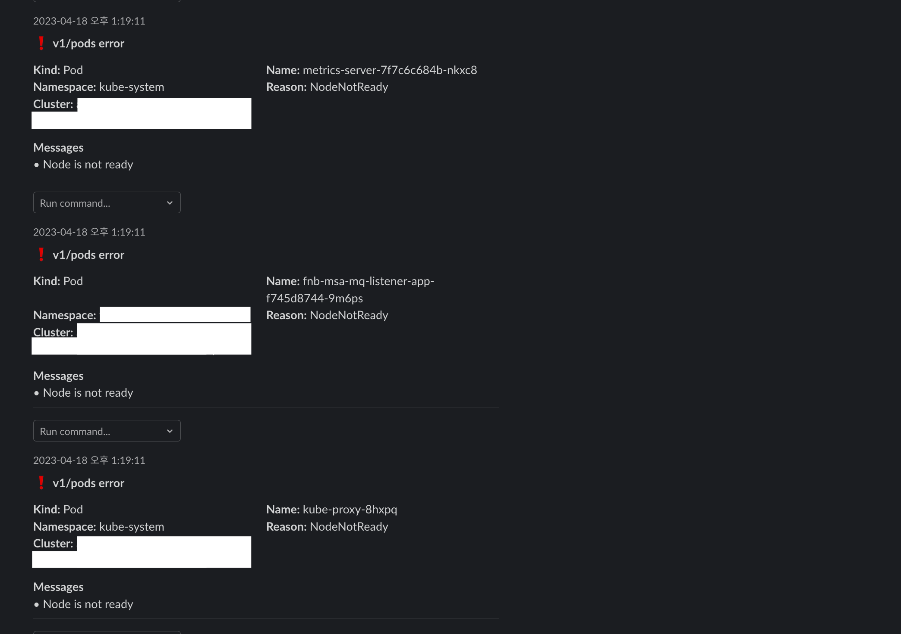
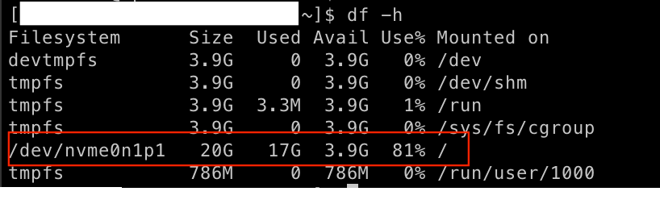
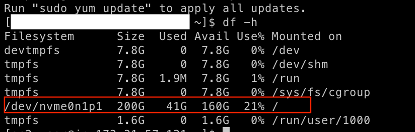

## 들어가며




k8s를 운영하다보면 어느날 갑자기 resource 에 대한 부족으로 인해 문제가 생길 수 있다.

그럴때 AWS Console에 접속하여 해당 EC2 Instance의 storage 용량을 증가시켜 해결할 수 있다.


## WorkFlow

1. 인스턴스에 접속한다.


2. 아래의 명령어로 해당 노드의 파티션을 확인한다.
```bash
$ sudo lsblk
NAME          MAJ:MIN RM SIZE RO TYPE MOUNTPOINT
nvme1n1       259:0    0  30G  0 disk /data
nvme0n1       259:1    0  16G  0 disk
└─nvme0n1p1   259:2    0   8G  0 part /
└─nvme0n1p128 259:3    0   1M  0 part
```


3. `growpart` 명령을 사용하여 확장할 파티션을 지정한다.
```bash
$ sudo growpart /dev/nvme0n1 1
```


4. `lsblk` 명령어를 사용하여 파티션이 확장되었는지 확인한다.
```bash
$ sudo lsblk
NAME          MAJ:MIN RM SIZE RO TYPE MOUNTPOINT
nvme1n1       259:0    0  30G  0 disk /data
nvme0n1       259:1    0  50G  0 disk
└─nvme0n1p1   259:2    0  16G  0 part /
└─nvme0n1p128 259:3    0   1M  0 part
```


5. `df -hT` 명령어를 사용하여 현재 스토리지 가용 현황을 확인한다.
```bash
$ df -hT
Filesystem      Type  Size  Used Avail Use% Mounted on
/dev/nvme0n1p1  xfs   8.0G  1.6G  6.5G  20% /
/dev/nvme1n1    xfs   8.0G   33M  8.0G   1% /data
...
```


6.  `xfs_growfs` 명령어를 사용하여 파티션 탑재를 진행합니다.
```bash
$ sudo xfs_growfs -d /
```


7. `df -hT` 명령어를 통해 변경된 스토리지 가용 현황을 확인합니다.
```bash
$ df -hT
Filesystem      Type  Size  Used Avail Use% Mounted on
/dev/nvme0n1p1  xfs   8.0G  1.6G  6.5G  20% /
/dev/nvme1n1    xfs   8.0G   33M  48.0G   1% /data
...
```


## Finish

### Before



### After



( 🚨 스크린샷에는  EC2 Instance type도 변경하여 `devtmpts` , `tmpfs`등 다른 filesystem도 증가되어 있다.)


## Reference
- https://docs.aws.amazon.com/ko_kr/AWSEC2/latest/UserGuide/recognize-expanded-volume-linux.html