## Overview

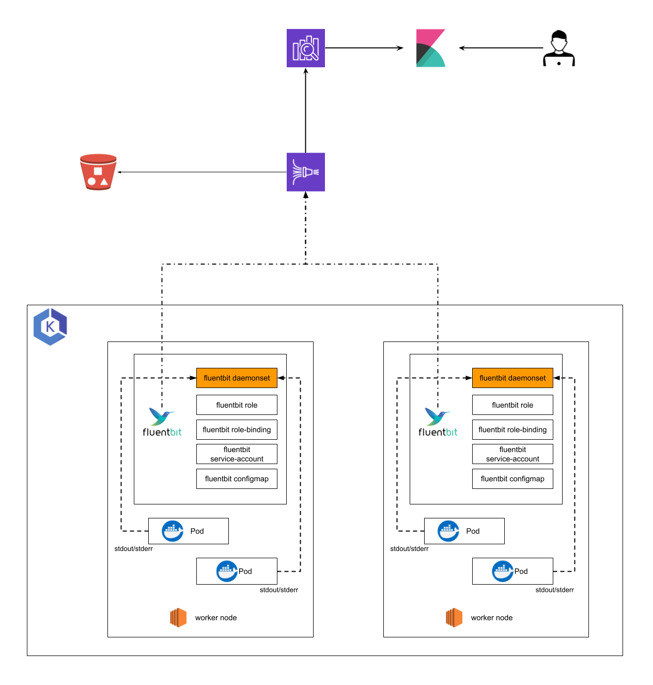


## 들어가며

`Kubernetes`는 생성된 `Pod`들에 대하여 `Stateless`하게 관리되어야하는 것이 기본 관리 원칙이다.

그렇기에 `STDOUT`/`STDERR`등 `SYSOUT`의 형태로 쌓이는 로그들을 노드내에 저장하는 방식이 아닌 중앙 집중식 로깅 시스템을 구축해야 한다.

`Pod`로부터 수신된 로그를 `Fluent-bit`를 통해 `AWS Kinesis`로 전송하고, 수신된 로그 데이터를 `AWS OpenSearch`의 `ElasticSearch`가 받게 되고 `Kibana`를 통해 시각화하게 된다.


## What Is EFK Stack?

### ELF Stack

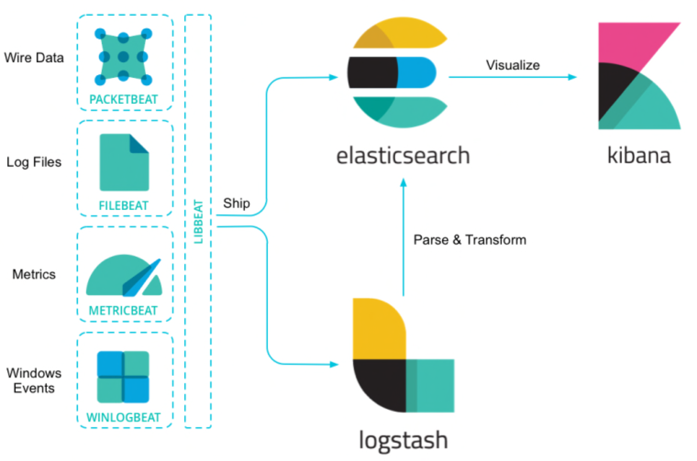

`ELK Stack`은 `ElasticSearch` + `Logstash` + `Kibana`의 로그 분석 프로세스를 지칭한다.

하지만 이 중 `Logstash`보다 `fluent-bit`이 쿠버네티스 환경에서 최적화 되어있는 시스템 구축 시 많이 사용되기 때문에 `Fluent-bit`를 선택하였다.

### EFK Stack

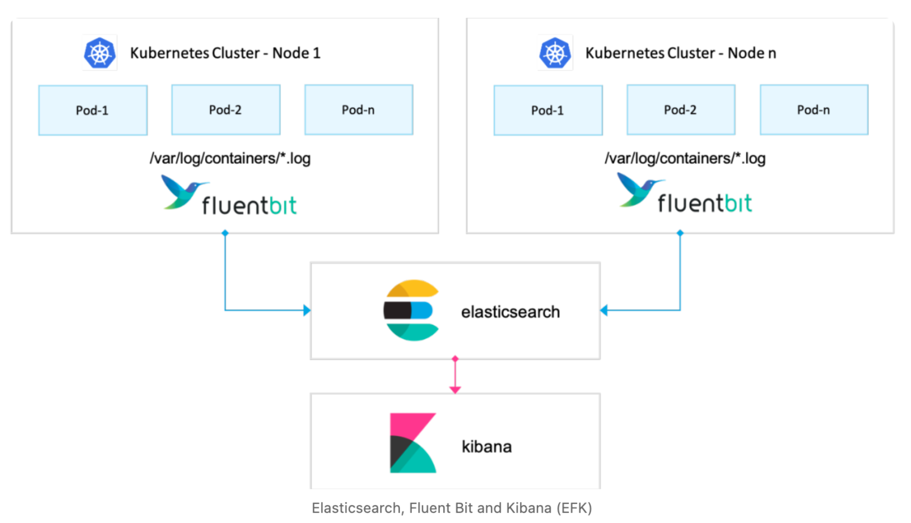

- `Fluent-bit` : 로그를 수집해서 `Elasticsearch`로 전달
- `Elasticsearch` : `Fluentd`로부터 받은 데이터를 검색 및 분석하여 저장
- `Kibana` : `Elasticsearch`의 빠른 검색능력을 통해 데이터 시각화


## 사내 EFK Stack


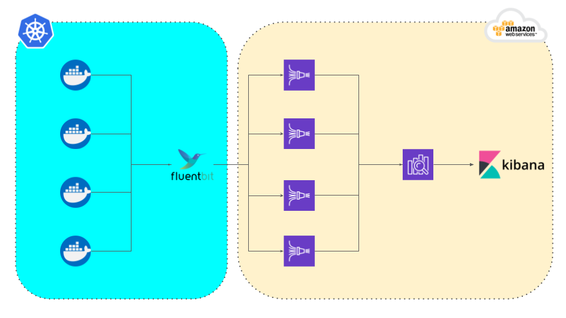

`k8s`내 파드들의 로그를 수집하는 `fluent-bit`가 노드별로 `DaemonSet`에 존재하고 `fluent-bit`에서 `AWS Kinesis Datafirehose`를 통해 `AWS OpenSearch`의 `ElasticSearch`로 전송하며 `Kibana`를 통해 시각화 하게 구성하였다.

## Set a EFK Stack


### Install Fluent-bit

```bash
## create k8s namespace
kubectl create ns logging
```
먼저 `loggging` 전용 `namespace`를 생성한다.

```bash
## helm repo add
helm repo add fluent https://fluent.github.io/helm-charts
```

그 후 `helm`을 통해 `fluent chart`를 다운로드한다.


```bash
## helm install
helm upgrade --install fluent-bit fluent/fluent-bit -n logging
```

`k8s cluster`에 해당 `helm repo`를 `logging namespace`에 설치합니다.


##### Result

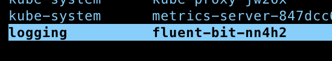


### Set AWS Kinesis Data Firehose

> AWS Kinesis Data Firehose를 생성하기 전 AWS Opensearch Domain과 백업용 AWS S3 Buckect을 생성해야 한다.


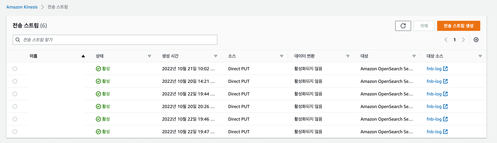

왼쪽 상단에 전송스트림 생성을 클릭한다.


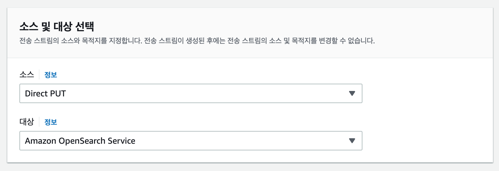

소스 및 대상을 선택한다.

- 소스 : `Direct PUT`
- 대상 : `Amazon OpenSearch Service`


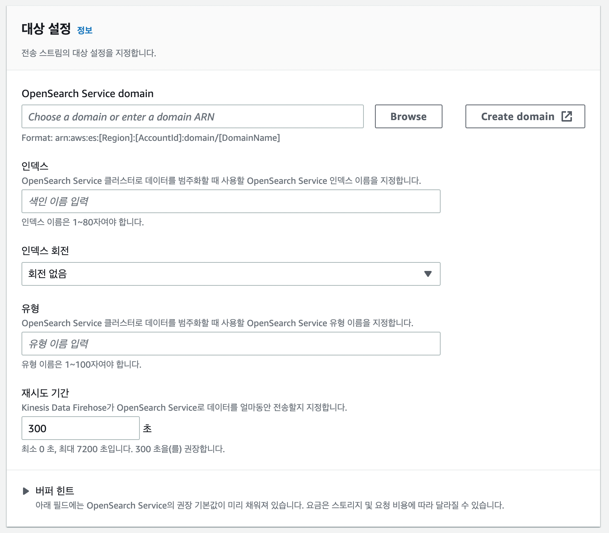

미리 생성해둔 `AWS OpenSearch Domain`을 설정하고 특히, `index` 이름을 설정한다. 
해당 `index` 이름과 같은 `fluent-bit`로 부터 수집된 `pod`들의 로그가 수집된다.


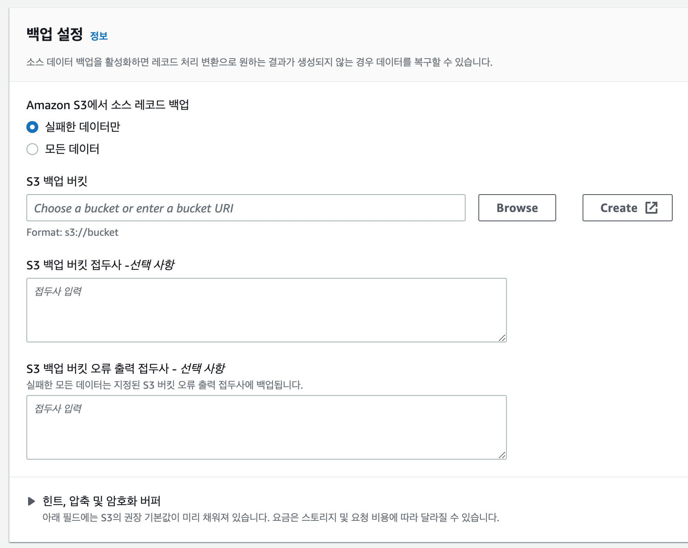

미리 생성해둔 백업용 `AWS S3 Bucket`을 설정한다. 
해당 `AWS S3 Bucket`에는 설정해놓은 버퍼와 파일 형태로 `log`들이 수집된다.


### Set Fluent-bit Configmap

```bash
apiVersion: v1
data:
  fluent-bit.conf: |
    [SERVICE]
        Parsers_File      parsers.conf
        HTTP_Server       On
        HTTP_Listen       0.0.0.0
        HTTP_Port         2020

    [INPUT]
        Name              tail
        Path              /var/log/containers/front-end-app-*.log
        DB                /var/log/flb_kube.db
        Mem_Buf_Limit     10MB
        Refresh_Interval  10
        Tag               front-end
        Parser            docker
    [FILTER]
        Name              record_modifier
        Match             front-end
        Whitelist_key     log
    [OUTPUT]
        Name              kinesis_firehose
        Match             front-end
        region            ap-northeast-2
        delivery_stream   kinesis-app
...

kind: ConfigMap
metadata:
  creationTimestamp: "2022-05-30T05:43:33Z"
  labels:
    k8s-app: fluent-bit
  name: fluent-bit
  namespace: logging

```


위의 내용중 `[INPUT]` , `[FILTER]`, `[OUTPUT]` 에 내용을 수정한다.

- `INPUT` : 로그를 수집할 `app log path`를 작성한다.
- `FILTER` : 해당 `INPUT` 의 `Type`을 작성한다.
- `OUTPUT` : 수집된 로그들을 어느 곳으로 전송할지 설정합니다. (여기서는 `AWS Kinesis delivery_stram`을 작성한다.)


#### Result

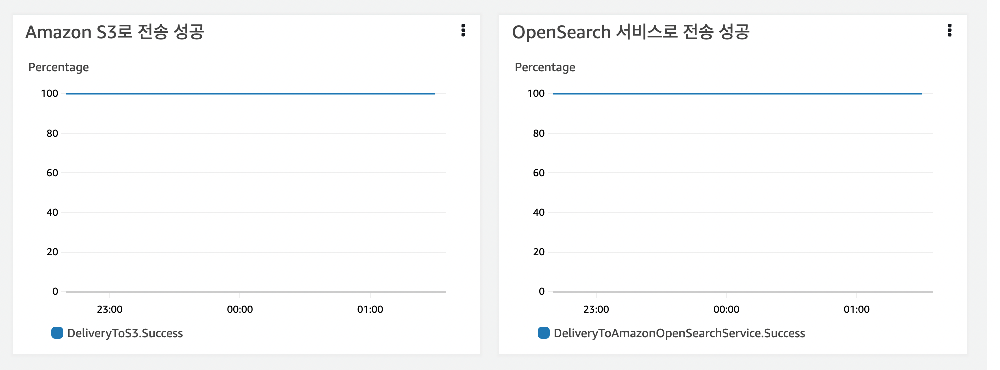

이제 AWS Kinesis로 접속하여 해당 DataFirehose에서 모니터링 탭에서 확인해보면 위의 사진 처럼 성공 그래프가 찍히는걸 볼 수 있다.

## Finish


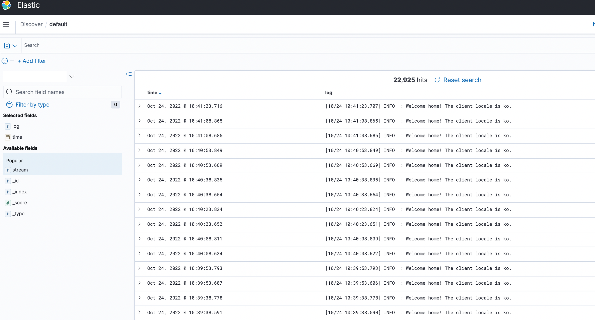

위의 과정을 모두 마쳤으면 `AWS OpenSearch Domain`으로 접속하여 `kibana`를 보자.

> `Index patterns` 설정을 먼저 하고 `kibana`의 `Discover` 메뉴에 접속하면 정상적으로 로그가 쌓이는 것을 확인할 수 있다.


## Reference
- https://nsxbaas.blog/2022/09/27/visualising-antrea-ids-logs/