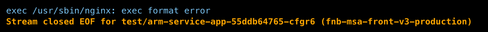
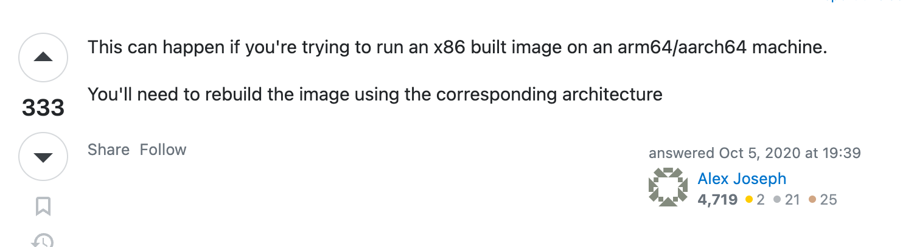
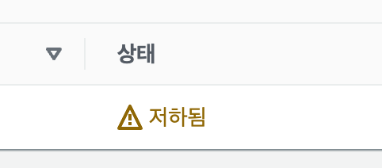
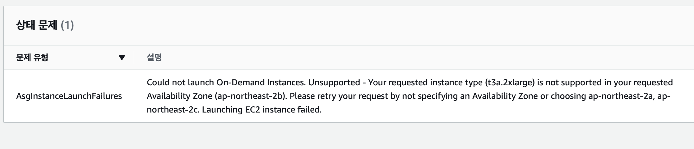
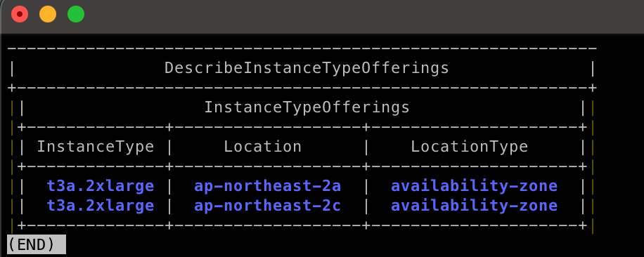

# 개요

현재 AWS EKS를 이용하여 K8s 를 구축하고 운영하고 있습니다. 하지만 최근들어 신규 서비스도 런칭하고, 배포해야 할 Pod 수도 늘어나고, 여러 가지 devops 관련 pod를 구축하고 싶어 프로젝트로 일정을 수립하고 진행하고 있던 와중 Pod가 정상적으로 생성되지 않는 현상이 발생했습니다..!

찾아보니 EKS Workernode로 사용중인 EC2 Instance 의 Memory 의 용량이 부족하여 Pod를 띄울 수 없었습니다.

# 적절한 EC2 Instance Type을 찾아보자!

제가 처음 고려했던 Type은 현재쓰고 있는 다음 크기의 EC2 였습니다.

- As-Is :  t3.xlarge
- To-Be : t3.2xlarge

**타입 비교**

|  | vCPU* | 메모리(GiB) | 네트워크 성능(Gbps)*** | 최대 Pod수 | 시간당 요금 | 한달 요금 |
| --- | --- | --- | --- | --- | --- | --- |
| t3.xlarge | 4 | 16 | 최대 5 | 58 | 0.208 USD | 200,524.46원 |
| t3.2xlarge | 8 | 32 | 최대 5 | 58 | 0.416USD | 401,048.92원 |

하지만,, 회사 입장에서 비용이 과하다는 피드백이 돌아왔고 눈물을 머금고 다른 type을 찾기 시작했습니다.

같은 CPU, Memory를 호스팅 해주는 것을 중점으로 찾다가 t4g type을 찾게 되었습니다..! 

**타입 비교**

|  | vCPU* | 메모리(GiB) | 최대 Pod수 | 시간당 요금 | 한달 요금 |
| --- | --- | --- | --- | --- | --- |
| t3.xlarge | 4 | 16 | 58 | 0.208 USD | 200,524.46원 |
| t3.2xlarge | 8 | 32 | 58 | 0.416USD | 401,048.92원 |
| t4g.2xlarge | 8 | 32 | 58 | 0.3328USD | 320,833.85원 |

# 하지만..!

그렇게 t4g type으로 결정하고 AWS EKS에서 새로운 node group을 생성하는 도중 AMI 이미지가 다른 것을 확인하게 되었습니다. t3는 `AL2_x86_64` 인 반면 t4g는 `AL2_ARM_64`였습니다. 

별 문제 없겠거니.. 싶었지만 그래도 조사를 해보았고 gpt는 아래와 같은 답변을 주었습니다.

## t3 vs t4g

> **[GPT]**
> #### T3 모델
> - T3 인스턴스 패밀리는 "burstable" 워크로드를 위해 최적화되었습니다. 이는 CPU 사용률이 낮고 가끔 높은 CPU 활동이 필요한 경우에 해당합니다.
> - 예를 들어, 워크로드가 일반적으로 낮은 CPU 부하를 가지며 가끔 특정 시점에서 높은 CPU 부하를 겪는 경우, T3 인스턴스 패밀리는 이러한 워크로드에 적합하며 비용 효율적일 수 있습니다.
> - T3a 인스턴스와 달리, T3 인스턴스는 Skylake 프로세서를 사용합니다.
> 
> → 가변적인 CPU 사용량을 가진 워크로드에 유용하
> 
> #### T4g 모델
> - T4g 인스턴스 패밀리는 ARM 기반의 AWS Graviton2 프로세서를 사용하여 동작합니다.
> - T4g 인스턴스는 가격 대비 성능을 개선하도록 설계되었습니다.
> - ARM 프로세서의 사용으로 인해 T4g 인스턴스는 일부 워크로드에서 좋은 성능을 발휘할 수 있습니다.
> 
> → ARM 기반 프로세서를 사용하여 특정 워크로드에서 성능을 향상
> 

```jsx

AL2_ARM_64 (ARM 64비트 아키텍처):
- AL2_ARM_64는 ARM 64비트 아키텍처를 기반으로 동작하는 Amazon Linux 2 인스턴스 유형입니다.
- ARM 아키텍처는 저전력 및 효율적인 프로세서 아키텍처로, 모바일 및 임베디드 시스템에서 주로 사용됩니다.
- AL2_ARM_64 인스턴스 유형은 ARM 프로세서를 사용하여 실행되며, 컴퓨팅 및 메모리 요구 사항을 처리하는 데 최적화되어 있습니다[1].

AL2_x86_64 (x86 64비트 아키텍처):
- AL2_x86_64는 x86 64비트 아키텍처를 기반으로 동작하는 Amazon Linux 2 인스턴스 유형입니다.
- x86 아키텍처는 주류 컴퓨터 시스템에서 많이 사용되며, Intel 및 AMD 프로세서를 포함한 다양한 프로세서에서 실행됩니다.
- AL2_x86_64 인스턴스 유형은 x86 64비트 아키텍처를 사용하여 실행되며, 다양한 워크로드 및 응용 프로그램을 처리하는 데 최적화되어 있습니다.
```

아키텍처가 다르다보니 여러 이슈가 생길 것 같았지만 무슨 문제가 있을까 궁금했습니다. 그래서 일단 해당 node에만 파드를 하나 생성해서 테스트 해보자 생각으로 구성을 이어갔습니다.

해당 node에 label을 주었고, test pod manifast file에 labelSelector를 이용하여 해당 노드에만 Pod가 띄어지게 구성하였고 바로 배포해보았습니다.

하지만 아니나 다를까 Pod가 생성되지 않고 `CrashBackOff`로 계속 restart가 되고 있었습니다..



띠용?!! `exec format error`?! 

해당 오류는 처음 보는 내용이었고 바로 구글링을 해봤습니다.



`x86`으로 build된 Docker Image는 `arm64/aarch64` 아키텍처 서버에서는 띄울 수 없다… 는 내용의 답변이었고 [Docker](https://docs.docker.com/build/building/multi-platform/) 공식 페이지를 들어가서 확인해보니 특정 옵션을 주어서 Docker Image build를 하면 된다 라는 문서를 확인하게 되었습니다.


하지만 이미 서비스중인 파드들이 많고 이미지 빌드 형식을 바꾸기엔 공수가 많이 드는 작업이었고, 추후 서비스가 더 늘어날 시에 `x86` 아키텍처의 EC2를 사용할 가능성이 다분하여 다른 대안을 모색하게 되었습니다.  

# 대안

현재 운영중인 모든 서비스가 띄어져 있는 기존 node의 memory를 늘려 더 많은 pod를 띄우려는 것이 목적이었던터라 **같은 아키텍처의 EC2 instance**가 전제였습니다.

그래서 결국 다른 EC2 instance type을 찾아보게 되었고 `t3a`를 찾았습니다..!

### t3a 모델

> **[GPT]**
> #### T3a 모델
> 
> - T3a 인스턴스 패밀리는 T3와 유사한 특성을 가지고 있습니다. 하지만 프로세서가 다릅니다. T3a는 AMD EPYC 7000 시리즈 프로세서를 사용합니다.
> - T3a 모델은 비슷한 워크로드에 대해 T3와 비슷한 성능을 제공하지만, 프로세서에 따른 차이가 있습니다.

### 타입 정리

| To-Be | vCPU* | 메모리(GiB) | 최대 Pod수 | 시간당 요금 | 한달 요금 | 최종 금액 |
| --- | --- | --- | --- | --- | --- | --- |
| t3.2xlarge | 8 | 32 | 58 | 0.416USD | 304.84 USD | 401,048.92원 |
| t4g.2xlarge | 8 | 32 | 58 | 0.3328 USD | 242.94 USD | 320,833.85원 |
| t3a.2xlarge | 8 | 32 | 58 | 0.3744 USD | 273.31 USD | 360,941.39원 |

## 또 다른 문제..!



t3 모델에서 t3a 모델로 바꾸면서 기존 node에 띄어져 있는 Pod들을 옮기는 drain을 진행했는데, t3a 모델의 노드 그룹 상태가 저하됨 이라고 표시되었습니다.



두둥…!

AWS EC2는 Instance Type별로 가용 영역이 정해져있습니다.

- 가용 영역: `ap-northeast-2a`, `ap-northeast-2c`
    - t2, t3a, c4 계열 등
- 가용 영역: `ap-northeast-2a`, `ap-northeast-2b`, `ap-northeast-2c`, `ap-northeast-2d`
    - t3, c5 계열 등
- 가용 영역: `ap-northeast-2a`, `ap-northeast-2b`, `ap-northeast-2c`
    - t3, c5 계열 등
- 가용 영역: `ap-northeast-2a,` `ap-northeast-2d`
    - mac1.metal
- 가용 영역: `ap-northeast-2d`
    - t3, c5 계열 등
- 가용 영역: `ap-northeast-2c`
    - t2, t3, c4, c5 계열 등

또 다른 확인 방법으로는 아래의 명령어를 이용하는 것입니다.

```bash
$ aws ec2 describe-instance-type-offerings \
    --location-type availability-zone \
    --filters Name=instance-type,Values=**t3a.*** \
    --region ap-northeast-2 --output table
```



그렇기에 현재 작업한 Type인 t3a는 `ap-northeast-2a`, `ap-northeast-2c` 영역에서만 EC2 Instance를 생성할 수 있었지만 nodegroup을 생성할 때 `ap-northeast-2b`, `ap-northeast-2d`도 추가를 해놔서 발생한 이슈였습니다!

즉, `ap-northeast-2b`, `ap-northeast-2d` 영역을 제외하고 node group을 생성해주시면 해결됩니다..!

# 마치며

AWS EC2는 type별로 각각의 특성이 있습니다. 이번 작업을 통해 AWS EC2의 type별로 어떤 특성이 있는지 확인할 수 있는 값진 경험이었습니다.😂

이러한 경험을 토대로 현재 운영서버는 문제없이 잘 돌아가고 있습니다 😎😎😎