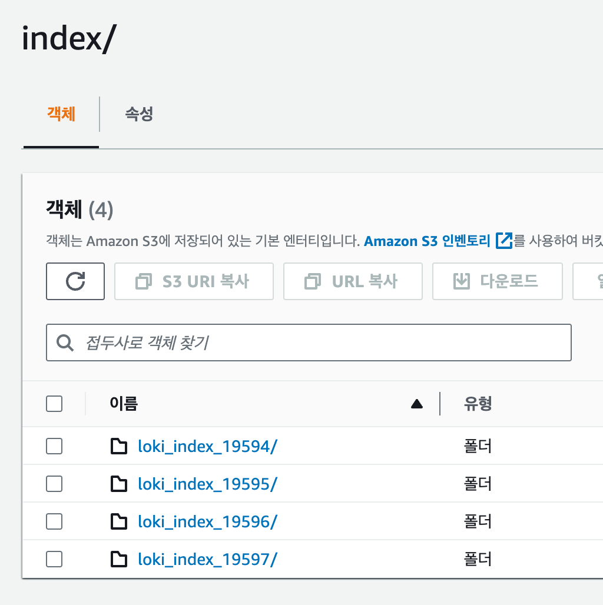

# 들어가며
사내에서 EFK-Stack(ElasticSearch+Fluent-bit+Kibana)를 이용하여 모니터링 시스템을 구축했었습니다. 하지만 AWS Opensearch를 이용하다보니 비용적인 문제와 비교적 활용도가 낮았던 fluent-bit(응답이 길면 Probe가 자꾸 문제가 발생), metirc 데이터 필요, 쿠버네티스에 맞지 않은 설정들등 다양한 이슈로 모니터링 시스템을 바꿔야 하는 요구 사항이 생겼습니다. 그러던 중 쿠버네티스 모니터링 시스템계의 또 하나의 터줏대감인 Prometheus, Loki, Grafana를 이용하여 새롭게 모니터링 시스템을 구축하였습니다.


>
> 💡 개념적인 내용은 공식 문서와 ChatGPT를 참고하여 작성하였습니다.
>


# Overview

<div style="width:100%">


</div>

# Prometheus


## Prometheus란?

Prometheus는 SoundCloud에서 처음 개발된 오픈 소스 시스템 모니터링 및 알림 툴킷입니다. 2012년에 시작된 이후로 많은 회사와 조직이 Prometheus를 채택하였고, 매우 활발한 개발자와 사용자 커뮤니티를 가지고 있습니다.


Prometheus는 2016년 Kubernetes 에 이어 두 번째 프로젝트로 Cloud Native Computing Foundation에 합류했으며, 서비스 운영을 위해 모니터링 시스템을 구축할 때 가장 널리 사용되는 툴 중 하나입니다.

## 특징


- **다차원 데이터 모델**: 메트릭 이름과 키/값 쌍으로 시계열 데이터를 식별합니다.
- **PromQL**: 이러한 차원성을 활용할 수 있는 유연한 쿼리 언어입니다.
- **분산 저장에 의존하지 않음**: 단일 서버 노드가 자립적으로 작동합니다.
- **HTTP를 통한 풀 모델**: 시계열 데이터 수집이 HTTP를 통해 이루어집니다.
- **서비스 발견 또는 정적 구성을 통한 타겟 발견**: 다양한 그래핑 및 대시보드 지원 모드가 있습니다.

위처럼 여러 특징이 있지만 주요 특징은 2가지로 요약됩니다.

**Pull-Based Monitoring**

기존의 Push-Based Monitoring 방식 대신에 Pull-Based Monitoring을 사용합니다. 대상 서버에 설치된 Exporter가 메트릭 정보를 수집하고, 이 데이터는 수집 서버가 주기적으로 가져가는 구조입니다. 

즉, 클라이언트에서 서버로 데이터를 보내는 것(PUSH)가 아닌 서버가 클라이언트의 데이터를 수집(Pull) 방식입니다. 이러한 방식은 기존의 에이전트(agent) 방식보다 더 유연하고 관리하기 쉽습니다.

**시계열 데이터베이스(TSDB)**

관계형 데이터베이스(RDB) 대신 메트릭 이름과 key-value 쌍으로 식별되는 시계열 데이터 모델을 사용합니다. 이를 통해 대량의 정보를 빠르게 검색할 수 있습니다.


## Architecture


**Exporter**

- host서버에 설치되어 메트릭 데이터를 수집하는 역할을 합니다.
- Prometheus 서버가 접근하여 데이터를 가져올 수 있는 HTTP 엔드포인트를 제공하여 다양한 데이터를 수집합니다.

**Prometheus Server**

- Prometheus Server는 메트릭 데이터를 스크랩하고 저장합니다.
- 메트릭 데이터 수집 주기를 설정하여 지정된 시간마다 대상 서버에 있는 Exporter로부터 데이터를 수집합니다.
- 수집한 데이터를 저장하고 PromQL(프로메테우스 쿼리 언어)를 사용하여 데이터를 쿼리하고 필터링할 수 있습니다.

**Grafana**

- Grafana는 데이터 시각화 도구로, Prometheus가 수집한 메트릭 데이터를 그래프나 대시보드 형태로 시각화하여 표현할 수 있습니다.
- Prometheus Server에서 직접 제공하는 웹 뷰보다 더 다양한 시각화 기능을 제공하며, Grafana를 통해 데이터를 더 직관적으로 이해할 수 있습니다.

**Alertmanager**

- Prometheus가 수집한 메트릭 데이터를 기반으로 경고를 생성하고 규칙을 만들어 관리합니다.


이렇듯 Prometheus로 metric 데이터를 수집하려고 했지만 Docker형태나 pod 형태로 배포하기엔 따로 작업을 해야해서 다른 방안이 없나하고 찾아보던 중 Prometheus, Grafana, Alertmanager 등을 함께 묶어 kubernetes 환경에 맞게 Helm 차트 형태로 설치할 수 있는 kube-prometheus-stack을 발견했습니다..!

# kube-prometheus-stack


## Kube-Prometheus-Stack이란?

kube-prometheus-stack은 kubernetes cluster에 맞게 구성된 오픈 소스 프로젝트입니다. Prometheus를 기반으로 하며, 쿠버네티스 클러스터의 다양한 컴포넌트들의 메트릭 데이터를 수집하고 이를 시계열 데이터로 생성하여 모니터링 및 경고 기능을 제공합니다.

즉, 쿠버네티스 클러스터만 있다면 간단하게 helm chart로 설치가 가능합니다!

github : https://github.com/prometheus-community/helm-charts/tree/main/charts/kube-prometheus-stack

## Architecture


**Prometheus Operator**

- 쿠버네티스 내에서 Prometheus 서버와 관련된 리소스들을 관리하기 위한 컨트롤러입니다.
- Prometheus와 관련된 설정, 서비스 디스커버리, 룰 및 대시보드를 관리할 수 있습니다.

**Prometheus Server**

- 고가용성을 제공하는 Prometheus 서버입니다.
- 메트릭 데이터를 스크랩하고 저장합니다.

**Alertmanager**

- Prometheus가 수집한 메트릭 데이터를 기반으로 경고를 생성하고 관리하는 역할을 합니다.

**Prometheus node-exporter**

- node-exporter는 Host의 metric을 수집하는 역할을 합니다.
- CPU, 메모리, 디스크 사용량 등의 데이터를 수집하여 Prometheus로 전달합니다.

**Prometheus Adapter for Kubernetes Metrics APIs**

- 쿠버네티스의 메트릭 API와 연동하여 클러스터 내부의 리소스 메트릭 데이터를 수집하고 Prometheus로 전달합니다.

**kube-state-metrics**

- 쿠버네티스 클러스터의 상태 정보를 메트릭으로 수집합니다.
- 파드, 디플로이먼트, 노드 등의 상태 정보를 모니터링할 수 있습니다.

**Grafana**

- Grafana는 데이터 시각화 및 대시보드 생성 도구로, 수집한 메트릭 데이터를 그래프나 대시보드 형태로 시각화하여 사용자에게 제공합니다.

## 구성


kube-prometheus-stack을 포함한 대부분의 Helm 배포 패키지는 비슷한 구성으로 이루어져있습니다.

**charts** 

- Helm 차트의 종속 차트를 포함하는 위치입니다.
- 이 패키지의 경우 grafana, kube-state-metrics, prometheus-node-exporter가 존재합니다.

**templates**

- Helm 차트의 템플릿 파일들을 포함합니다.
- 템플릿은 Kubernetes 리소스의 정의를 작성하는 데 사용되며, 애플리케이션의 배포, 서비스, 구성 등을 관리할 수 있습니다

**crds** 

- Custom Resource Definitions(CRDs) 파일을 포함할 수 있는 위치입니다.
- Kubernetes API에 사용자 정의 리소스와 그에 대한 스키마를 추가하는 데 사용됩니다.

**Chart.yaml** 

- Helm 차트의 메타 정보를 정의합니다.
- 메타 정보에는 차트의 이름, 버전, 유형, 유지 보수자 정보 등이 포함됩니다.
- 종속 차트, 애플리케이션의 버전 제약 조건 등을 지정할 수도 있습니다.

**values.yaml**

- Helm 차트의 기본 구성 값을 정의합니다.
- 애플리케이션의 설정 옵션, 환경 변수, 리소스 크기 등을 설정할 수 있습니다.
- `values.yaml` 파일에 정의된 값은 템플릿 파일 내에서 사용될 수 있으며, 차트를 배포할 때 사용자 지정 값으로 수정하여 배포할 수도 있습니다.

## 설치하기

### create namespace

```bash
$ kubectl create namsespace monitoring
```

먼저 KPS을 설치할 네임스페이스를 생성합니다.

### Add Helm repo

```bash
# 헬름 차트의 저장소 추가
$ helm repo add prometheus-community https://prometheus-community.github.io/
$ helm repo update
```

Helm을 통해 prometheus-community repo를 cluster에 받아옵니다.

### Pull helm config file

몇가지 커스텀을 해야하기 때문에 config에 대한 값을 수정할 수 있는 manifast file을 다운로드 한 후 압축을 풀어줍니다.

```bash
$ helm pull prometheus-community/kube-prometheus-stack
$ tar xvfz kube-prometheus-stack-${version}.tgz #설치된 버전을 작성하시면 됩니다!
```

### service 수정

대시보드 형태로 외부에서 접근할 수 있게 `prometheus-grafana`만 clusterIP에서 LoadBalancer나 NodePort로 변경합니다. (이 글에선 loadbalancer로 설정하였습니다)

```yaml
...
grafana:
	enabled: true
	...
	## Passed to grafana subchart and used by servicemonitor below
  ##
  service:
    type: LoadBalancer
    portName: http-web
...

```

그 후 수정된 values.yaml 파일을 paramater로 주어 helm chart를 배포합니다. 

```bash
$ helm install prometheus . -n monitoring -f values.yaml
```

### service 확인

```bash
kubectl get svc -n mornitoring
```


배포되어있는 service를 확인해보면 정상적으로 prometheus-grafana의 servive type이 LoadBalancer로 설정되어 배포된 것을 확인할 수 있고, `EXTERNAL-IP` 에 명시된 외부 IP 주소로 접근하실 수 있습니다. 

(후에 AWS Route53와 같은 DNS service를 통해 해당 주소를 routing 해주시면 좋습니다!)

자! metric data 수집과 모니터링 구축은 완료했습니다. 이제 log를 수집해보겠습니다.

# Loki-Stack

## Loki-stack이란?

Loki-Stack은 Loki 로깅 엔진을 포함하지만, 추가적으로 로그를 수집, 집계, 시각화하기 위한 다른 컴포넌트들도 함께 제공합니다. 

- **Loki**: 로그 데이터를 저장하고 쿼리합니다.
- **Promtail**: 로그 데이터를 수집하고 Loki로 전송합니다.
- **Grafana**: 로그 데이터를 시각화합니다.

### Loki VS Loki-Stack

|  | 구성 요소 | 기능 범위 | 용도 | 설치 및 관리 |
| --- | --- | --- | --- | --- |
| loki | 로깅 엔진 | 로그 저장 및 쿼리에 중점 | 다른 로깅 시스템이나 시각화 도구와 통합 | 단일 컴포넌트로 더 간단하게 설치 및 관리 |
| loki-stack | 로깅 엔진, 로그 수집기, 시각화 도구까지 포함 | 로그 수집부터 저장, 쿼리, 시각화까지 전체 로깅 파이프라인 제공 | 독립적인, 통합된 로깅 솔류션을 제공 | 여러 컴포넌트를 관리해야하므로 설정과 관리 복잡 |

loki만이 아니라 promtail과 여러 컴포넌트를 쉽게 사용할 수 있는 loki-stack을 선택해서 배포하도록 하겠습니다. 

## 설치

```bash
git clone https://github.com/grafana/helm-charts
```

위의 명령어로 helm chart를 받아옵니다.

```bash
cd helm-charts/charts/loki-stack
```

grafana/helm-chart 레포지토리를 clone하여 받아온 후 loki-stack 디렉토리로 이동합니다.

**디렉토리 구조**

```bash
./                                
├── Chart.yaml                    
├── README.md                     
├── charts                        
│   ├── filebeat-7.17.3.tgz       
│   ├── fluent-bit-2.6.0.tgz      
│   ├── grafana-6.43.5.tgz        
│   ├── logstash-7.17.3.tgz       
│   ├── loki-2.16.0.tgz           
│   ├── prometheus-15.5.4.tgz     
│   └── promtail-6.14.1.tgz       
├── requirements.lock             
├── requirements.yaml             
├── templates                     
│   ├── NOTES.txt                 
│   ├── _helpers.tpl              
│   ├── datasources.yaml          
│   └── tests                     
└── values.yaml
```

loki-stack 디렉토리에서 values.yaml 파일을 수정하여 원하는 기능을 키고 끄고 추가로 설정할 수 있습니다.

```yaml
...
loki:
  enabled: true
...
promtail:
  enabled: true
...
grafana:
  enabled: false
...

```

저희가 사용할 서비스는 loki와 promtail 인데 기본값이 `enabled:true` 이기 때문에 수정하지 않고 배포합니다.

```bash
$ helm install loki-stack . --namespace monitoring
```

---

### 배포시 오류

```bash
helm install loki-stack . --namespace monitoring                                │
Error: INSTALLATION FAILED: An error occurred while checking for chart dependencies. You may need to run `helm dependency build` to fetc│
h missing dependencies: found in Chart.yaml, but missing in charts/ directory: loki, promtail, fluent-bit, grafana, prometheus, filebeat│
, logstash
```

만약 설치시 위와 같이 문제가 생긴다면 `helm dependency build` 을 통해 의존성을 설치하신 후 진행하시면 됩니다.

---

## 확인

```bash
kubectl get po -n monitoring
```

조금 후 해당 namespace의 pod 목록을 출력해보면 아래와 같이 Running이 되고 있습니다!설치가 완료되었습니다…!


### promtail에서 로그가 수집안되는 이슈


위의 사진처럼 promtail에서 log를 수집할 때에 error level의 로그 수집 오류 내용이 발생할 수 있습니다. 해당 이슈의 원인은 비교적 설치 시간이 짧은 promtail이 loki보다 먼저 설치되어 발생한 이슈인데, promtail Pod를 재시작해주면 해결됩니다!

## Retention

기본적으로 `table_manager.retention_deletes_enabled`또는 `compactor.retention_enable`플래그가 설정되지 않은 경우 Loki로 전송된 로그는 영원히 유지됩니다.

table_manager 통한 보존은 객체 저장소 TTL 기능을 사용하며 boltdb-shipper store와 chunk/index store 에서 작동합니다. 그러나 Compactor을 통한 로그 보관은 boltdb-shipper store 에서만 지원됩니다.

### boltdb-shipper

Grafana Loki에서 사용되는 index 및 chunk 데이터를 저장하는 데 사용되는 저장소 엔진 중 하나입니다.

**특징**

- 인덱스와 로그 청크 모두를 객체 저장소(예: Amazon S3, Google Cloud Storage 등)에 저장합니다.
- 객체 저장소만을 사용하기 때문에, 일반적으로 비용이 더 저렴합니다.
- 수평 확장이 가능하며, 큰 규모의 로그 데이터를 처리할 수 있습니다.
- Loki의 Compactor 컴포넌트와 함께 사용할 때 더 세밀한 데이터 보존 정책을 설정할 수 있습니다.
- 인덱스 데이터를 로컬에 캐싱할 수 있어, 쿼리 성능이 향상될 수 있습니다.

### table_manager

Loki 데이터베이스의 핵심 구성 요소로서 로그 데이터의 저장, 유지 관리, 압축 및 정리를 관리하며 데이터베이스의 성능과 공간 효율성을 유지하는 역할을 합니다.

**특징**

- 로그 데이터를 시간별로 테이블에 저장하는 형태로 데이터를 구성하며, 이를 통해 검색 성능을 최적화합니다.
- 설정된 로그 보존 기간 내에 있는 데이터만을 유지하고, 설정보다 오래된 데이터는 자동으로 삭제합니다.
- 인덱스 관리
- 데이터를 정리하고 필요한 경우 압축하여 저장 공간을 효율적으로 관리합니다.
- 설정된 보존 기간이 지난 로그 데이터를 정기적으로 삭제하여 데이터베이스의 용량을 유지합니다.

**설정하기**

```yaml
...
loki:
	...
	config:
    table_manager:
      retention_deletes_enabled: true
      retention_period: 24h
...
```

### Compactor

**특징**

- `boltdb-shipper` 저장소에서만 지원됩니다.
- 단일 인스턴스(싱글톤)로 실행하는 것이 권장됩니다.
- Compactor가 재시작되면 이전에 중단된 지점에서 계속 작업을 수행합니다.
- 설정된 `compaction_interval`마다 압축과 보존을 적용하기 위해 루프를 실행합니다.
- Compactor의 알고리즘은 다음과 같습니다
    
    ```bash
    - 각 테이블을 단일 인덱스 파일로 압축합니다.
    - 전체 인덱스를 순회하여 제거해야 할 청크를 식별하고 표시합니다.
    - 표시된 청크를 인덱스에서 제거하고 디스크에 있는 파일에 참조를 저장합니다.
    - 새로 수정된 인덱스 파일을 업로드합니다.
    ```
    
- 보존 알고리즘은 인덱스에 적용되며, 청크는 즉시 삭제되지 않고 추후에 비동기적으로 삭제됩니다.
- 설정된 `retention_delete_delay`가 만료된 후에만 표시된 청크가 삭제됩니다.
- Compactor를 사용하여 보존을 적용할 때는 table_manager가 필요하지 않습니다.

**설정하기** 

```yaml
...
	loki:
	...
		config:
	    compactor:
	      shared_store: s3 // store가 설정되어 있어야 함
	      retention_delete_delay: 72h
	      retention_enabled: true
...
```

### table_manager VS Compactor

`table_manager`는 데이터의 논리적 구조와 스키마를 관리하고 구성하며, `Compactor`는 저장된 데이터의 물리적인 관리와 최적화를 담당합니다.

### 결과




위의 사진을 보시면 loki_index_ 형식으로 log index가 쌓이고 있습니다. 해당 데이터들은 설정된 Retention 값에 따라 gz file로 압축하여 AWS S3에 전송한 후 pod내에선 삭제합니다.


실제로 Retention을 24h로 설정한 Loki pod 내부입니다. 총 4일이 지나 loki_index_ 디렉토리가 4개가 생성되어있는데, 가장 최근의 값인 loki_index_19597에만 log data들이 저장되어 있고 loki_index_19594의 디렉토리는 비어져있습니다.


# 마치며

이렇게 PLG (Prometheus, Loki, Grafana)를 이용하여 모니터링 시스템을 구축해보았습니다! 개인적으로 EFK (Elasticsearch, Fluent-bit, Kibana)보다 가볍지만 강력하다고 생각이 들어요!
다음엔 Grafana Dashboard 설정에 대해 공부해보고 포스팅 해보도록 하겠습니다!


# Reference

[Prometheus - Monitoring system & time series database](https://prometheus.io/)

[[Helm] kube-prometheus-stack 모니터링 시스템 구축하기 (Grafana, exporter, monitoring)](https://ksr930.tistory.com/315)

[Retention |  Grafana Loki documentation](https://grafana.com/docs/loki/latest/operations/storage/retention/#table-manager)