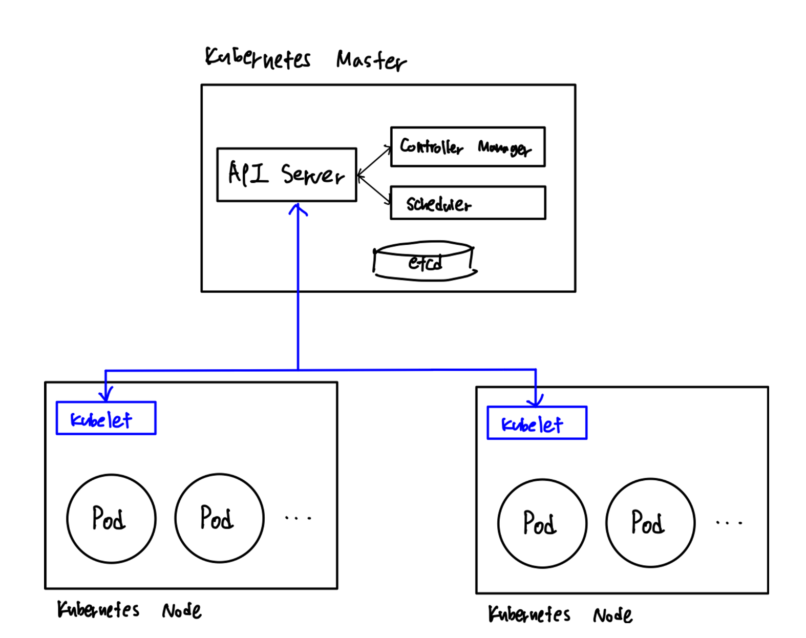

각 Node에는 ControlPlane과 통신하는 kubelet이 있습니다. kubelet은 각 노드에서 실행되는 기본 Node Agent입니다.

즉, 쿠블릿(kubelet)은 노드에서 컨테이너가 동작하도록 관리해 주는 핵심 요소입니다. 각 노드에서 파드를 생성하고 정상적으로 동작하는지 관리하는 역할을 담당하고 있으며, 실제로 우리가 쿠버네티스의 워크로드를 관리하기 위해 내려지는 명령은 kubelet을 통해 수행된다고 볼 수 있습니다.

## 작동 방식

1) 쿠버네티스 파드를 관리하기 위해 YAML 파일을 작성합니다.
2) kubectl 명령어를 통해 해당 명령을 쿠버네티스 클러스터에 적용합니다.
3) 이때 YAML의 명령이 kube-apiserver로 전송된 후 kubelet으로 전달됩니다. 
4) kubelet은 이 YAML을 통해 전달된 파드를 생성 혹은 변경하고, 이후 이 YAML에 명시된 컨테이너가 정상적으로 실행되고 있는지 확인합니다.

## 기능

- kublet은 컨테이너가 포드에서 실행되게 합니다. 컨트롤 플레인에서 노드에 작업을 요청하는 경우 kubelet이 이 작업을 실행합니다.

- api-server와 통신하며, PodSpecs라는 설정을 받아서 그 조건에 맞게 컨테이너를 실행하고 컨테이너가 정상정으로 실행되고 있는지 상태 체크를 진행합니다.

- 선언된 상태와 일치하지 않는 Pod가 있는지 확인하고, 어떤 Node에 Pod을 배치하면 좋을지 결정합니다.

- 어디에 배치할 지는 Scheduler가 결정하지만 실제로 Container Runtime(Docker등)에 배치를 명령하는 것은 kubelet입니다.

## Reference

- https://velog.io/@squarebird/Worker-Node-Kubelet
- https://www.redhat.com/ko/topics/containers/kubernetes-architecture
- https://www.samsungsds.com/kr/insights/kubernetes-3.html