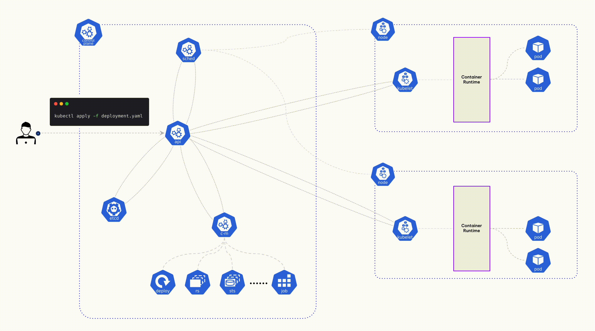

# 들어가며
kubectl 명령을 통해 pod를 생성하거나 수정할 때에 무슨 과정이 일어나는지에 대해 포스팅 해보았습니다. kubernetes를 사용 및 관리한다면 알아야 할 정말 기초적인 일련의 과정이지만 막상 kubernetes cluster object들이 무슨 일을 하는지 모를 수 있으니 이번 기회에 개념을 확! 잡고 갑니다!

> 💡 개념적인 내용은 공식 문서와 ChatGPT를 참고하여 작성하였습니다.

 

# Overview

### kubectl apply 명령어가 적용되는 순서

1. client → kube-apiserver
2. kube-apiserver → etcd
3. kube-apiserver → kube-controller-manager
4. kube-apiserver → kube-scheduler
5. kube-apiserver → kubelet → Container Runtime
6. kube-apiserver → etcd

 
 

# **1) client → kube-apiserver**

`kubectl` 클라이언트는 `deployment.yaml` 파일에 정의된 `resource`를 생성하거나 수정하기 위해 `kube-apiserver`에 요청을 보냅니다.

## kube-apiserver

`Kubernetes Cluster`의 모든 컴포넌트와 사용자가 상호 작용할 수 있도록 중앙 집중식 `API`를 제공하며, 특히 `Kuberentes Cluster`의 게이트키퍼(클러스터 내부 또는 외부의 모든 API 요청을 처리하고, 해당 요청이 유효하고 권한이 있는지 확인) 역할을 합니다.

### **주요 기능**

- **RESTful API 제공** : `RESTful API`를 통해 클라이언트와 통신합니다. 이 `API`를 통해 `Resource`를 생성, 읽기, 수정, 삭제(`CRUD`)할 수 있습니다.
- **인증**: `client`가 실행한 명령에 의해 `cluster`내에 접근하기 전에 토큰, 인증서, 기본 인증 등 다양한 방법으로 누구인지 확인합니다.
- **인가** : 인증된 `client`가 특정 `resource`에 대한 작업을 수행할 권한이 있는지 `Role-Based Access Control (RBAC)`, `Attribute-Based Access Control (ABAC)` 등을 통해 수행됩니다.
- **데이터 유효성 검사**: 들어오는 요청이 유효한 형식과 데이터를 가지고 있는지 검사합니다.
- **API 요청 라우팅**: 들어오는 `API` 요청을 적절한 서비스나 컴포넌트로 라우팅합니다.
- **API Aggregation**: 여러 `API` 버전과 추가적인 `API server`를 하나의 `API Endpoint`로 묶을 수 있습니다.
- **상태 저장**: `kube-apiserver`는 일반적으로 `etcd`와 같은 분산 데이터 스토어에 클러스터 상태를 저장합니다.

 
 

# **2) kube-apiserver → ETCD**

유효성 검사가 통과되면, **`kube-apiserver`**는 **`etcd`** 데이터베이스에 리소스의 상태를 저장합니다.

## ETCD

`etcd`는 분산 `key-value`저장소로, 데이터를 저장하고 고가용성을 제공하며 주로 분산 시스템의 설정 정보, 상태 정보, 메타데이터 등을 저장하는 데 사용됩니다. 

### **주요 특징**

- **고가용성**: `etcd cluster`는 여러 `node`노드로 구성되며, 일부 `node`가 실패해도 계속 작동합니다.
- **일관성**: `etcd`는 `Raft` 합의 알고리즘을 사용하여 분산 `node` 간에 데이터의 일관성을 유지합니다.
- **분산 시스템**: `etcd`는 분산 시스템을 통해 네트워크 파티션, 장애 복구 등 복잡한 문제를 해결합니다.
- **트랜잭션 지원**: 여러 연산을 하나의 트랜잭션으로 묶을 수 있습니다.
- **보안**: `etcd`는 `TLS`를 통해 데이터를 암호화하고, 인증서를 통해 클라이언트와 서버 간의 신뢰성을 확보합니다.
- **key-value 모델**: 간단한 `key-value` 데이터 모델을 사용하여 데이터를 저장하고 검색합니다.

### **Kubernetes에서의 역할**

`etcd`는 `kubernetes cluster`의 모든 상태 정보를 저장합니다.

즉, **`kube-apiserver`**는 `etcd`와 통신하여 이러한 정보를 읽고 쓰며, 다른 `Kubernetes` 컴포넌트들은 **`kube-apiserver`**를 통해 이 정보에 접근합니다. 이렇게 해서 `Kubernetes cluster`의 모든 컴포넌트가 일관된 상태 정보를 가질 수 있습니다.

 
 

# **3) kube-apiserver → kube-controller-manager**

**`kube-apiserver`**는 리소스의 상태가 변경되었음을 **`kube-controller-manager`**에 알려주게 됩니다.

## kube-controller-manager

**`kube-controller-manager`**는 `Kubernetes cluster`에서 여러 개의 컨트롤러를 실행하는 컴포넌트입니다. 이 컴포넌트는 클러스터의 전반적인 상태를 관리하고, 필요한 작업을 자동으로 수행하며, **`kube-apiserver`**와 통신하여 `cluster`의 상태를 읽고 업데이트합니다.

### **주요 기능**

- **상태 관리** : 클러스터의 다양한 `resource` 상태를 지속적으로 체크하고, 필요한 경우 조정합니다.
- **자동화** : `node`가 어떠한 이유로 `pod`를 유지할 수 없게된다면 자동으로 해당 `node`에서 실행되던 `pod`를 다른 `node`로 옮기는 등의 작업을 자동으로 수행합니다.
- **스케일링** : `pod`의 수를 자동으로 늘리거나 줄일 수 있습니다.
- **롤아웃과 롤백**: 새로운 버전의 애플리케이션을 안전하게 배포하고, 문제가 발생하면 이전 버전으로 롤백할 수 있습니다.

### **주요 컨트롤러**

- **Node Controller**: `node`의 상태를 모니터링하고, `node`가 다운되면 이를 감지하여 적잘한 조치를 취합니다.
- **Replication Controller**: 지정된 수의 `Pod`의 `Replicas`가 항상 유지되고 있는지 확인합니다.
- **Deployment Controller**: 사용자가 선언한 상태를 기반으로 `Pod`와 `ReplicaSets`을 관리합니다.
- **StatefulSet Controller**: 상태를 유지하는 `Pod`의 배포와 스케일링을 관리합니다.
- **DaemonSet Controller**: 모든 (또는 일부) `node`에서 `deamonsets`의 복제본이 실행되도록 관리합니다.
- **Job Controller**: 배치 작업을 실행합니다.
- **Horizontal Pod Autoscaler**: `CPU` 사용량 등의 `metric`을 기반으로 `pod`의 수를 자동으로 조절합니다.
- **Persistent Volume Controller**: `storage` 요구사항에 따라 `persistent volume`을 생성하고 관리합니다.

 
 

# **4) kube-apiserver → kube-scheduler**

새로 생성된 `pod`는 초기에는 `Pending` 상태입니다. 이 `pod`를 적절한 `node`에 배포하기 위해  **`kube-scheduler`** 가 동작합니다. (`kube-scheduler` 가 `pod`를 직접 배포를 하는 것이 아니라 `pod`가 배포될만한 적절한 `node`를 찾는 작업을 합니다.)

## kube-scheduler

`kube-scheduler`는 `Kubernetes Cluster`에서  여러 가지 `metric`과 규칙, 정책등을 고려하여 `Pod`의 `scheduling` (어떤 `Pod`를 어떤 `Node`에 배치할 것인지를 결정하는 과정) 을 담당하는 컴포넌트입니다. 

### **작동 원리**

- **파악**: `kube-apiserver`를 통해 새로 생성되거나 아직 할당되지 않은 `Pod`를 감지합니다.
- **선택**: 감지된 `Pod`에 대해 여러 가지 `scheduling` 알고리즘과 정책을 적용하여 가장 적합한 `worker node`를 선택합니다.
- **할당**: 선택된 `node`에 `pod`를 할당하고, 이 정보를 `kube-apiserver`에 정보를 전달합니다.

### **고려하는 요인**

- **리소스 요구사항**: `CPU`, `Memory`, `Storage` 등의 `resources`가 충분한지
- **노드 제약사항**: `node-selector`, `node-affinity`, `Taints`, `Tolerations` 등이 설정되어있는지
- **데이터 지역성**: 데이터를 가까운 곳에서 처리할 수 있도록 `node`를 선택
- **로드 밸런싱**: 모든 `node`에서 균등하게 `resources`를 사용할 수 있도록 `node`를 선택
- **사용자 정의 정책**: 사용자가 정의한 `scheduling` 정책 또는 알고리즘을 적용

 
 

# **5) kube-apiserver → kubelet**

`Woker Node`에서 `kubelet`과 함께 동작하는 `Container Runtime`이 `Pod`를 생성하고 실행합니다.

## Kubelet

`kubelet`은 `Kubernetes Cluster`의 각 `Worker Node`에서 실행되는 `Agent`입니다. 이 `Agent`는 `Node`에서 `Container`의 실행, 중지, 업데이트 등을 관리하며, `Node`의 상태를 모니터링합니다. `kubelet`은 앞의 작업을 수행하고 `kube-apiserver`와 통신하여 상태 정보를 전달합니다.

### **주요 기능**

- **파드 수명 주기 관리** : `kube-apiserver`로부터 `Pod`의 명세(spec)를 받아와 해당 `Node`에서 `Pod`와 그 안의 `Container`를 실행합니다.
- **노드 상태 모니터링**: `Node`의 `CPU`, `Memory`, 디스크 사용량 등을 `moniroting`하고 이 정보를 `kube-apiserver` 전달합니다.
- **리소스 격리**: `kubelet`은 `cgroups`, `namespaces` 등의 리눅스 커널 기능을 활용하여 `Pod`와 `Container`의 `Resource`를 격리합니다.
- **로그 및 메트릭 수집**: 설정에 따라 `Container`의 `Log`를 수집하고, `Metric`을 추출하여 필요한 경우 외부 시스템에 전달합니다.
- **자동 복구**: 설정에 따라 `Container`나 `Pod`가 실패하면 자동으로 복구 작업을 수행합니다.
- **컨테이너 런타임 인터페이스(CRI) 지원**: 다양한 `Container Runtime`(`Docker`, `containerd`, `CRI-O` 등)과 통신할 수 있습니다.

### **작동 방식**

1. **API 서버로부터 파드 정보 가져오기**: `kubelet`은 `kube-apiserver`와 통신하여 해당 노드에 스케줄링된 파드의 목록과 상태 정보를 가져옵니다.
2. **원하는 상태와 현재 상태 비교**: `kubelet`은 가져온 파드의 원하는 상태(Desired State)와 노드의 현재 상태(Current State)를 비교합니다.
3. **컨테이너 런타임에 명령 내리기**: 원하는 상태와 현재 상태가 일치하지 않으면, `kubelet`은 `Container Rumtime` 에게 필요한 작업을 수행하도록 명령을 내립니다.
4. **상태 업데이트**: 작업이 완료되면, `kubelet`은 파드의 상태를 업데이트하고 이 정보를 다시 API 서버에 보고합니다.
5. **로그 및 메트릭스 모니터링**: `kubelet`은 또한 `Container`의 `Log`와 `Metric` 를 수집하여 필요한 경우 중앙 로깅 및 모니터링 시스템에 전달할 수 있습니다.

## Container Runtime

`Container`를 실행, 중지, 관리하는 역할을 하는 소프트웨어 컴포넌트로써 `kubelet`과 통신하여 `Worker Node`에서 `Container`의 생명주기를 관리합니다.

### **주요 Container Runtime**

**Docker** : 가장 널리 사용되는 `Container Runtime` 중 하나이며 사용하기 쉬운 `CLI`와 `API`를 제공하고 다양한 플랫폼에서 지원됩니다.

**containerd** : `Docker`사에서 개발한 오픈소스로써 현재는 독립적인 프로젝트이며, `OCI(Open Container Initiative)` 표준을 따르고 `Docker` 엔진 위에서도 작동합니다.

**CRI-O** : `CRI(Container Runtime Interface)`가 구현된 `Kubernetes`를 위한 경량의 `Container Runtime`입니다. 

### **역할**

- **이미지 관리**: `Container` 이미지를 다운로드하고 저장합니다.
- **컨테이너 실행**: `Container` 를 시작, 중지, 재시작 등의 작업을 수행합니다.
- **로깅과 모니터링**: `Container`의 `Log`를 수집하고, `resources` 사용량을 모니터링합니다.
- **보안**: 하나의 `Container`가 다른 `Container`나 호스트 시스템에 영향을 주지 않도록 격리합니다.
- **네트워킹**: `Container` 간의 통신과 외부와의 통신을 관리합니다.

 
 

# **6) kube-apiserver → ETCD**

`Pod`의 상태가 변경되면 이 정보는 다시 `kube-apiserver`를 통해 `etcd`에 업데이트됩니다.