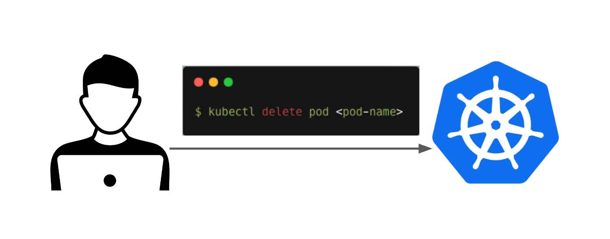
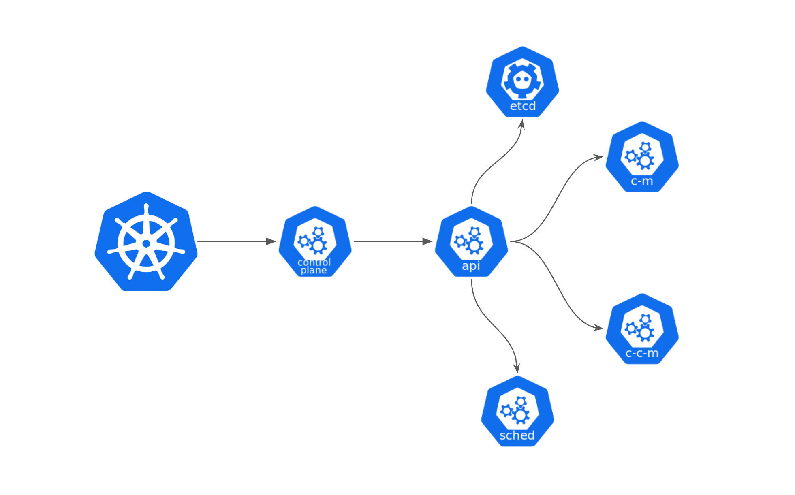
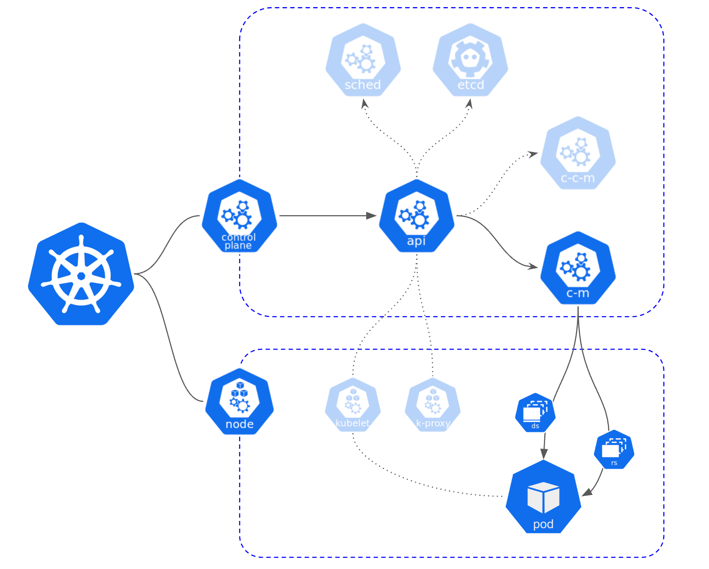
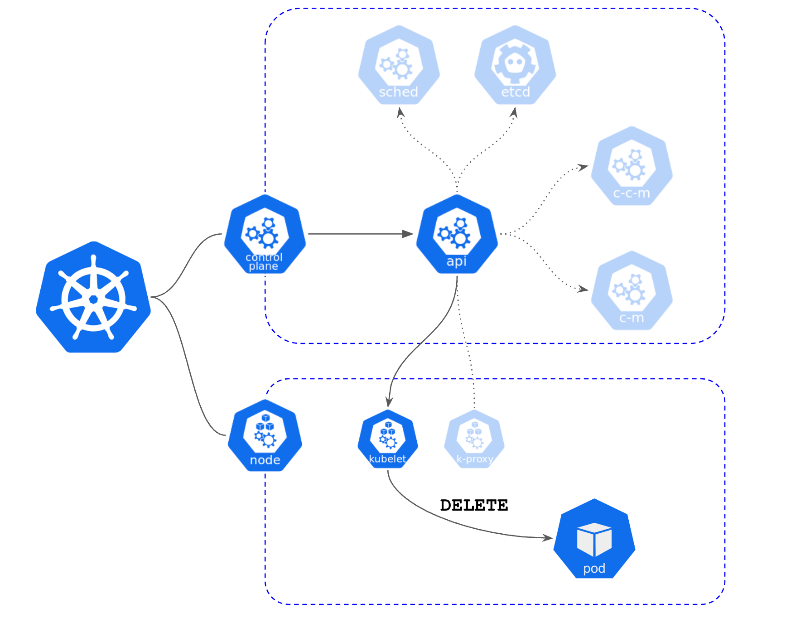
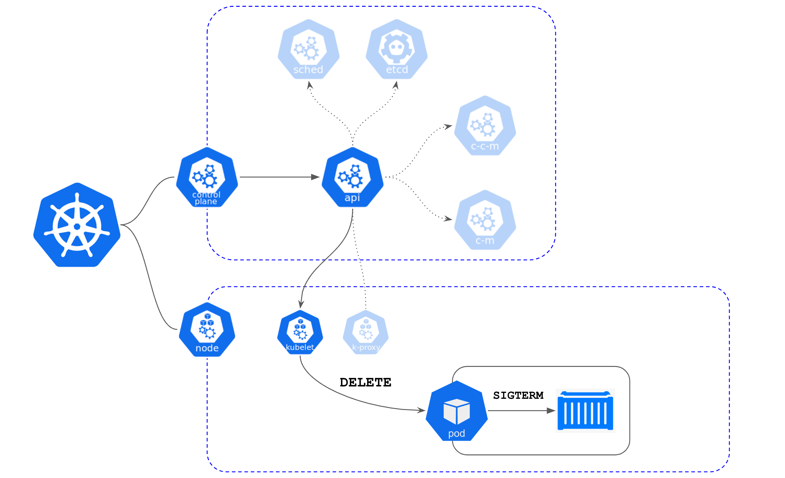
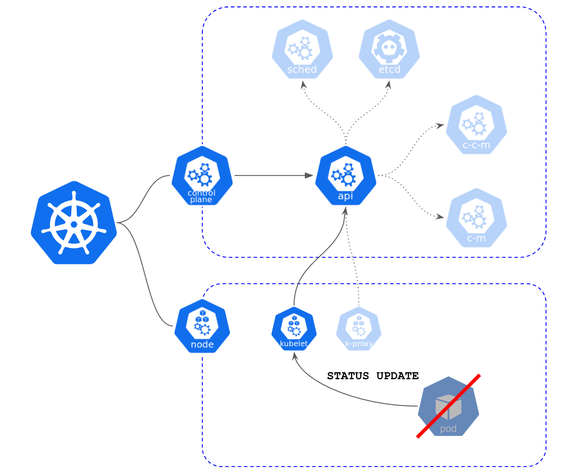

# 들어가며

 kuberentes 에서  pod 를 어떻게  kill 하는지, 어떻게 delete하는지에 대해 알아보려고 합니다.
상당히 많은 회사에서 물어보는 질문으로 미리 알고갔으면 어땟을까? 하는 생각이 들지만... 늦었더라도 지금이라도 정리하고 넘어가려고 합니다!

# 순서

1. 사용자 또는 관리자가 아래의 명령으로  Pod 를 삭제 요청합니다. 


```bash
$ kubectl delete pod <pod-name>
```

2.  Kubernetes Control Plane 내의  api-server  는  Pod  삭제 요청을 받고, 해당 요청을 클러스터 내의 모든  Control Plane  구성 요소에게 전달합니다.





<details>
<summary> Control Plane </summary>
<div markdown="1">

#### Control Plane
컨트롤 플레인은 Kubernetes 시스템의 논리적인 부분으로, 클러스터의 마스터 노드에 실행되는 여러 컴포넌트들의 조합입니다.

##### kube-apiserver
Kubernetes 클러스터의 모든 작업은 API 서버를 통해 수행됩니다. 
kube-apiserver는 클러스터 내의 모든 리소스 및 작업에 대한 인터페이스를 제공하며, 클라이언트와의 상호 작용을 관리합니다.
##### etcd
etcd는 Kubernetes 클러스터의 상태 정보를 저장하는 고가용성 분산 key-value 저장소입니다. 
etcd는 컨트롤 플레인 컴포넌트들 간의 통신과 클러스터의 상태를 유지하는 데 사용됩니다.
##### kube-scheduler
kube-scheduler는 새로 생성된 Pod에 대해 적합한 노드를 선택하여 배치하는 역할을 합니다. 
리소스 요구 사항, 제약 조건, 애플리케이션의 가용성 등을 고려하여 최적의 노드를 선택합니다.
##### kube-controller-manager
kube-controller-manager는 다양한 컨트롤러를 실행하고 관리합니다. 
예를 들면 ReplicaSet, Deployment, StatefulSet, Service와 같은 오브젝트들을 감시하고 클러스터의 상태를 원하는 상태로 유지합니다.
##### cloud-controller-manager
cloud-controller-manager는 클라우드 제공 업체의 기능과 통합된 컨트롤러를 실행합니다. 
클라우드 특정 작업(예: 로드 밸런서 프로비저닝, 스토리지 관리 등)을 처리하는 역할을 합니다.

</div>
</details>
<br>

3.  Kubernetes ControlPlane 내의  kube-controller-manager  는  Pod 가  ReplicaSet  또는  Deployment 와 같은 객체의 소유  Pod 인지 확인합니다.



만약  Pod 가  ReplicaSet  또는  Deployment 에 속한 경우,  kube-controller-manager 는 해당 컨트롤러가 관리하는  ReplicaSet 또는  Deployment 에서  Pod 의 개수를 조정합니다. 그로인해 일반적으로  Pod 를 삭제하면 새로운  Pod 를 생성하여 설정된 개수를 유지하도록 합니다. 
 
4.  Pod 를 삭제하기 위해  kube-api-server  는 해당 노드의  kubelet 에게  Pod  삭제 요청을 전달합니다.




5.  kubelet 은  Pod 를 삭제하기 전에  Pod  내의 컨테이너에  SIGTERM  시그널을 보내고, 일정 시간(기본적으로 30초) 동안 대기합니다. 컨테이너는 이 시그널을 받고 종료 준비를 시작합니다.




만약 일정 시간 내에 컨테이너가 종료되지 않으면  kubelet 은  SIGKILL  시그널을 보내어 강제로 컨테이너를 종료시킵니다.

6.  Pod 의 모든 컨테이너가 종료되면  kubelet 은  Pod 를 완전히 삭제하고, 상태 업데이트를  kube-api-server 로 보냅니다.




7.  kube-api-server 는  Pod  삭제 완료를 확인하고, 상태를 업데이트한 후 요청한 클라이언트에 응답합니다.