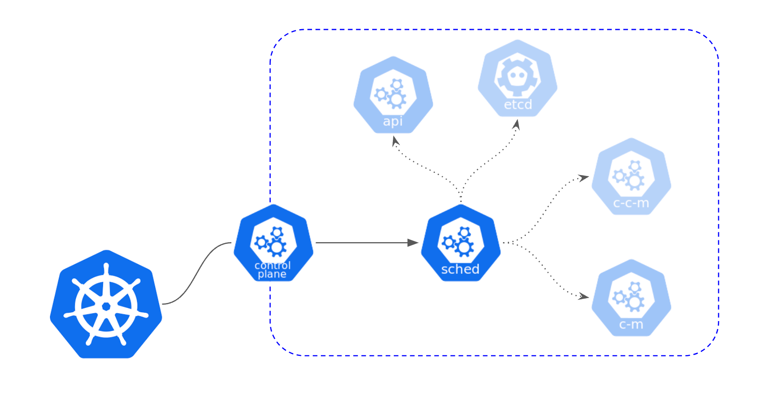

# 들어가며

쿠버네티스는 `node`의 리소스에 따라 `Pods`의 배치 전략도 달라지고, 제한이 됩니다.
이번 게시글에서는 `Node`의 리소스가 꽉 찼을 때 리소스를 확보하기 위해 어떤 우선 순위에 의해 `Pods`를 삭제하는지에 대해 알아보겠습니다.

## 우선 순위

`Kubernetes`에서 `Node`의 리소스가 가득 찼을 때 `Pod`를 삭제하는 순서를 정하는 것은 `kube-scheduler`에 의해 정해집니다.




### QoS 클래스
`Kubernetes`에서 `QoS(Quality of Service)`는 `Pod`의 리소스 요구 사항을 기반으로 `Pod`를 세 가지 클래스로 분류하는 개념입니다. 
해당 클래스는 관리자가 직접 부여하는 것이 아니라 해당 **조건이 충족되면 자동으로 부여**됩니다.
즉, `QoS` 클래스는 `Pod`가 얼마나 신속하게 할당된 리소스를 사용할 수 있는지와 관련이 있는데 세가지로 분류됩니다.

#### Guaranteed (보장)
- 리소스 요구 사항을 완벽하게 충족하는 `Pod`입니다.
- `Pod`는 `CPU`와 `Memory`에 대한 정확한 요구 사항을 지정합니다.
- `Pod`가 필요한 리소스를 모두 사용할 수 있으며, 다른 `Pod`가 리소스를 사용하지 못하도록 합니다.
- 다른 클래스의 `Pod`보다 우선 순위가 높습니다.
- **이 클래스의 `Pod`는 리소스 부족 상황에서도 최우선으로 유지됩니다.**
- 요구 조건
    - 파드 내 모든 컨테이너는 메모리 상한과 메모리 요청량을 가지고 있어야 한다.
    - 파드 내 모든 컨테이너의 메모리 상한이 메모리 요청량과 일치해야 한다.
    - 파드 내 모든 컨테이너는 CPU 상한과 CPU 요청량을 가지고 있어야 한다.
    - 파드 내 모든 컨테이너의 CPU 상한이 CPU 요청량과 일치해야 한다.


```yaml
...
spec:
  containers:
  - name: myapp
    image: nginx
    resources:                  // resource의 limit(cpu,memory)와 request(cpu, memory)가 명시되어있다.
      limits:
        cpu: 700m
        memory: 200Mi
      requests:
        cpu: 700m
        memory: 200Mi
...
```

위의 명세로 파드를 생성한 후 상세 정보를 보게 되면 아래와 같이 `status`가 부여된 것을 확인할 수 있습니다. 

```yaml
...
spec:
  containers:
  - name: myapp
    image: nginx
    resources:
      limits:
        cpu: 700m
        memory: 200Mi
      requests:
        cpu: 700m
        memory: 200Mi
    
...
status:
  qosClass: Guaranteed
...
```


##### Burstable (가변)
- 일부 리소스를 보장하면서도 추가 리소스를 요청할 수 있는 Pod입니다.
- `Pod`는 최소한의 리소스 요구 사항을 지정하며, 필요한 경우 추가 리소스를 동적으로 요청할 수 있습니다.
- 다른 클래스의 Pod보다 우선 순위가 낮습니다.
- **`Burstable Pod`는 리소스 부족 상황에서 `Guaranteed Pod`보다 우선 삭제될 수 있습니다.**
- 요구 조건
    - 파드 내에서 최소한 하나의 컨테이너가 메모리 또는 CPU 요청량/상한을 가집니다.

``` yaml
...
spec:
  containers:
  - name: myapp
    image: nginx
    resources:              // resource의 limit.memory와 request.memory만 명시되어있다.
      limits:
        memory: 200Mi
      requests:
        memory: 200Mi
...
```

위의 명세로 파드를 생성한 후 상세 정보를 보게 되면 아래와 같이 `status`가 부여된 것을 확인할 수 있습니다. 

```yaml
...
spec:
  containers:
  - name: myapp
    image: nginx
    resources:
      limits:
        cpu: 700m
        memory: 200Mi
      requests:
        cpu: 700m
        memory: 200Mi
    
...
status:
  qosClass: Burstable
...
```

#### BestEffort (최선의 노력)
- 리소스 요구 사항이 없거나 매우 낮은 `Pod`입니다.
- `Pod`는 최소한의 리소스를 요청하지 않으며, 리소스를 다른 `Pod`와 공유합니다.
- 다른 클래스의 `Pod`보다 우선 순위가 가장 낮습니다.
- **리소스 부족 상황에서 가장 먼저 삭제될 수 있습니다.**
- 요구 조건
    - 파드의 컨테이너에 메모리 또는 CPU의 상한이나 요청량이 없어야 합니다.

``` yaml
...
spec:
  containers:
  - name: myapp
    image: nginx
...
```

위의 명세로 파드를 생성한 후 상세 정보를 보게 되면 아래와 같이 `status`가 부여된 것을 확인할 수 있습니다. 

```yaml
...
spec:
  containers:
  - name: myapp
    image: nginx
    resources: {}       // 비어있음.
...
status:
  qosClass: BestEffort
...
```

## 정리
- 우선순위 클래스에 따라 `BestEffort Pod`가 가장 먼저 삭제됩니다.
- 그 다음으로는 우선순위가 낮은 `Burstable Pod`가 삭제됩니다.
- `Guaranteed Pod`는 리소스가 부족한 상황에서도 최우선으로 유지되며, 가장 마지막에 삭제됩니다.


# Reference
- https://kubernetes.io/ko/docs/tasks/configure-pod-container/quality-service-pod/