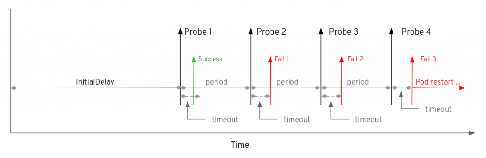

# 들어가며

처음 kubenetes로 container 운영 환경을 구성하였을 때, 애플리케이션 컨테이너가 생성되지도 않았는데 kube-scheduelr가 scheduling을 하고, ingress에선 해당 파드로 트래픽을 보내는데 아직 생성되지 않아 500 ERROR 발생하기도 하고.. pod가 unhealth 상태인데 kubenetes에선 그 상태를 감지하지 못해 계속 트래픽을 분산하기도 하고.. 아주 곤욕스러웠습니다. 그러던 중 kubernetes에서도 health check를 할 수 있는 Probe가 존재한다는 것을 알게되었고 바로 도입하였습니다. 

나아가 kubernetes pod probe는 오픈소스인 [botkube](https://botkube.io/)를 통해 효율을 극대화 할 수 있습니다. 이번 포스팅에서는 kubernetes의 probe에 대해 다뤄보고 추후에 botkube에 대해 포스팅하도록 할게요!

# Probe란?

- kubenetes는 kubelet을 통해 pod의 상태를 파악하는 Probe(조사) 기능을 제공합니다.
- 컨테이너의 상태를 파악하고 라이프 사이클을 제어하는 health-check기능을 수행합니다.
- 진단을 수행하기 위해서, kubelet은 컨테이너 안에서 코드를 실행하거나, 또는 네트워크 요청을 전송합니다.

# 종류

## ReadnessProbe(준비성 조사)

- 컨테이너가 요청(트래픽)을 처리할 준비가 되었는지 여부를 나타냅니다.
- 준비성 프로브가 실패한다면 엔드포인트 컨트롤러는 파드에 연관된 모든 서비스들의 엔드포인트에서 파드의 IP 주소를 제거합니다.

```bash
[동작 원리]
- 문제가 발생한 컨테이너는 일시적으로 어떠한 요청도 처리하지 않는 상태가 된다.
- 해당 probe가 성공하게 되면 Pod는 해당 Pod의 Service가 생성되는 시점에 
kube-proxy 에 의해 iptable에 등록되면서 서비스 백엔드에 등록된다.
- 서비스 백엔드에 등록된 pod들은 `chain rule` 에 의해 
해당 서비스로 들어온 트래픽을 분배하고 이를 처리하게 된다.

→ 서비스 백엔드에서 제외되면 해당 pod는 어떠한 요청도 처리하지 않는 상태가 된다.
```

## LivenessProbe(활성 조사)

- 컨테이너가 동작 중인지 여부를 나타냅니다.
- 활성프로브에 실패한다면 kubelet은 컨테이너를 죽이고 해당 컨테이너는 재시작 정책의 대상이 됩니다.

## StartupProbe(시작 조사)

- 컨테이너 내의 애플리케이션이 시작 되었는지를 나타냅니다.
- 스타트업 프로브가 주어진 경우, 성공할 때 까지 다른 나머지 프로브는 활성화 되지 않습니다.
- 스타트업 프로브가 실패하면 kubelet이 컨테이너를 죽이고 컨테이너는 재시작 정책에 따라 처리됩니다.

# 옵션

## health-check

### ExecAction

- 컨테이너에서 지정된 명령어를 실행
- 명령어를 실행한 후, `exit code` 가 0이면 성공, 이외의 값은 실패로 분류

### TCPSocketAction

- 지정된 포트로 TCP 소켓 연결을 시도
- 연결이 정상적으로 이루어지는 경우 성공, 연결에 실패한 경우 실패로 분류

### HttpGetAction

- 지정된 포트와 주소로 HTTP GET 요청을 전송
- 응답 상태가 200~400 구간에 속하는 경우 성공, 이외에는 실패로 분류

## health-check parameter



### initialDelaySeconds

- 기본 옵션
- 시작하기전에 기다리는 시간을 설정
- 기본 값 : 0초

### periodSeconds

- 추가 설정 옵션
- 검사 빈도를 결정
- 기본 값 : 10초

### timeoutSeconds

- 기본 옵션
- 얼마나 기다려야 하는지를 결정
- 기본 값 : 1초

### successThreshold

- 추가 옵션
- 시도가 실행한 후 성공한 것으로 간주할 최소 연속 성공 횟수를 지정
- 기본 값 : 1회

### failureThreshod

- 추가 옵션
- 시도가 실행한 후 실패한 것으로 간주할 최소 연속 실패 횟수를 지정
- 기본 값 : 3회

### example

```bash
failureThreshold: 1
initialDelaySeconds: 3
periodSeconds: 3
successThreshold: 1
timeoutSeconds: 3
terminationGracePeriodSeconds: 5
```

최초 3초 기다리고 (`timeoutSeconds : 3`) 

3초 후에 첫 헬스 체크를 하고 (`initialDelaySeconds : 3`)

3초 마다 체크하며 (`periodSeconds : 3`)

수행 실패가 1번 이상이면 실패로 판단한다. (`failureThreshold : 1`)

```bash
failureThreshold: 10
initialDelaySeconds: 3
periodSeconds: 5
successThreshold: 5
timeoutSeconds: 1
```

최초 1초 기다리고  (`timeoutSeconds : 3`) 

3초 후에 첫 헬스 체크를 하고 (`initialDelaySeconds : 3`)

5초마다 헬스 체크를 하며 (`periodSeconds : 5`)

수행 실패가 10번 이상이면 실패로 판단한다.  (`failureThreshold : 1`)

# 참고

- [https://medium.com/finda-tech/kubernetes-pod의-진단을-담당하는-서비스-probe-7872cec9e568](https://medium.com/finda-tech/kubernetes-pod%EC%9D%98-%EC%A7%84%EB%8B%A8%EC%9D%84-%EB%8B%B4%EB%8B%B9%ED%95%98%EB%8A%94-%EC%84%9C%EB%B9%84%EC%8A%A4-probe-7872cec9e568)
- https://velog.io/@koo8624/Kubernetes-Probes
- https://kubernetes.io/docs/tasks/configure-pod-container/configure-liveness-readiness-startup-probes/