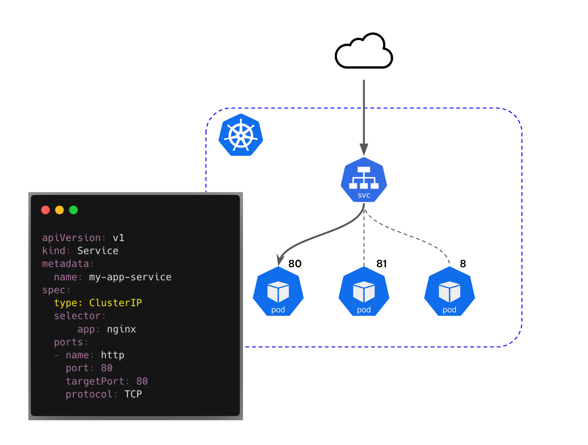
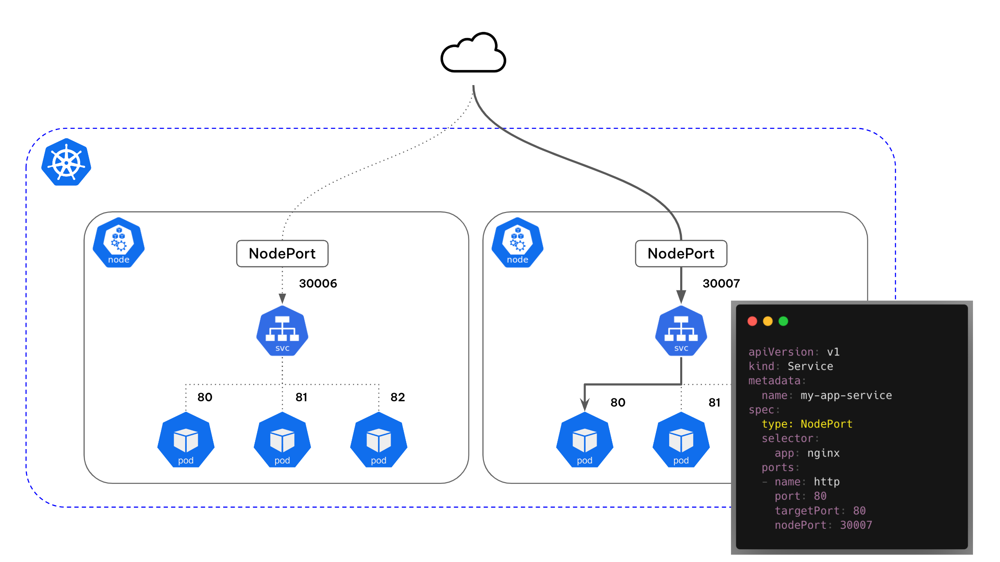
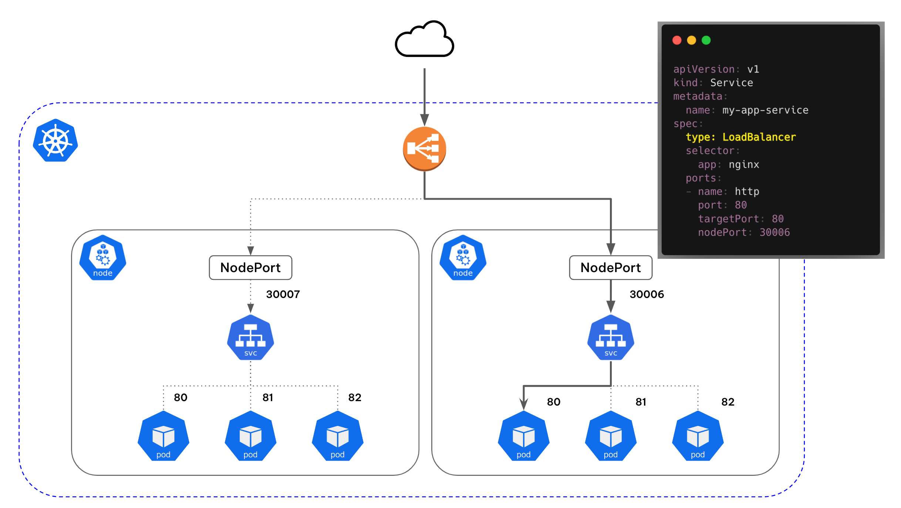
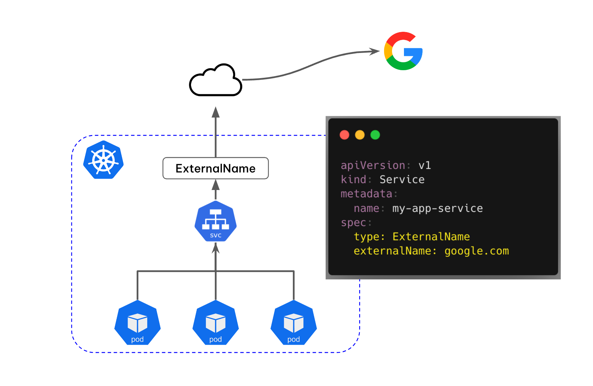

# 들어가며
인터넷을 통해 일반 사용자가 kubernetes의 파드에 접근하는 흐름은 어떻게 될까요? 직접 pod에 접근할까요? 아니면 routing을 통해 특정 경로로 접근할까요? 이러한 것을 도와주는 것이 Kubernetes Service 입니다.

# Kubernetes Service란?

kubernetes service는 cluster내에서 컨테이너화된 파드들을 네트워크에 노출하는 가상의 컴포넌트입니다. 이를 통해서 다른 cluster 내부의 객체들과 외부의 애플리케이션 혹은 사용자와 연결되도록 도와줍니다.

kubernetes에서 Pod는 언제든지 다른 노드로 이동하거나 삭제될 수 있으며, 생성될 때마다 새로운 내부 IP를 할당받게 됩니다. 이로 인해 Pod는 외부와 지속적인 통신이 어렵습니다. 

kubernetes에서는 service를 통해 Pod가 외부와 통신할 수 있도록 고정적인 IP를 부여하고 애플리케이션을 구동하는 여러 Pod에게 하나의 Network Endpoint를 제공하여 통신을 가능하게 합니다.

Kubernetes Service에는 ClusterIP, NodePort, LoadBalancer, ExternalName과 같은 다양한 유형이 있습니다.

## ClusterIP

ClusterIP는 Kubernetes Service의 기본값으로 클러스터 내부에서 여러 파드들 간의 통신을 지원합니다.
클러스터 내에서만 접근 가능할 수 있게 IP를 할당하며 외부에서는 접근할 수 없고 port forwarding 또는 proxy를 통해 접근을 해야 합니다. 

## NodePort

NodePort는 ClusterIP의 확장한 유형으로, 외부에서도 접근 가능하도록 합니다. Node의 IP 주소와 지정된 포트 번호를 통해 서비스에 접근할 수 있게 해줍니다. 

NodePort는 30000-32767 범위 내에서 지정할 수 있으며, 명시적으로 지정하지 않으면 Kubernetes가 자동으로 할당합니다.

단점은 노드가 사라졌을때 자동으로 다른노드를 통해 접근이 불가능합니다. 따라서 자동으로 다른 노드에 접근을 하려면 별도의 Loadbalancer가 필요 합니다

## Loadbalancer

LoadBalancer는 Nodeport의 확장한 유형으로 가장 일반적으로 사용되는 서비스 유형입니다.

NodePort타입 앞단에 Cloud 공급업체(AWS, GCP, Azure등) 지원하는 Loadbalancer가 붙어서 살아있는 노드를 체크하여 트래픽을 전달 할 수 있는 장점이 있습니다.

## ExternalName

ExternalName은 내부 클러스터에서 외부 서비스에 접근하기 위해 사용되는 서비스 유형입니다. 

외부 서비스의 DNS 이름을 클러스터 내부에서 CNAME으로 사용하고자 할 때 유용합니다. 

이 서비스 유형은 외부에 직접 연결되지 않으며, 단순히 DNS 이름을 노출시켜 주는 역할을 합니다.

# Reference
- https://kim-dragon.tistory.com/52
- https://gasidaseo.notion.site/K8S-Service-1-f095388c48a84841b09a13b582f374c8 