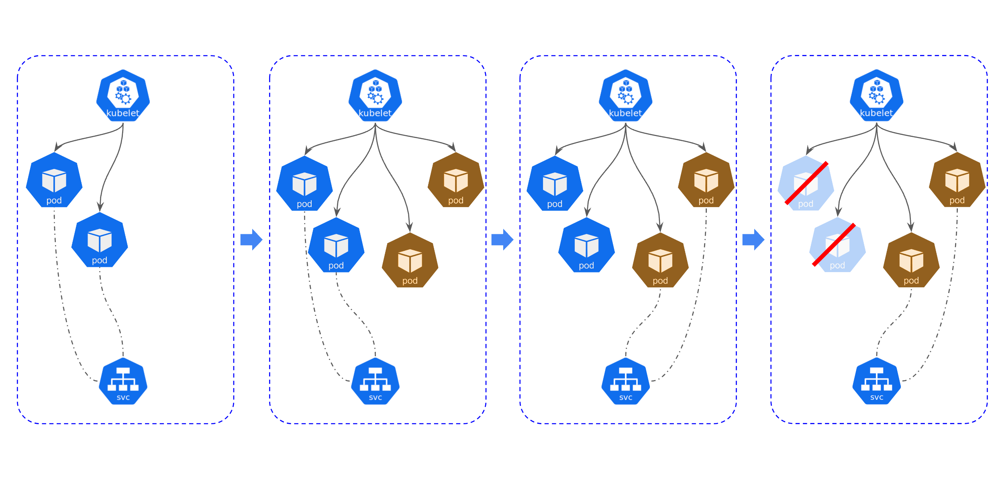

# 들어가며
얼마전 nginx 기반의 vue 애플리케이션에 대해 평소와 같이 manifast 파일을 만들어서 RollingUpdate하여 배포했는데 502, 504 Error가 빈번히 발생했습니다..!

분명히 Probe 설정을 해두었는데도 발생하였고 terminationGracePeriodSeconds와 lifecycle.prestop을 설정하여 해결했습니다! 

해당 내용에 대해 정리할 예정인데, 그보다 먼저 Kubernetes의 Update 방식에 관해 먼저 정리해볼게요!

# Kubernetes Pod Update

쿠버네티스는 pod를 다양한 방법으로 Update할 수 있습니다.

## 과정

### 클라이언트 요청


Pod 업데이트를 요청하는 클라이언트(kubectl, REST API 호출등) 업데이트 관련 명령을 실행합니다.

### kube-apiserver


클라이언트의 요청은 kube-apiserver에 전달되며 인증과 권한, 요청 유효성 검사등 검증 과정을 거치게 됩니다.

검사 등의 과정을 거칩니다. kube-apiserver는 요청을 처리하고 클라이언트에 응답을 반환합니다.

그 후 kube-apiserver는 요청된 업데이트 작업을 수행하기 위해 관련된 리소스(Deployment, ReplicaSet)를 식별합니다.

### kube-controller-manager에게 전달


kube-controller-manager는 리소스의 현재 상태를 확인하고 설정되어 있는 업데이트 전략에 따라 작업을 진행합니다.

##### 업데이트 전략 확인

- kube-controller-manager는 업데이트를 수행할 리소스의 업데이트 전략(Recreate, Rolling, Canary, Blue/green)을 확인합니다.
    
##### Pod update 진행

- 새로운 버전의 pod 를 생성하거나 기존 버전의 pod를 제거하는 등의 작업을 진행합니다.
    
##### kubelet 처리


- kubelet은 각 worker node에서 실행되며 pod의 상태를 모니터링하고 실제로 pod를 생성하거나 제거하는 역할을 합니다.
    
##### 업데이트 완료

- 업데이트 작업이 완료되면 클러스터의 상태는 새로운 버전의 pod로 업데이트됩니다.


## 종류

### Recreate


Recreate 업데이트 전략은 기존의 모든 Pod를 제거하고 새로운 Pod를 생성하는 방식입니다. 

-> 무중단 형태의 업데이트 방식이 아니기 때문에 다운타임이 발생합니다.

### RollingUpdate


RollingUpdate 업데이트 전략은 새로운 버전의 Pod를 하나씩 생성하고 기존 버전의 Pod를 제거하는 방식입니다. 

업데이트 중에는 기존 버전과 새 버전의 Pod 인스턴스가 함께 실행되며, 점진적으로 업데이트가 진행되기 때문에 가용성이 보장됩니다.

-> 구버전과 신버전이 함께 배포되어있는 순간이 존재하고 기본 방식입니다.

### Blue/Green



Blue/Green 업데이트는 새로운 버전의 Pod를 별도의 "Green" 환경에 배포한 후, 트래픽을 기존의 "Blue" 환경에서 Green 환경으로 전환하는 방식입니다. 

이 방법은 롤백이 쉽고 빠른 가용성 전환을 제공합니다. 

업데이트 중에는 블루와 그린 환경이 병행되며, 트래픽을 그린 환경으로 전환하기 전까지는 사용자에게는 보이지 않습니다.

-> 기존과 같은 수의 pod를 새로 띄어야하기 때문에 리소스가 많이 소모됩니다.

### Canary


Canary 업데이트는 일부 트래픽을 새로운 버전의 Pod로 전달하여 새로운 버전의 성능 및 안정성을 검증하는 방식입니다. 

트래픽의 일부만 카나리(새로운 버전)로 전송되고, 나머지는 기존 버전으로 유지됩니다. 이를 통해 카나리 환경의 동작을 모니터링하고 문제가 발생하면 롤백할 수 있습니다.

-> 위험감지를 하기 위한 배포 전략으로 성능 모니터링에 유용하다는 장점이 있습니다.


<details>
<summary style="font-weight: bold;"> Rolling VS Canary</summary>
<div markdown="1">

> 롤링 업데이트는 새 버전을 점진적으로 배포하고 기존 버전을 제거하는 방식으로, 서비스의 가용성을 유지하며 업데이트를 수행합니다. 반면, 카나리아 업데이트는 일부 트래픽을 새 버전으로 전달하여 신규 기능이나 변경 사항을 검증하고, 문제가 발생할 경우 롤백할 수 있는 가용성과 안정성을 제공합니다. 

</div>
</details>
<br>

## 무중단 배포

pod를 RollingUpdate로 배포할 경우  새로운 pod를 생성하고 기존 pod에 terminated 명령을 내리고 새롭게 띄어진 pod에 service를 연결하고 트래픽을 보내는 일련의 과정이 일어나는데 새로운 pod에 트래픽을 미쳐 보내지 못한다거나 기존의 파드가 늦게 죽는다거나 등 다양한 이유로 무중단 배포가 되지 못하는 현상이 발생합니다. 

그럴 때 설정하는 옵션인 terminationGracePeriodSeconds와 lifecyle.preStop에 대해 알아보겠습니다.

### terminationGracePeriodSeconds
terminationGracePeriodSeconds란 Kubernetes(Pod)에서 컨테이너의 종료(graceful termination)에 대한 대기 시간을 설정하는 속성입니다. 

이 속성은 컨테이너가 종료되기 전에 운영체제에게 대기할 시간을 지정하여 종료 과정에서 진행 중인 연결을 처리하고 리소스 정리 등의 작업을 완료할 수 있도록 합니다.

#### 왜 써야하지?
일반적으로 컨테이너의 종료 시에는 컨테이너가 동작 중인 애플리케이션에 대한 연결이 있을 수 있습니다. 

그렇기 때문에 갑작스럽게 컨테이너를 중지하면 이러한 연결이 강제로 끊어질 수 있고, 데이터의 손실이나 비정상적인 동작이 발생할 수 있습니다.

terminationGracePeriodSeconds 속성을 사용하여 컨테이너 종료 시 애플리케이션에 대기 시간을 지정합니다. 설정한 시간 동안 Kubernetes는 컨테이너에 종료 신호를 보내며, 컨테이너는 종료 프로세스를 시작하고 진행합니다.

예를 들어, terminationGracePeriodSeconds를 30으로 설정하면, 컨테이너는 종료 신호를 받은 후 30초 동안 종료 과정을 수행할 수 있습니다. 만약 해당 기간 내에 컨테이너가 종료되지 않으면 Kubernetes는 강제로 종료시킵니다.

이렇게 terminationGracePeriodSeconds 속성을 설정하여 컨테이너의 graceful termination을 지원하면 애플리케이션의 안정성과 데이터 무결성을 보다 잘 유지할 수 있습니다.

<details>
<summary style="font-weight: bold;"> Graceful termination</summary>
<div markdown="1">

> Graceful termination(정상 종료)은 컨테이너나 애플리케이션을 종료할 때, 현재 처리 중인 작업이나 연결을 완료하고 정리 작업을 수행하는 것을 의미합니다. 
이는 애플리케이션의 안정성과 데이터 무결성을 유지하며, 사용자에게 원활한 서비스 경험을 제공합니다.

</div>
</details>
<br>
<br>


기본 값은 30초이며 spec 하위에 선언해줍니다.

```yaml
...
spec:
  containers:
  - image: ***
  ...
    readinessProbe:
      httpGet:
        path: /health
        port: 80
      initialDelaySeconds: 30
      periodSeconds: 30
  terminationGracePeriodSeconds: 60 <<
  ...
```

### lifecycle.preStop

컨테이너가 종료되기 전(pre-stop)에 실행할 작업을 정의하는 속성입니다
예를 들어, 컨테이너 내에서 정리 작업이나 연결 종료, 상태 저장 등의 작업을 수행해야 할 수 있습니다. lifecycle.preStop은 이러한 종료 전 작업을 정의하고 실행할 수 있도록 도와줍니다.

lifecycle.preStop을 사용하면 컨테이너가 종료되기 전에 필요한 작업을 수행할 수 있습니다. 종료 전 작업을 수행함으로써 데이터의 일관성을 유지하거나 리소스를 안전하게 정리할 수 있습니다. 이는 graceful termination을 통해 애플리케이션의 안정성과 사용자 경험을 향상시키는 데 도움을 줍니다.


##### 작동 방식
- lifecycle.preStop 설정
  - 컨테이너의 스펙 내에서 lifecycle.preStop 속성을 정의합니다. 이 속성은 컨테이너의 lifecycle 속성 중 하나로 설정되며, 실행할 명령을 포함하는 컨테이너 생명주기 후크(hook)를 지정합니다.

- PreStop 후크 실행
  - 컨테이너가 종료되기 전에 Kubernetes는 lifecycle.preStop에 지정된 명령을 실행합니다. 이 명령은 컨테이너가 안전하게 종료되기 전에 실행되는 스크립트 또는 명령어일 수 있습니다. 예를 들어, 연결을 종료하거나 현재 진행 중인 작업을 완료하는 등의 작업을 수행할 수 있습니다.
- 대기 시간
  - lifecycle.preStop 명령이 실행되고 난 후에도 컨테이너는 정해진 대기 시간(terminationGracePeriodSeconds) 동안 대기합니다. 이 시간 동안 컨테이너는 여전히 요청을 처리하거나 작업을 완료할 수 있습니다.

```yaml
...
spec:
  containers:
  - image: ***
    lifecycle:  <<
      preStop:
        exec:
          command:
          - /bin/sh
          - -c
          - sleep 40
  ...
    readinessProbe:
      httpGet:
        path: /health
        port: 80
      initialDelaySeconds: 30
      periodSeconds: 30
  terminationGracePeriodSeconds: 60
...
```
 
lifecycle.preStop으로 인해 컨테이너가 종료되기 전에 sleep 40 명령을 실행하여 40초 동안 대기합니다. 
그후 terminationGracePeriodSeconds가 60으로 설정되어있어 컨테이너가 종료되기 전에 60초 동안 대기할 수 있도록 설정한 것입니다. 이 기간 동안 컨테이너는 새로운 버전으로 트래픽을 전달 받을 수 있습니다.

**즉, 기존의 파드를 60초동안 대기하며 트래픽을 받습니다. 바로 끊는 것이 아니라 40초동안 대기하고 새로운 파드로 트래픽을 전달합니다.**
