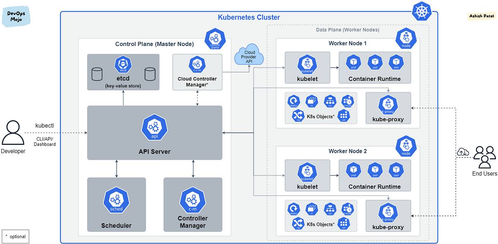

# 쿠버네티스란

쿠버네티스는 컨테이너화된 애플리케이션을 배포하기 위한 오픈 소스 오케스트레이터(orchestrator)입니다.

쿠버네티스는 애플리케이션 지향 API로 구글이 컨테이너에 확장 가능하고 안정적인 시스템을 배포해온 10년의 경험을 토대로 개발하여 배포되었습니다.

## 쿠버네티스 클러스터

클러스터는 쿠버네티스가 최종 사용자에게 줄 수 있는 전체 컴퓨팅 리소스를 제공하기 위해 함께 작동하는 여러 시스템이며 모두 단일 API로 제어되며 해당 API의 사용자가 사용할 수 있는 시스템 모음입니다.

- 쿠버네티스 클러스터는 간단한 선언 구문을 사용하여 애플리케이션을 정의하고 배포할 수 있게 해주는 오케스트레이션 API를 제공
- 오류가 있는 경우 애플리케이션을 복구하는 수많은 온라인 자가 재해 복구 알고리즘을 자체척으로 제공
- 쿠버네티스 API는 소프트웨어 무중단 업데이트를 더욱더 쉽게 수행 할 수 있게 배포
- 서비스의 여러 레플리카 간에 트래픽을 쉽게 분산할 수 있는 서비스 로드밸러서 개념을 제공

## 클러스터 작동 방식

> 기초 이해 없이 쿠버네티스만큼 복잡한 소프트웨어를 관리하는 것은 배기관이 엔진과 어떻게 관련되어 있는지도 모른 채 자동차를 수리하려는 것과 같습니다.

## 클러스터 조정, 보안, 적용

클러스터의 요소가 결합된 방법과 개발자가 애플리케이션을 빌드하고 배포할 때 쿠버네티스 API를 사용하는 방법을 아는 것이 중요합니다.

클러스터와 클러스터의 사용량에는 주기가 있다. 클러스터의 수명 변화에 모두 대응하려면 명령줄 플래그, 배포 옵션, API 구성 등으로 쿠버네티스를 구성하는 방법을 이해해야 합니다.

클러스터는 애플리케이션을 배포하는 대상이기만은 아니다. 애플리케이션의 보안상 취약점을 공격하기 위한 매개체가 될 수도 있습니다.

## 문제에 대응하기

문제가 발생하였을 때 가장 중요한 것은 **사용자를 통해서 문제를 알아내기보다는 자동화와 알림**으로 신속하게 문제를 알아내고 가능한 한 빨리 시스템을 복구해 응답하도록 조치하는 것 입니다.

1. 적합한 메트릭을 올바르게 설정
    - 컨테이너에는 그 자체로 CPU, 메모리, 네트워크, 디스크 사용과 같은 기본 메트릭을 관찰할 수 있는 도구가 오픈 소스로 많이 존재한다. ex) 프로메테우스 오픈 소스 프로젝트
2. 시스템의 문제에 대응하고 복구
    - 쿠버네티스는 시스템과 결합하지 않은 모듈 방식으로 최소한의 상태만 시스템에 구축되어 있습니다.
    - 일반적으로 언제든지 시스템에 부하가 걸리거나 오작동 할 수 있는 구성 요소를 다시 시작하는 것이 안전함을 의미합니다. (모듈성, 멱등성)

> 💡 어떤 일이 발생했는지 알려주는 모니터링, 무언가가 고장 났을 때 알려주는 알림, 어떻게 수리해야 하는지 알려주는 시나리오뿐만 아니라 성공적인 클러스터의 관리를 위해서는 재해 대응 및 복구 절차를 개발하고 실행해야 합니다.

## 새로운 기능과 사용자 정의 기능으로 시스템 확장하기

쿠버네티스 오픈 소스 프로젝트의 가장 중요한 강점은 쿠버네티스 클러스터의 사용법을 구축/확장/개선하는 라이브러리, 툴, 플랫폼의 폭발적인 성장에 있습니다.

쿠버네티스 생태계에 있는 모든 툴을 사용하면 관리 중인 쿠버네티스 클러스터를 개선, 확장, 향상할 수 있습니다. 그러나 이러한 툴을 사용하면 클러스터가 불안정해지고 보안이 취약해지며 오류가 발생하기 쉬워집니다.

쿠버네티스 클러스터를 운영하기 위해서는 이러한 툴, 플랫폼, 프로젝트를 클러스터에 추가하는 방법과 시기를 잘 이해해야 합니다.

클러스터 운영자는 다른 솔루션을 권장하거나, 특정 프로젝트가 클러스터에 적합한지 아니면 최종 사용자에 대해 동일한 목표를 달성하는 더 나은 방법이 있는지를 알려주는 편지자나 조언자의 역할도 해야 합니다.

## 마치며

- 쿠버네티스 클러스터 운영은 일련의 컴퓨터에 일부 소프트웨어를 설치하는 것 이상의 일 입니다.

- 성공적인 관리를 위해서는 쿠버네티스를 어떻게 조합할지 확실히 이해하고, 쿠버네티스를 사용하는 개발자가 클러스터를 다루는 방법을 정확하게 알아야 합니다.

- 사용패턴이 바뀌면 그에 따라 클러스터를 유지, 관리, 조정, 개선하는 방법을 이해해야 합니다.

- 작동중인 클러스터에서 나오는 정보를 모니터링 하는 방법, 클러스터의 상태가 좋지 않을 때를 알려주는 알림, 대시보드를 개발하는 방법, 다시 상태를 좋게 만드는 방법을 알아야 합니다.