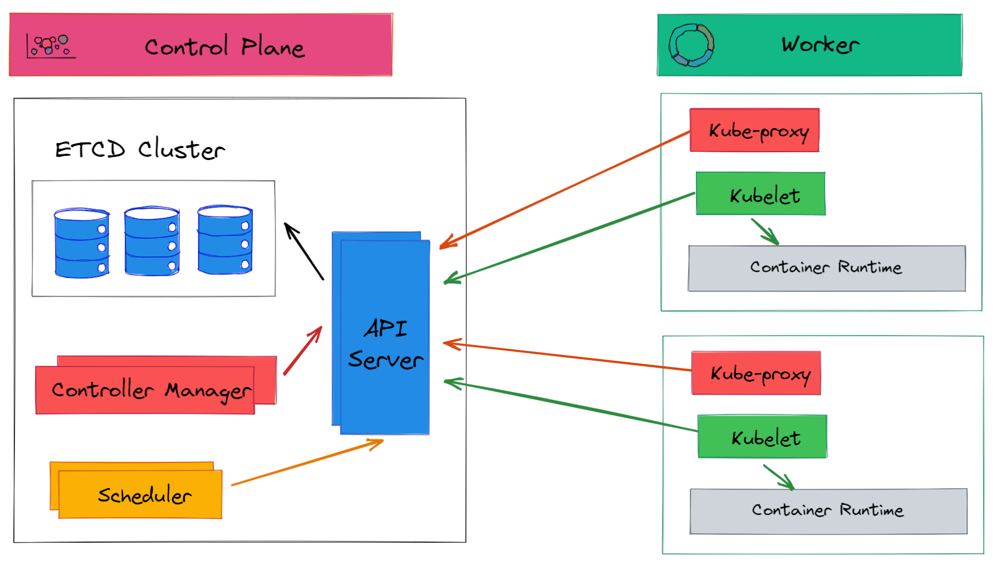

# 3. 아키텍처





쿠버네티스는 분산 시스템을 쉽게 배포하고 관리할 수 있도록 고안되었는데, 쿠버네티스는 그 자체로도 관리가 필요한 분산 시스템이다.

## 개념

시스템이 꽤 복잡해 보일 수 있지만 사실은 비교적 적은 수의 몇몇 개념을 토대로 하고 이 개념들이 전체적으로 반복된다. 

### 선언적 구성(Declarative Configuration)

사용자가 결과를 생성하기 위해 원하는 상태를 선언하는 선언적 구성(declarative configuration)은 쿠버네티스 개발의 주요 동력 중 하나이다. 

선언은 실제로 구조화된 YAML 또는 JSON 문서의 형태로 이루어진다.

시스템에 일련의 명령보다 더 많은 것을 제공하며 ‘원하는 상태’를 선언하여 개발자가 원하는 상태를 이해하고 사용자 상호작용과 관계없이 능동적인 조치를 할 수 있다.

즉, 자동으로 자가 수정과 복구가 가능하다. (이는 개발자에게 매우 중요한 기능인데 한밤중에 시스템이 개발자를 깨우지 않고도 스스로 복구가 가능)


### 조정 또는 컨트롤러

#### 조정

자가 복구나 자가 수정을 수행하기 위해 쿠버네티스는 많은 독립 조정(Independent Reconciliation) 또는 제어 루프(Control Loops)를 기반으로 구성

1. 단일 상태 기반 접근 방식(단일 시스템 설계)
- 시스템이 모든 프로세스의 상태를 인식하고 모든 것을 조화롭게 발전시키기 위해 완전한 관점 사용
- 시스템 작동이 중앙 집중화되어 이해하기 쉬움.
- 안정적이지 않다.
- 예기치 않은 일이 발생하면 전체 시스템이 다운될 수 있음

2. 분산형 컨트롤러 기반 접근 방식
- 많은 수의 컨트롤러로 구성되어 각 컨트롤러는 자체 독립 조정 루프를 수행
    - 독립적인 조정 루프
        
        1) 원하는 상태를 얻는다.
        
        2) 관찰한다.
        
        3) 관찰 결과와 원하는 상태 사이의 차이점을 찾는다.
        
        4) 관찰 결과와 원하는 상태가 일치하도록 조치를 취한다.
        
- 각 컨트롤러는 다른 나머지 부분과는 완전히 무관
- 작은 문제에 집중하고 해결하면 전체 시스템을 훨씬 더 안정적으로 만듬.
- 시스템의 작동 방식에 대한 설명을 찾을 수 있는 단일 위치가 없으므로 시스템의 전반적인 동작을 이해하기 어려움.

#### 쿠버네티스 컨트롤러

쿠버네티스 API 서버에 대한 선언문으로 원하는 상태를 관찰

```bash
[동작 원리]
# 사용자는 "웹 서버의 레플리카 4개가 필요합니다." 라고 선언
1) 쿠버네티스 복제 컨트롤러는 원하는 상태를 받아들이고 현재 상태를 관찰.
2) 컨트롤러는 현재 상태와 원하는 상태 사이의 차이점을 찾음.
3) 원하는 상태와 일치하도록 컨테이너를 생성/삭제 작업 수행.
```

### 암시적 또는 동적 그룹화

어떤 것을 한 집합으로 묶을 때에는 두 가지 접근법이 존재.

- 명시적/정적 그룹화
    - 모든 그룹이 구체적인 목록으로 정의(ex. 내 팀원은 alice, bob, ted입니다.)
    - 목록은 그룹의 멤버 이름을 명시적으로 호출하며 목록은 정적이다.
    - 목록 자체가 변경되지 않으면 멤버 자격이 변경되지 않는다.
    - 그룹에 누가 있는지 알기 위해서는 그저 목록을 읽기만 하면 된다.
    - 유연성이 부족하여 동적으로 변화하는 것에 대응 하기 어렵다.

- 암시적/동적 그룹화
    - 멤버 목록 대신 그룹을 ‘우리 팀원은 오렌지색의 옷을 입고 있는 사람들입니다’ 와 같은 문구로 정의
    - 그룹의 정의에는 일일이 이름이 적힌 멤버가 없다.
    - 존재하는 사람들에 대한 그룹을 정의
    - 복잡성을 초래할 수 있지만, 훨씬 더 유연하고 안정적이며 정적 목록을 지속해서 조정하지 않고도 변화에 대응 할 수 있다.
    - 쿠버네티스에서는 레이블, 레이블 쿼리 또는 레이블 셀렉터로 수행된다.

### 구조

#### 유닉스 철학

첫 번째 원칙은 쿠버네티스가 일반적인 유닉스 철학인 ‘각자 일을 잘 수행하는’ 작은 조각, 즉 모듈화를 기반으로 한다.

쿠버네티스는 단일 바이너리에서 다양한 기능을 모두 구현하는 단일 애플리케이션이 아니다.

쿠버네티스라는 전체 시스템을 구현하기 위해 서로 모르는 다른 애플리케이션의 모음이다.

다수의 상이한 기능을 함께 그룹화하는 바이너리가 있을지라도 그 기능들은 해당 바이너리 내에서 거의 독립적으로 유지된다.

구성 요소 간의 긴밀한 결합 때문이 아니라 쿠버네티스를 쉽게 배포하고 관리할 수 있도록 컴파일 된다.

→ 이 모듈 방식의 장점은 쿠버네티스가 유연하다는 것.

- 시스템의 큰 부분을 교체할 때도 다른 부분을 고려하거나 신경 쓰지 않고 그 부분만 교체할 수 있다.
- 시스템을 배포하고 모니터링하고 이애하기 위해서 여러 가지 툴에 정보와 구성을 통합해야하기 때문에 복잡하다.

#### API 기반 상호작용

쿠버네티스의 두 번째 구조 설계 원칙은 구성 요소 간의 모든 상호작용이 중앙 집중식 API로 이루어진다는 것이다.

→ 구성 요소가 사용하는 API가 다른 모든 클러스터 사용자가 사용하는 API와 완전 동일

1. 시스템의 어느 부분도 다른 어떤 부분보다 특권을 갖지 않고 상호간에 직접 접근할 수 없다.
2. API서버를 제외하고는 내부에 대한 접근 권한이 전혀 없다.
    - 모든 구성 요소를 대체 구현하여 교체할 수 있으며 핵심 구성요소를 재구성하지 않고도 새로운 기능을 추가할 수 있다.

### 구성 요소

쿠버네티스는 다수 장비를 하나의 단위로 그룹화하여 API로 사용할 수 있는 시스템

쿠버네티스 구현 시에는 실제로 장비 집합을 워커 노드와 헤드 노드라는 두 그룹으로 나눈다.

쿠버네티스 인프라를 구성하는 대부분의 구성 요소는 헤드, 제어, 플랜 노드에서 실행된다.

클러스터에는 일반적으로 노드 수가 1개, 3개, 5개로 제한되어 있다. 

이 노드에서는 etcd나 API 서버와 같은 쿠버네티스를 구성하는 요소를 실행한다.

- 노드의 수는 홀수인데 쿼럼에 대해 Raft/Paxos 알고리즘을 사용하여 쿼럼을 공유 상태로 유지

클러스터의 실제 작업은 워커 노드에서 수행된다.

쿠버네티스의 구성 요소가 생성되면 쿠버네티스 클러스터에 스케줄된다.

#### 헤드 노드의 구성 요소

헤드 노드는 쿠버네티스 클러스터의 두뇌이다. 

쿠버네티스 API 기능을 구현하는 핵심 구성 요소들이 모아져 있다.

##### etcd

- 쿠버네티스 클러스터의 핵심
- 쿠버네티스 클러스터의 모든 오브젝트가 유지되는 키/값 저장소를 만든다.
- 분산된 합의 알고리즘인 Raft를 구현하여 스토리지 서버 중 하나에 장애가 발생하더라도 etcd에 저장된 데이터를 유지하고, etcd 서버가 정상 상태가 되어 다시 클러스터에 추가할 때 데이터를 복구할 수 있도록 충분한 복제가 이루어진다.
- etcd 서버는 쿠버네티스가 많이 사용하는 두 가지 중요한 기능을 제공한다.
    1. 낙관적인 동시성
        - etcd에 저장된 모든 값에는 해당 리소스 버전이 있다.
        - 키/값 쌍이 etcd 서버에 기록되면 특정 리소스 버전을 조건으로 지정할 수 있다.
        - etcd를 사용하면 모든 동시성 시스템에서 제일 중요한 **비교 후 교환(CAS, Compare and swap)**을 구현
        - 비교 후 교환을 사용하면 사용자가 값을 읽고 시스템의 다른 구성 요소가 값을 업데이트하지 못했다는 것을 알게 되어 업데이트 할 수 있게 된다.
        
        → 시스템이 비관적인 잠금장치가 없어도 etcd의 데이터를 조작하는 다중 스레드를 안전하게 가질 수 있게 하여 서버의 처리량을 크게 줄일 수 있다.
        
    2. 워치(Watch) 프로토콜 구현
        - 워치의 장점은 클라이언트가 전체 값 디렉터리에 대한 키/값 저장소의 변경 사항을 효율적으로 감시할 수 있다는 것
        - 워치를 사용하면 클라이언트가 지속적으로 etcd 서버에 폴링하지 않아도 변경 사항을 효율적으로 기다리고 이에 대응할 수 있다.

##### API 서버

etcd가 쿠버네티스 클러스터의 핵심이긴 하지만 쿠버네티스 클러스터에 직접 접근할 수 있는 서버는 실제로 API서버 하나 뿐이다.

API 서버는 쿠버네티스 클러스터의 허브로서 클라이언트와 etcd에 저장된 API 오브젝트 사이의 모든 상호작용을 중개한다.

→ 결과적으로 다양한 구성 요소 모두에 대한 중앙 집중 지점이 된다.

##### 스케줄러

파드가 실행될 위치를 찾는 것이 바로 쿠버네티스 스케줄러의 역할

→ 스케줄러는 API 서버에서 스케줄 되지 않은 파드를 검색한 다음, 이들을 실행할 최적의 노드를 결정

##### 컨트롤러 관리자

etcd, API 서버, 스케줄러가 작동한 후에는 성공적으로 파드를 만들고 노드에 스케줄된 것을 볼 수 있지만 예상대로 ReplicaSets, Deployment, Service는 작동하지 않는다.

→ 필요한 모든 조정 제어 루프가 현재 실행중이지 않기 때문이다.

루프를 실행하는 것은 컨트롤러 관리자의 역할

#### 모든 노드의 구성 요소

##### 쿠블렛(kubelet)

- 쿠버네티스 클러스터의 일부인 모든 시스템의 노드 데몬이다.
- 사용 가능한 CPU, 디스크, 노드의 메모리를 큰 쿠버네티스 클러스터에 연결하는 다리이다.
- API 서버와 통신하여 노드에서 실행되어야 하는 컨테이너를 찾는다.
- 다른 조정 제어 루프가 컨테이너의 현재 상태를 볼 수 있다.
- 실행될 것으로 예상되는 컨테이너의 상태를 확인하고 다시 시작하는 일을 담당한다.

→ 쿠블렛이 실행한 컨테이너가 죽거나 상태 점검에 실패하면 쿠블렛은 컨테이너를 다시 시작하고 상태와 재시작 정보를 다시 API 서버에 전달한다.

##### kube-proxy

- 모든 컴퓨터에서 실행되는 다른 구성 요소
- 쿠버네티스 Service 로드 밸런서 네트워킹 모델 구현을 담당

```bash
[동작 원리]
1. 쿠버네티스 클러스터의 모든 서비스에 대한 엔드 포인트 오브젝트를 항상 감시한다.
2. 노드의 네트워크를 프로그래밍하여 Service의 가상 IP 주소에 대한 네트워크 요청이 실제로 
	 Service를 구현하는 엔드포인트로 라우팅되도록 설정한다.
```

- 쿠버네티스의 모든 Service는 가상 IP 주소를 가지며 kube-proxy는 로컬 로드밸런서를 정의하고 구현하는 데몬이다.
    
    → 클러스터 내의 어떤 곳이든 파드에서 파드로 트래픽을 라우팅하게 된다.
    

#### 스케줄된 구성 요소

##### 쿠버 DNS

- 스케줄된 구성 요소 중 첫 번째는 쿠버 DNS 서버이다.
- 쿠버네티스 Service가 생성되면 가상 IP 주소를 얻지만 해당 IP 주소는 DNS 서버에 프로그램이되어 쉽게 검색할 수 있다.
- 쿠버 DNS 컨테이너는 쿠버네티스 Service 오브젝트에 대해 네임 서비스를 구현한다.
- 쿠버 DNS Service 자체는 쿠버네티스 Service로 표현되므로 kube-proxy가 제공하는 동일한 라우팅이 DNS 트래픽을 쿠버 DNS 컨테이너로 라우팅된다.
    
    → 쿠버 DNS 서비스에 정적 가상 IP 주소가 부여된다.
    
    → API 서버가 생성한 모든 컨테이너에 DNS 서버를 프로그래밍할 수 있음을 의미하며 쿠버네티스 서비스에 대한 이름 지정 및 서비스 검색이 가능해짐을 의미한다.
    

##### 힙스터

- 쿠버네티스 클러스터에서 실행되는 모든 컨테이너에서 CPU, 네트워크, 디스크 사용량과 같은 메트릭을 수집한다.
- 이러한 메트릭은 인플럭스DB(InfluxDB)와 같은 모니터링 시스템으로 푸시되어 클러스터의 애플리케이션 상태에 대한 경고 및 일반 모니터링을 수행한다.
- 쿠버네티스 클러스터 내에서 파드의 자동 스케일링을 구현하는데 이러한 메트릭을 사용한다.
    
    → 힙스터는 특정 기준을 수집하고 집계하여 자동 측정기가 구현한 조정 루프를 가동하는 구성 요소.
    
- metric-server와 metric API로 대체되었다.

## 마치며

- 쿠버네티스는 API 서버를 실행하는 컨트롤 플랜 노드와 API 백업 스토어를 구성하는 etcd클러스터를 포함해 완전한 쿠버네티스 API를 구현하는 다양한 구성 요소를 가진 복잡한 분산 시스템
- 스케줄러는 API 서버와 상호작용하여 컨테이너를 특정 워커 노드로 스케줄링하고, 컨트롤러 관리자는 클러스터가 올바르게 작동하도록 대부분의 제어 루프를 작동
- 클러스터가 제대로 작동하면 클러스터 DNS 서비스, 쿠버네티스 서비스 로드 밸런서 인프라 구조, 컨테이너 모니터링 등을 비롯하여 클러스터 자체에서 실행되는 수많은 구성 요소가 작동


## Reference

- https://techdozo.dev/kubernetes-architecture/