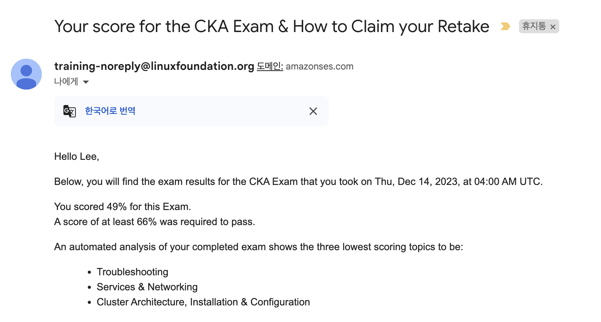

# 들어가며

사내에서 Kubernetes를 도입하기 위해 공부하던 찰나 쿠버네티스 관련 자격증이 있다는 것을 알게 되었습니다. 하지만 당시에 자격증 취득을 위한 공부보단 하루 빨리 실무에 적용하기 급급했던터라 수박겉핥기 식으로 공부를 했었습니다. 그렇게 오직 이론보단 실무를 위하여 Kubernetes를 도입하여 운영했었고, 어느정도 시간이 지남에 따라 안정화가 되어 자격증을 공부를 하기 시작했습니다. (시기로 보자면 23년 11월부터 준비를 했습니다.) 23년 12월에 2번의 시험을 본 후 연달아 불합격했고 24년 1월에 한 번 더 결제를 하여 2번을 보아 합격했습니다!(총 4번을 보았네요…) 그리고 바로 2주 뒤 45% 설날 세일이 가능해져 이때다 싶어 CKAD까지 1번의 불합격에 이어 결국 합격을 했습니다..! (저만큼 불합격 받은 사람 없을 겁니다… 🤣🤣) 

> 시험을 많이 보면서 노하우도 생겼고, 문제 유형도 많이 알게 되었고 무엇보다 시험 환경에 익숙해졌습니다. 이런 저의 경험을 후기로 남겨 봅니다. (많은 분들에게 도움이 되었으면 좋겠습니다!)

# CKA

## 첫 번째 시험

첫 번째 시험은 Udemy의 강의만 수강하고 덤프도 풀어보지 않은채 ‘어차피 한번 더 기회있으니까 한번 봐 보자!’ 라는 생각으로 시험을 보았습니다. 

### 결과 (처참한 결과…)

66%가 커트라인인데 저는 49%였습니다. 하하… 이 결과를 보고 충격을 먹기도 했지만 왠지 모를 자신감도 있었습니다.. (~~dump도 풀어보지 않고 봤는데 49점이라고?!~~)

## 두 번째 시험

두번째 시험은 Udemy의 CKA 강의에 수록되어있는 Mock Exam과  killer.sh를 어느정도 풀어본 후 도전했습니다. 이때 떨어지면 진짜 $395가 공중분해 되는 것이라… 어느 정도 마음의 부담감을 느끼며 준비를 하였고 시험을 보았습니다.

### 결과

이때까지도 대체 무엇이 틀렸는지 문제 자체는 알려 주지 않고 틀린 유형에 대해서만 알려 주어 난감했습니다. 하지만 2번의 기회가 없어진 터라 새로 자격증 응시를 구매해야 했고, 무엇보다 어떤 것이 틀렸는지 감을 잡을 수 없어 이성미 강사님의 [따배씨](https://www.youtube.com/watch?v=KdATmTulf7s&list=PLApuRlvrZKojqx9-wIvWP3MPtgy2B372f&ab_channel=TTABAE-LEARN) 를 수강하였습니다.

## 세 번째 시험

$395(한화로 53만원)의 가격을 자랑하는 CKA를 어떠한 할인도 없이 응시하기엔 부담이 되서 할인하는 타이밍을 기다렸습니다. 그러던 중 24년 연초 세일로 25% 세일 쿠폰을 뿌려 바로 구매했고, 시험 날짜까지 바로 예약했습니다. 이때부터는 강의도 다시 들었고, Mock Exam도 완벽하게 외울 정도로 준비를 하였습니다. 그 후 [killer.sh](http://killer.sh) 도 풀어 보았는데, 난이도가 정말 어려워 하나의 session만 풀고 초기화 하고를 반복해서 풀어 보았고 해당 문제들의 오답 정리 수준으로 준비를 했었습니다.

### 결과 (역시나 탈락..)

이번 탈락으로 보니 공통적으로 제가 틀렸던 카테고리가 있었습니다.

- Service & Networking
- Cluster Architecture, Installation & Configuratoin
- Storage
- TroubleShooting

이 점을 지독하게 파고 들었고, 이때부터 [Killer.sh](http://Killer.sh) 도 완벽하게 풀어보기로 했습니다. [killer.sh](http://killer.sh) 가 정말 도움이 많이 되었는데, 특히 2번의 session 에서 첫 번째 session은 시간 제한 없이 풀어 보았고 어느 정도 감을 잡은 후에 2번째 session은 시간 제한을 염두에 두고 풀어 보았습니다. 이때 느낀 건, 이 문제에서 원하는 것이 무엇인가를 명확히 인지하느냐가 문제를 푸는 데에 있어 크게 작용한다는 것이었습니다.

## 네 번째 시험

틀린 문제에 해당하는 문제 유형을 강의 노트에서 따로 정리해서 유형을 파악했고, killer.sh도 체계적으로 풀어 보았습니다.

2시간 동안 25문제 중 23문제 정도 풀어 본 것 같네요. 시간이 지난 후 score 확인 창에서 101점이라는 점수를 받고나서야 마음이 안심되었고 바로 다음날 시험을 보았습니다. (이때 시험 환경에 완벽히 적응하였습니다. 그래서 실제 시험을 볼 때 시간도 여유로웠고 무엇보다 긴장이 덜했습니다!!)

### 결과

**90%의 정답률로 합격!**

# CKAD

## 첫번째 시험

[(CKAD 후기 (Certified Kubernetes Application Developer) - 라온클)](https://lifeoncloud.kr/entry/ckad)

CKAD는 CKA의 연장선이라고 들어서 별도로 공부하지 않았습니다. 시험에 출제된다는 커리큘럼을 보니 Job, CronJob, 배포 방식등 CKA에 해당 하지 않은 내용들은 시험을 보면서 직접 Doc에서 검색하여 풀었습니다. 왠지 모를 자신이 있었고 [killer.sh](http://killer.sh) 를 풀었을 때도 60점이라는 스코어가 나왔어서 더욱 자신이 있었습니다…

### 결과

하지만 정말 아쉽게도 66%를 맞아야 합격인데, 65%를 받아 1% 차이로 탈락했습니다. (후우….) 멘탈이 정말 많이 흔들렸고 “그냥 올해 후반기에 시험볼까” 싶었지만 시험에 대한 내용들을 잊을까 바로 1주일 후 시험 날짜를 예약해서 틀렸던 항목들, 풀면서 고민했던 부분들을 주로 공부하고 다시 응시하였습니다.

## 두번째 시험

killer.sh를 정말 열심히 풀었고, 스스로 시간 제한을 두고 풀었을 때 120점중 100점을 받았습니다. 또, 후기 글을 많이 찾아보고 첫번째 시험때 나왔었던 내용들을 복기해서 오답노트 식으로 만들어 숙지하고 시험을 봤습니다.

### 결과

86점의 득점으로 시험을 통과했습니다.. 길고 긴, 멀고 먼 시험 여정이 드디어 막을 내렸습니다…!

# 시험 후기 (!!꿀팁 대방출!!)

## CKA

### 강의

- Udemy - certified kubernetes administrator with practice tests
- Youtube - 따배씨 (따라 배우는 CKA)

### Dump

- Udemy- certified kubernetes administrator with practice tests (Mock Exam)
- killer.sh

### 문제 유형

최대한 기억나는 것만 적어 보면 아래와 같습니다.

- notReady 상태인 Node를 ready 상태로 변경 (`kubelet restart` )
- Pod의 log 확인 후 특정 경로에 저장하기 (`kubectl logs` )
- 특정 node를 drain 후 uncordon 하기 (`kubectl drain` , `kubectl uncordon` )
- run 상태인 특정 파드에 sidecar container 생성 하여 로그 저장하기 (volumes mount)
- 각각 다른 ENV를 가진 multi container pod 생성하기
- 문제에 정의된 상황에 맞는 network policy 생성하기 (namespace selector, pod selector, ports)
- CPU 가장 많이 할당된 Pod 이름 특정 경로에 저장하기 (`kubectl top` )
- ETCD Backup & Restore
- kubeadm version 업그레이드 & kubelet, kubectl 업그레이드

## CKAD

### 강의

- 따로 듣지 않음

### Dump

- killer.sh

### 문제 유형

최대한 기억나는 것만 적어 보면 아래와 같습니다.

- canary 배포
- sidecar container (`kubect edit`)
- netowrk policy를 건들지 않고 network 설정 (`kubectl label`)
- 주어진 조건에 따른 cronJob 생성
- pod 생성 (`kubectl run`)
- deployment 생성 (`kubectl create deploy`)
- nodePort type의 service 생성 (`kubectl expose`)
- replicas를 늘리고, 이미지를 바꾼 후 다시 undo (`kubectl rollout`)
- service account 생성 (`kubectl create serviceaccount generic`)
- resource 설정 (`request, limit`)
- readinessProbe, livenessProbe 설정
- Docker file 핸들링

## 메일

시험에 떨어지면 하나의 메일이 오게 되고, 합격하게 되면 3개의 메일이 오게 됩니다. (그래서 시험을 보고 24시간이 지난 후 메일이 왔다는 알림이 올 때에 한번만 진동이 느껴지면 불합격임을 인지했고, 2번 이상온다 하면 합격임을 인지하고 결과를 확인했습니다..)

### **불합격시 메일 제목**

- Your score for the CKA Exam & How to Claim your Retake

### 합격시 메일 제목

- Your Exam Results for the CKA Exam
- 'Certified Kubernetes Administrator (CKA)' certificate granted!
- Lee! You just earned a badge from The Linux Foundation

---

# Reference

- https://lifeoncloud.kr/entry/ckad