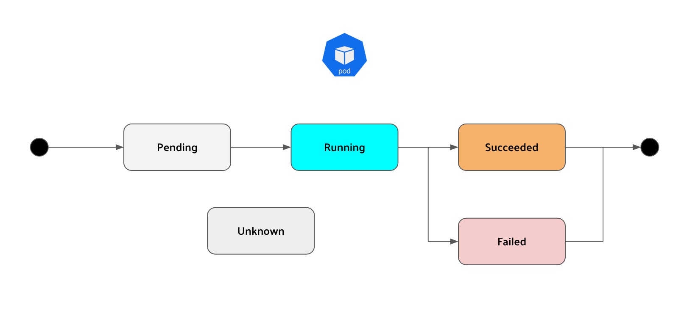
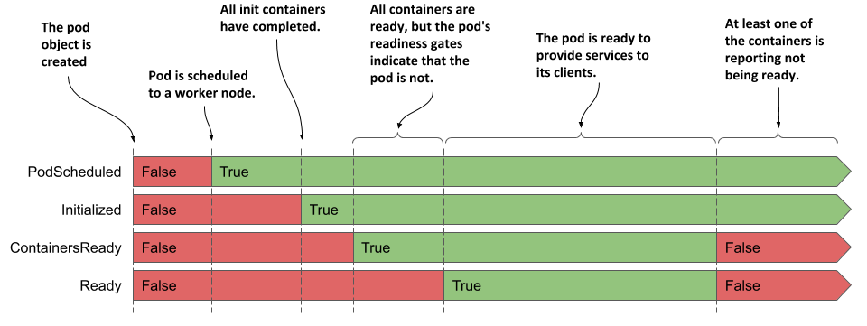
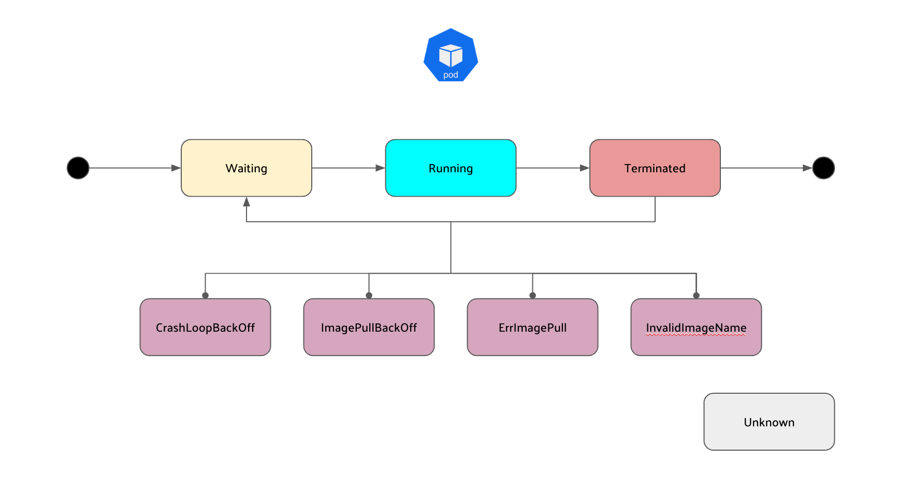

# 들어가며

최근에 면접을 본 곳에서 한가지 질문을 받았습니다. <br>

🗣 : "Pod의 LifeCycle에 대하여 설명해주세요."  <br>

여태 K8s Cluster나 Controle Plane의 구성 요소, Pod가 생성되는 과정에 대해서만 질문을 받았었는데 막상 쿠버네티스에서 가장 작은 컴퓨팅 단위인 Pod에 대해서는 나름 공부하지 못했던 것 같다는 생각이 들게 되었습니다. 그렇기에 이번에 정리를 해보았습니다.


# Pod phase (Pod 단계)



##### Pending

- 파드가 쿠버네티스 클러스터에서 생성되는 것에 승인되었지만 Pod에 정의된 하나 이상의 컨테이너가 아직 실행되지 않았음을 뜻하는 상태입니다.
- Pod가 Schedule되기 이전까지의 시간 뿐만 아니라 네트워크를 통한 컨테이너 이미지 다운로드 시간도 포함됩니다.


##### Running
- 파드가 노드에 바인딩되었고, 모든 컨테이너가 생성되었다는 상태입니다. 
- 적어도 하나의 컨테이너가 여전히 활성 상태이거나 시작 또는 다시 시작되는 중입니다.

##### Succeeded 
- 파드에 있는 모든 컨테이너들이 성공적으로 종료되었고, 재시작되지 않을 것임을 알려주는 상태입니다.


##### Failed
- 파드에 있는 모든 컨테이너가 종료되었고, 적어도 하나 이상의 컨테이너가 실패로 Pod가 종료되었다는 상태입니다.
- 즉, 해당 컨테이너가 non-zero 상태로 빠져나왔거나(exited) 시스템에 의해서 종료(terminated)되었음을 뜻합니다.


##### Unknown
- 어떤 이유로 포드의 상태를 알 수 없으며, 포드 호스트와의 통신 오류로 인해 발생했을 가능성이 높습니다.

<br>


> Pod를 삭제할 때 gracefully하게 종료되도록 약간의 시간(기본값 30초)이 존재하는데, 그 상태가 Terminated 입니다.


pod의 phase는 pod 객체의 `status` 필드 중 하나입니다. 그렇기에 pod의 phase를 확인하려면 아래와 같이 명령하면 확인할 수 있습니다.

```bash
$ kubectl get po my-app -o yaml | grep phase
phase: Running
```

```bash
$ kubectl describe po my-app
Name:         my-app
Namespace:    default
...
Status:       Running
...
```

```bash
$ kubectl get po my-app
NAME    READY   STATUS    RESTARTS   AGE
my-app   1/1     Running   0          40m
```


# Pod Conditions (Pod 조건/상태)



##### PodScheduled 
- 포드가 노드에 예약되었는지 여부를 표시합니다.

##### Initialized
-  포드의 초기화 컨테이너가 모두 성공적으로 완료되었음을 표시합니다.


##### ContainersReady 
- Pod의 모든 컨테이너는 준비가 되었음을 표시합니다.


##### Ready 
-  포드가 클라이언트에게 서비스를 제공할 준비가 되었음을 표시합니다.


위의 조건은 모두 충족되거나 충족되지 않습니다. `PodScheduled` `Initialized`은 처음부터 충족되지 않고 실행되지만 곧 충족되고 Pod가 실행되는 동안 유지됩니다. 반면 `ContainersReady`, `Ready` 조건은 pod가 실행되는 동안 여러 번 변경될 수 있습니다.

Pod의 condition을 보려면 `kubectl describe` 명령어로 확인할 수 있습니다.

``` bash

$ kubectl describe po my-app | grep Conditions: -A5
Conditions:
  Type              Status
  Initialized       True            # Pod가 초기화 되었다.
  Ready             True            # Pod와 Container가 준비되었다.
  ContainersReady   True            # Pod와 Container가 준비되었다.
  PodScheduled      True            # Pod가 Node에 Schedule되었다.

```


하지만 `kubectl describe` 명령은 결과값이 boolean 입니다. false인 이유를 찾으려면 pod의 manifast를 확인해야 합니다.

``` bash
$ kubectl get po my-app -o json | jq .status.conditions
[
  {
    "lastProbeTime": null,
    "lastTransitionTime": "2020-02-02T11:42:59Z",
    "status": "True",
    "type": "Initialized"
  },
  ...
```

# Container Status(Container 상태)





##### Waiting	
- 컨테이너가 시작되기를 기다리고 있음을 나타내는 상태입니다. 
- reason 및 message 필드에서 컨테이너가 이 상태에 있는 이유에 대해 명시합니다.

##### Running	
- 컨테이너가 생성되었으며 컨테이너에서 프로세스가 실행 중임을 나타내는 상태입니다. 
- startAt 필드는 이 컨테이너가 시작된 시간을 나타냅니다.

##### Terminated	
- 컨테이너에서 실행 중이던 프로세스가 종료되었음을 나타내는 상태입니다. 
- startAt 및 doneAt 필드는 컨테이너가 시작된 시기와 종료된 시기를 나타냅니다. 기본 프로세스가 종료되는 종료 코드는 exitCode 필드에 있습니다.

##### Unknown	
- 컨테이너의 상태를 확인할 수 없음을 알려주는 상태입니다.

```bash
$ kubectl describe po my-app | grep Containers: -A15
Containers:
  kubia:
    Container ID:   docker://c64944a684d57faacfced0be1af44686...
    Image:          nginx
    Image ID:       docker-pullable://luksa/kubia@sha256:3f28...
    Port:           8080/TCP
    Host Port:      0/TCP
    State:          Running                                     # 컨테이너의 현재 상태
      Started:      Sun, 02 Feb 2020 12:43:03 +0100             # 컨테이너의 시작 시기
    Ready:          True                                        # 컨테이너가 서비스를 제공할 준비가 되었는지 여부
    Restart Count:  0                                           # 컨테이너가 다시 시작된 횟수
    Environment:    <none>
    Mounts:
      ...

```


##### CrashLoopBackOff
- 컨테이너가 시작한 후 실패하고, Kubernetes가 재시작을 시도하고 있지만, 반복적으로 실패하는 상태입니다.


##### ImagePullBackOff
-  Kubernetes가 컨테이너 이미지를 가져오려고 시도하고 있지만 실패하는 상태입니다. 

##### ErrImagePull
- ErrImagePull은 첫 번째 시도에서 실패했을 때 나타나고, ImagePullBackOff는 지속적인 시도와 실패 후 나타납니다.


##### InvalidImageName
- 지정된 컨테이너 이미지 이름이 잘못되었거나 존재하지 않아 이미지를 가져올 수 없는 상태입니다.


# 요약

##### Pod Phase
- Pod의 전체 상태를 나타내는 값.
- `pending`, `running`, `succeeded`, `failed`, `unknown`이 존재.

##### Pod Conditions
- Pod가 생성되어 실행되는 상태를 나타내는 값.
- `podScheduled`, `Initialized`, `ContainersReady`, `Ready` 가 존재

##### Container Status
- Pod안에는 Container가 있어, Container마다 State가 있고 Container의 상태를 나타내는 값.
- `waiting`, `running`, `terminated`, `unknown`이 존재


---

# Reference

- https://kubernetes.io/ko/docs/concepts/workloads/pods/pod-lifecycle/
- https://bobcares.com/blog/kubernetes-pod-states/
- https://wangwei1237.github.io/Kubernetes-in-Action-Second-Edition/docs/Understanding_the_pods_status.html
- https://qiita.com/umkyungil/items/5f784bd9ba085414647f